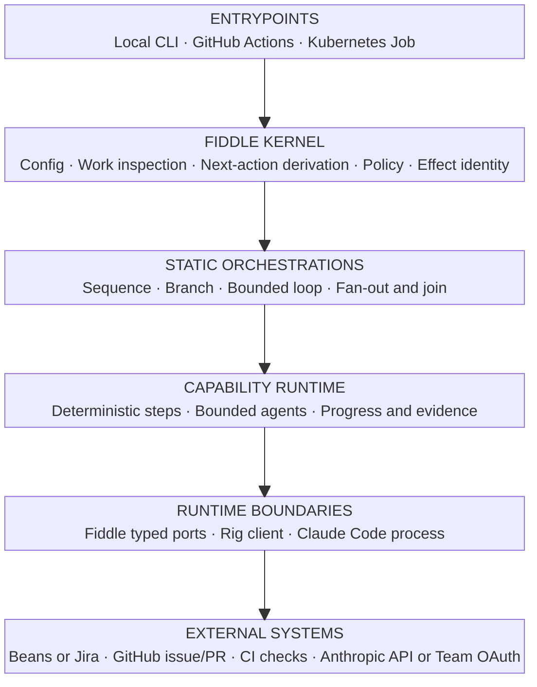
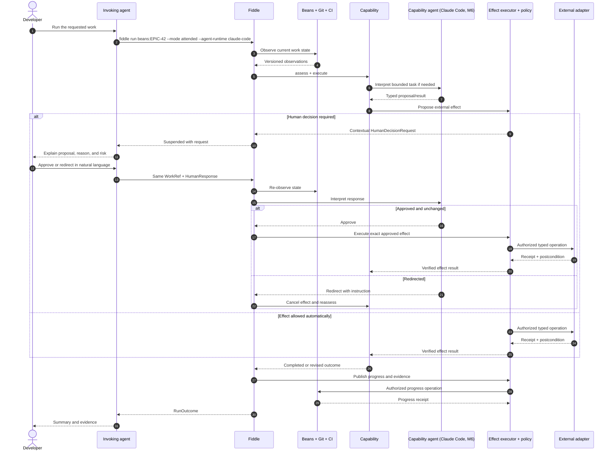
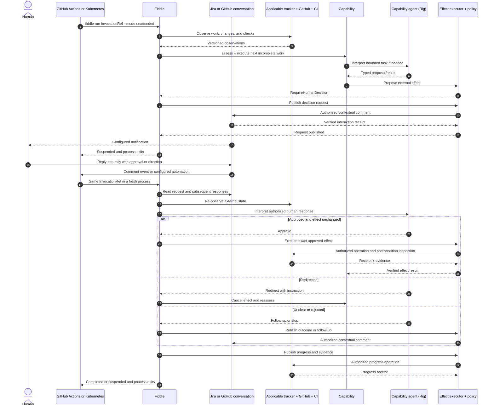
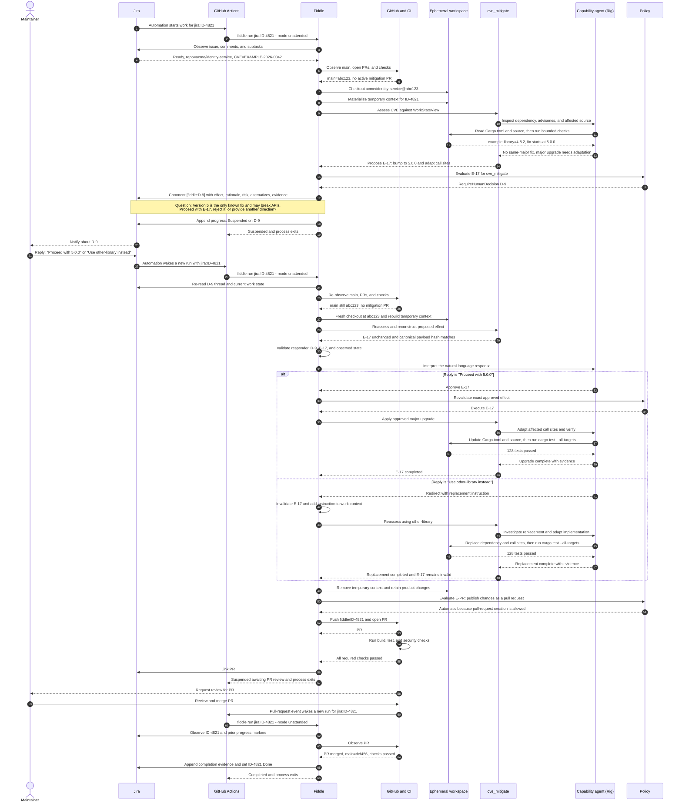
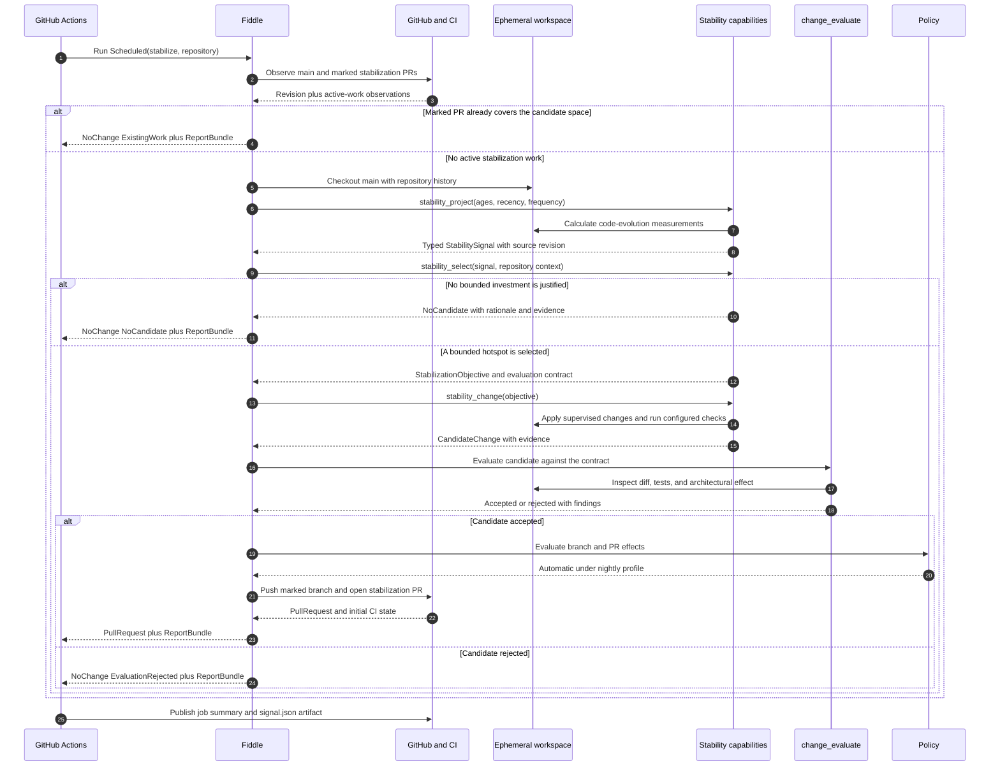
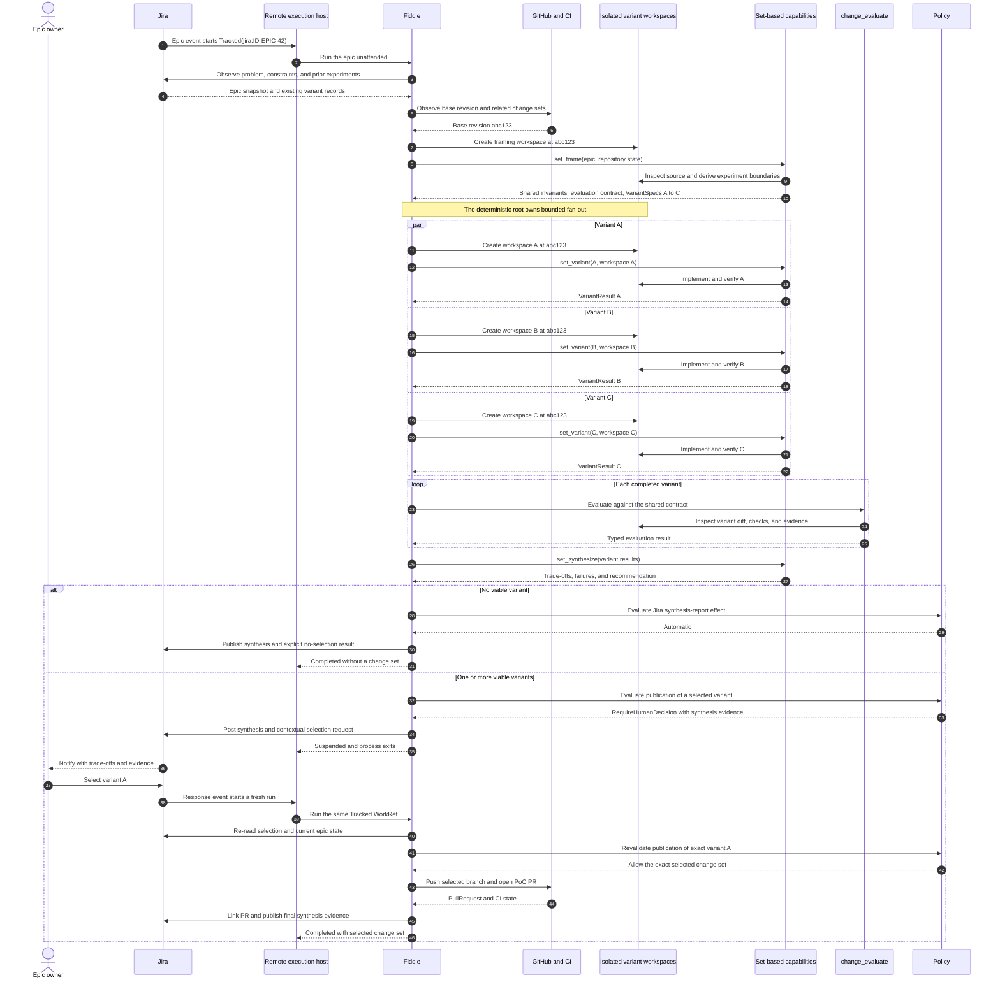
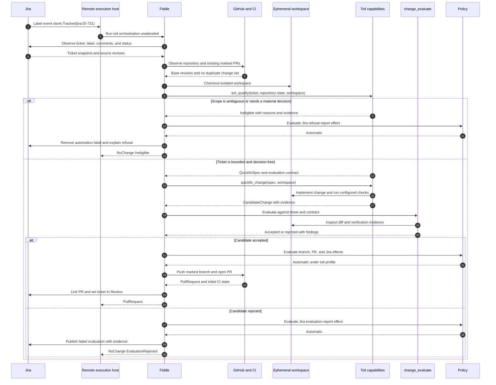
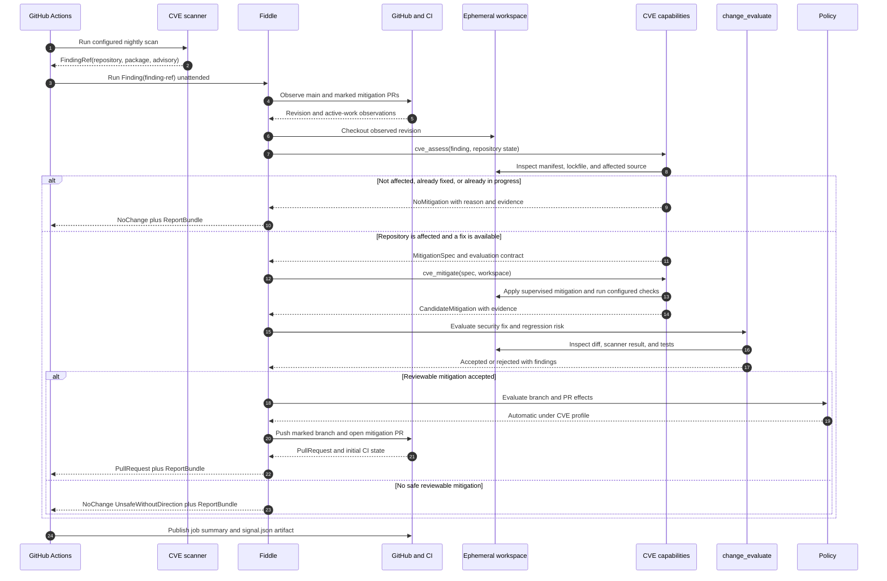

# RFC / PRD: Fiddle agentic software factory

**Status:** draft for implementation-team review  
**Audience:** Fiddle maintainers and implementers  
**Date:** 2026-08-07  
**Decision scope:** V1 product and component interfaces  
**Supersedes:** the factory direction in `docs/specs/2026-08-01-fiddle-v2-infrastructure-design.md` where this document differs

## TL;DR for wider engineering

Fiddle turns one work reference into a bounded software operation. The reference names a tracker item, a scheduled routine, or a scanner finding. Fiddle supervises that operation. It does not replace the tracker, GitHub, CI, or the execution platform. Static Rust workflows coordinate typed capabilities. A bounded agent runs only inside a step that needs judgment.[S2](#s2)

The same operation runs locally, in GitHub Actions, or in Kubernetes. Safety and restart behave the same in all three. Policy and human decisions gate every declared external effect. Credentials stay outside agent state and workspace state. Capability tools run unattended, so Fiddle does not interrupt the agent for each tool call.

Four outcomes are required: Stabilize, set-based engineering, Toil implementation, and CVE mitigation. Each becomes one supervised orchestration of deterministic steps and bounded judgment. A standalone version for circulation is in [`fiddle-agentic-factory-engineering-tldr.md`](fiddle-agentic-factory-engineering-tldr.md).

## Summary

Fiddle becomes a small type-driven orchestrator of software work. Its outer shell is deterministic. The shell observes durable work state, derives the next safe action, applies policy, executes typed effects, and records evidence. Its bounded capabilities may be deterministic, agentic, or both. Static Rust orchestrations compose capabilities, and a capability may not invoke another capability.

V1 is remote-first. GitHub Actions is the primary real-model runtime. Fiddle embeds [Rig](https://www.rig.rs/docs) inside every capability that needs model judgment. Rig supplies an in-process agent loop, typed tools, typed structured output, hooks, provider integrations, test doubles, and `tracing` instrumentation.[S5](#s5)[S6](#s6)[S20](#s20)[S21](#s21) Fiddle supplies the orchestration, the policy, the source tracking, the restart rules, and the adapters. Rig is neither the workflow engine nor a store of durable work state.

This document was written against Rig's Anthropic provider and a CI `ANTHROPIC_API_KEY`. The build settled elsewhere. `fiddle_runtime::gateway::completion_model` builds `rig_core::providers::openai::Client` against the `base_url` that `[agent]` names, and it reads the variable that `[agent] api_key` names. Read every later mention of an Anthropic key for a Rig call as that configured gateway credential. The Claude Code mentions are unaffected, because that executable owns its own authentication.

Local real-model execution arrives after remote Jira and Toil work prove the quick-fix contract. That milestone adds a Beans adapter and one narrow Claude Code implementation that launches `claude -p` under a Team subscription. Both implementations satisfy the same typed capability contract, and Fiddle adds no model-provider abstraction between them. Claude Code supports bounded non-interactive execution, structured output, tool controls, streaming events, and OpenTelemetry export.[S30](#s30)

One CLI binary runs on a developer machine, a GitHub Actions runner, or a Kubernetes job. V1 adds no Fiddle service, scheduler, shared database, hosted sandbox, artifact store, or model-session continuation.

The kernel and the adapters alone do not complete this RFC. The work completes when the four workflows in [Required implementation use cases and capability orchestration](#required-implementation-use-cases-and-capability-orchestration) run end to end. The M6 local Beans and Claude Code contract must also pass, and every milestone acceptance criterion must hold.

## Problem

Fiddle expresses its lifecycle and its evaluator loop through portable Markdown skills, shell helpers, and harness entrypoints.[S1](#s1) That works for attended reasoning. It also spreads the correctness-critical mechanics across model instructions and scripts. Those mechanics are state assessment, restart, idempotent external effects, policy enforcement, and progress reporting.

The product needs one durable coordination boundary. It must not become another tracker, CI system, GitHub client, sandbox platform, or workflow engine. A fresh Fiddle process receives one stable invocation reference. From that reference it must inspect the applicable external state and continue at the next incomplete capability. Correctness must not depend on the prior model transcript. Correctness must not depend on the prior runner filesystem.

## Goals

- Run bounded capabilities from one stable `InvocationRef`, attended or unattended.
- Make every state transition and external effect typed, inspectable, policy-gated, and idempotent.
- Use a bounded embedded agent only where interpretation adds value, and keep lifecycle control deterministic.
- Keep trackers, workspaces, model providers, GitHub, and CI behind narrow interfaces.
- Recover semantically from the tracker, Git, pull requests, CI, and curated source context after process loss.
- Emit useful progress, evidence, and telemetry without a shared V1 database.
- Delegate commodity behavior to existing CLIs, SDKs, APIs, and execution platforms.
- Deliver all four use cases: nightly Stabilize, Jira-epic set-based engineering, Jira-ticket Toil implementation, and CVE mitigation.
- Add local attended Beans execution only after remote quick-fix semantics are proven, through `claude -p`, without changing the typed contract.

### Implementation planning constraint

Each milestone must deliver a runnable and more capable Fiddle. Each milestone must expose its new behavior through the public CLI. Each must prove that behavior through unit and contract tests plus a black-box scenario in `peel/fiddle-acceptance`. Infrastructure forms a milestone only when a complete observable behavior exercises it. A set of unused abstractions that compiles is not a milestone.

The plan must give every required use case an end-to-end acceptance scenario. It may sequence a use case as a later vertical slice. It may not defer one as an optional future application. The Fiddle lifecycle skills own task decomposition after this RFC sets the milestone boundaries.

External prerequisites stay explicit dependencies. A missing Jira integration may block live acceptance of set-based engineering and Toil implementation. It does not remove either workflow from scope. Work that needs no Jira proceeds while that dependency stands open.

## Non-goals and boundaries

- No persistent control plane, queue, scheduler, or cross-run database.
- No durable model conversation, serialized agent-run checkpoint, or exact continuation of a prior model loop. A restart creates a fresh agent attempt.
- No dynamic capability loading, plugin ABI, capability package format, or per-capability schema version.
- No autonomous capability self-modification or promotion loop in V1.
- No provider matrix, and no attempt to make unlike agent tool systems interchangeable. Rig is the primary CI implementation. M6 adds one Claude Code implementation for local attended Beans work.
- No credential broker. No credentials in workspace commands or model-visible tool arguments.
- No artifact service. Code, pull requests, checks, tracker updates, runner artifacts, and telemetry stay in their own systems.
- No reimplementation of a complete GitHub, Jira, Beans, Git, CI, or Kubernetes client.

[`fiddle-agentic-factory-future-research.md`](fiddle-agentic-factory-future-research.md) keeps the deferred ideas and their reasons.

## Users and scenarios

### Local attended developer — introduced in M6

A developer runs Fiddle in a repository with a Beans work reference. Fiddle invokes the proven quick-fix capability through local `claude -p`. It uses the developer's Claude Team login when no API key overrides it.[S31](#s31) Fiddle returns a decision request through the invoking agent when a proposed effect needs judgment. The developer approves, rejects, or redirects the work in ordinary language. The developer may ask for JSON output instead.

### Remote unattended maintainer

A GitHub Actions workflow or a Kubernetes job invokes Fiddle with an `InvocationRef`. Fiddle performs bounded work and exits. Fiddle posts a question to the configured Jira or GitHub conversation when it needs judgment, then returns `Suspended`. A later invocation with the same reference reads and interprets the answer.

### Capability author

An implementer adds one statically registered Rust capability. The implementation may run deterministic commands. It may launch one bounded Rig agent. It may use a small manager-worker arrangement where a delegation boundary is clear. It may combine those forms. Every form uses the same typed assessment, progress, evidence, policy, and outcome contracts.

M6 shows a second implementation of the already-proven quick-fix contract through Claude Code. No capability has to support every runtime.

### Factory operator

An operator inspects tracker updates, GitHub state, CLI JSON, runner logs, and OpenTelemetry.

## Product model

### Identity

| Identity | Meaning | Persistence requirement |
|---|---|---|
| `InvocationRef` | Stable identity of the invocation source: a tracker item, a repository routine, or a scanner finding | Required on every invocation |
| `WorkRef` | Stable durable work identity, such as `beans:fiddle-123`, `jira:FID-42`, or a marked GitHub change set | Required once an invocation advances durable work. A scheduled `NoChange` result needs none |
| `RunId` | One logical orchestration run for one invocation | May be rebuilt or linked externally |
| `AttemptId` | One process attempt or agent attempt | Unique per invocation |
| `CapabilityInvocationId` | One logical capability operation | Stable across a retry of the same intended operation |
| `EffectId` | Identity of one proposed external effect | Stable enough to detect a prior success and bind an approved decision |
| `DecisionRequestId` | One question that needs human judgment | Stable across suspension and continuation |

### Outcome

```rust
enum RunOutcome {
    Completed,
    Suspended { reason: SuspensionReason },
    Retryable { reason: RetryReason },
    Failed { error: RunError },
}
```

`Suspended` means Fiddle cannot continue until an external condition changes. In unattended mode Fiddle publishes the interaction request durably before it exits. In attended mode it returns the request to the invoking agent. Fiddle may ask again when an attended interaction is lost. `Retryable` means a fresh invocation can make progress without human judgment. The CLI maps each outcome to human text, stable JSON, and a documented exit code.

## Component architecture

The diagram uses one vertical path on purpose. The interfaces below specify component-to-component detail. Cross-layer arrows do not.



### Ownership

| Component | Owns | Does not own |
|---|---|---|
| Fiddle kernel | configuration, work inspection, pure assessment, next-action derivation, policy, effect identity, run outcome | domain reasoning, external system internals |
| Static orchestration | sequence, branching, bounded retry, bounded fan-out and join over capabilities | open-ended model planning, hidden dynamic graphs |
| Capability | one domain operation, an optional bounded agent, its bounded tool set, its minimum effect policy, typed progress and evidence | lifecycle composition, calling another capability, weakening deployment policy |
| Tracker adapter | native work-item observations and mutations | repository truth, CI truth |
| Human-interaction adapter | questions and answers on one configured channel | effect execution, trusting a trigger payload as state |
| Workspace runtime | local files and command execution under an isolated root | authenticated GitHub, tracker, or model calls |
| GitHub and Git adapter | published branches, commits, pull requests, reviews | workspace command execution, tracker status |
| CI adapter | workflow and check observations, requested check operations | deciding that product work is complete |
| Rig | model transport, the per-attempt agent loop, typed tools and output, hooks, usage data, agent-as-tool composition | Fiddle work semantics, orchestration, policy authority, cross-run recovery, credentials |
| Claude Code process runner (M6) | launching the local quick-fix implementation, bounded CLI arguments, JSON parsing, cancellation, process telemetry | a provider abstraction, backend effects, session recovery, support for every capability |

## Execution model

### Deterministic shell, agentic interior

The outer kernel keeps a decision pure where purity improves correctness and testing. For example:

```rust
fn derive_next(
    orchestration: OrchestrationId,
    work: &WorkStateView,
) -> Result<NextAction, AssessmentError>;
```

A static orchestration is ordinary async Rust. It uses typed values, `match`, bounded loops, and explicit concurrency. Fiddle adds no workflow DSL. Fiddle does not force every orchestration into one event and command reducer. An adapter returns an observation or a receipt. A pure assessment and a policy decision then derive the next action from those values. Rig recommends this shape: code owns the known sequence, and an agent loop handles the open-ended step.[S5](#s5)

"Deterministic" covers state transitions, policy evaluation, effect handling, and evidence rules. It does not promise repeatable model output.

### Capability contract

```rust
trait Capability: Send + Sync {
    type Input;
    type Output;

    fn id(&self) -> CapabilityId;
    fn assess(&self, work: &WorkStateView) -> CapabilityAssessment;

    async fn execute(
        &self,
        ctx: &CapabilityContext,
        input: Self::Input,
    ) -> Result<CapabilityOutcome<Self::Output>, CapabilityError>;
}

enum CapabilityOutcome<T> {
    Completed(T),
    Suspended(Suspension),
    Retryable(RetryAdvice),
}

struct CapabilityContext {
    invocation_ref: InvocationRef,
    attempt_id: AttemptId,
    services: CapabilityServices,
    cancellation: CancellationContext,
}
```

`assess` is pure and must state its evidence. `execute` takes one of four forms:

- deterministic: a sequence of typed observations and commands;
- agentic: one bounded Rig `AgentRunner` with selected tools and typed output;
- agentic local: an M6 Claude Code process running an already-proven contract;
- hybrid: deterministic preparation and verification around an agentic step.

Only the static orchestration composes capabilities. A capability cannot invoke another capability. This keeps the call graph visible. It also prevents hidden recursive agency.

Inside one agentic capability, Rig may expose a specialist agent as a tool. Use that only where an internal delegation boundary is clear. The worker stays an implementation detail of the capability. The worker cannot invoke a Fiddle capability. The worker cannot broaden policy. Rig advises one focused agent where its domain and tool set are small.[S7](#s7)

V1 registers every capability statically in Rust. A stable `CapabilityId` and the Fiddle build revision identify it. A descriptor format and a per-capability version lifecycle are deferred.

Each capability also declares its bounded tool set and its minimum effect policy:

```rust
struct CapabilityDefinition {
    id: CapabilityId,
    tools: CapabilityToolSet,
    effects: EffectPolicy,
}

enum HumanDecisionRequirement {
    Automatic,
    Human,
}

trait EffectPolicy {
    fn human_decision_for(&self, effect: &ProposedEffect) -> HumanDecisionRequirement;
}
```

The capability controls which tools exist and which effects need judgment. Deployment policy may make a rule stricter. Deployment policy cannot weaken the capability minimum. No agent can modify either policy.

### Agent runtimes

From M1 through M5, an agentic capability builds a Rig agent or an explicit `AgentRunner` for one bounded attempt. The capability owns its prompt, its tool set, its turn budget, and its typed result. Rig derives each tool's model-visible schema from its Rust types. `TypedPrompt` or an extractor returns a schema-validated Rust value.[S6](#s6)[S19](#s19) A deterministic or hybrid capability need not build an agent.

A registered tool runs without per-call human confirmation. Rig hooks can audit, instrument, cancel, shape a request, and recover from an invalid tool call. Rig calls a hook guardrail a control, not an authorization boundary.[S6](#s6) Safety comes from the small tool set, workspace isolation, typed inputs, host-only context, and the Fiddle effect executor. Read "workspace isolation" narrowly: it is an ephemeral worktree, a sanitized environment, and path containment on Fiddle's own file tools. It is not a sandbox. A tool that starts a program — `run_check` since M1, `run_command` since M4 — starts a process with the invoking user's authority, and a build tool runs code out of the repository under repair. Decision 043 states what holds and what does not.

One Rig agent may use another Rig agent as a tool. That gives manager-worker composition without subagent machinery in Fiddle.[S7](#s7) It stays optional and local to one capability. Static Fiddle orchestration sequences capabilities and bounded fan-out. A model manager does not.

M6 adds `ClaudeCodeQuickfix`, which implements the typed quick-fix capability that `RigQuickfix` proves in M5. It launches a pinned `claude -p` process. That process gets an explicit prompt, bounded turns, controlled tools, a structured output schema, streaming JSON, and no session persistence. Its prompt and tools receive only the isolated workspace and sanitized capability inputs. GitHub, Jira, and effect credentials stay outside that process. Its wrapper resolves model authentication, and that credential must not reach a child tool. Claude Code owns its inner tool loop, and Fiddle keeps preparation, output validation, verification, policy, and effects.[S30](#s30)

The seam is the typed `Capability` contract: input, output, assessment, and evidence. It is not a completion-provider API. The runtime selects one statically registered implementation that the capability supports. Rig tools and Claude Code tools may differ internally. Both implementations must satisfy the same acceptance contract, and neither may broaden its policy. M6 therefore does not make every capability portable to Claude Code.

Fiddle stays responsible for:

- capability selection and composition rules;
- invocation, work, attempt, capability, and effect identity;
- policy and human-decision semantics;
- normalized work-state inspection;
- durable progress and evidence;
- credentials and authenticated integration handles;
- semantic restart across fresh agent attempts.

Fiddle core owns the durable lifecycle across capability attempts, CI results, human decisions, suspension, and restart. A capability owns agentic iteration inside one attempt: investigation, modification, and the immediate checks. A later attempt uses a fresh agent. Continuity comes from the current source state, the external observations, and the structured prior-attempt report, never from a preserved conversation.

Rig can serialize a lower-level `AgentRun` while a tool call waits, then resume after an out-of-process approval.[S22](#s22) Claude Code can persist a session. V1 uses neither path for correctness. Fiddle publishes the decision externally, exits, and rebuilds the capability input and the proposed effect on the next invocation. Exact agent-loop continuation and a suspended-run store are deferred.

## V1 implementation stack

Fiddle is a Cargo workspace with three ownership boundaries:

- `fiddle-core`: identities, observations, assessments, policy decisions, effects, evidence, and outcomes. No Tokio, no Rig, no process execution, no external I/O.
- `fiddle-runtime`: Tokio orchestration, ports, effect execution, static workflows, capabilities, Rig integration, the M6 Claude Code process runner, and the external adapters.
- `fiddle-cli`: the Clap commands, TOML configuration loading, effective-config validation, process lifecycle, human and JSON rendering, and exit codes.

A fourth crate, `fiddle-acceptance`, holds the black-box scenarios. It ships no product code.

The runtime uses the Tokio multi-threaded runtime for concurrent I/O and bounded task groups for set-based fan-out. It uses a channel only where ownership or streaming requires one. It propagates a `CancellationToken` from the process through orchestration into each capability attempt.[S25](#s25) V1 adds no actor framework, Axum service, daemon, or Tauri control plane.

Configuration and boundary types use Serde with strict TOML deserialization. Clap parses the CLI. `thiserror` defines domain failures and `miette` renders CLI diagnostics.[S27](#s27) Two intended dependencies are not in the build at this head. `secrecy` does not wrap resolved secret material: `fiddle-cli` reads the named variable with `std::env::var` and holds a plain `String`. `tracing` is not a dependency, so the instrumentation facade and the telemetry export arrive with the milestone that needs them.

The Git and GitHub adapters delegate to the real `git` and official `gh` executables through `tokio::process::Command`. The scanner adapter delegates to `wizcli` the same way. The Jira adapter will delegate to the official Atlassian `acli`, and M5 owns it: no `acli` call exists at this head. Each adapter asks for structured output where it exists and parses it into a narrow Fiddle type. No CLI output shape reaches orchestration.[S28](#s28) A native community client stays a documented future option.

The repository copies the `peel/rust.nix` design as a template rather than sharing a flake module. The refreshed template uses a locked Nix flake and Fenix for one exact toolchain. It uses Devenv for the shell and Crane for cached builds.[S26](#s26)[S29](#s29) Cargo manifests and `Cargo.lock` own the Rust dependencies. `rust-toolchain.toml` owns the compiler version. `flake.lock` pins the Nix inputs and the external CLI packages. Formatting, linting, tests, and package builds are separate flake checks.

## Client interfaces

### Configuration

Project configuration moves from `orchestrate.json` to `fiddle.toml`. Cargo makes TOML a Rust convention for project configuration. This is a product choice, not a requirement of Rust.[S15](#s15)

The schema is organized by component ownership, not by an abstract provider hierarchy. GitHub owns the repository, pull-request, and check settings under one authenticated integration. A deployment does not select GitHub once as a repository kind and again as a CI kind. Jira and Beans may coexist, and the `InvocationRef` selects the adapter. **The block below is a composite across the whole of V1.** It is a boundary map, and it is not a document a deployment can load. The note after it says how far from loadable it is. [The configuration this build loads](#the-configuration-this-build-loads) follows that note. Field names may change during implementation, but this reference configuration fixes the intended boundaries:

```toml
# fiddle.toml configures Fiddle in this repository. It provisions no runner,
# declares no schedule, and holds no secret value.

[project]
# The repository-independent identity used in reports and telemetry.
name = "icecube"


[github]
# One integration owns source observations, branch publication, pull requests,
# and check observations. Fiddle resolves the credential from the named
# environment source. No capability and no agent receives it.
repo = "snowplow/icecube"
base = "main"
token = { env = "GITHUB_TOKEN" }

[github.pull_requests]
# The repository conventions Fiddle applies when it publishes a change.
branch_prefix = "fiddle/"
managed_label = "fiddle/managed"

[github.actions]
# The required checks Fiddle observes after publication. GitHub Actions keeps
# the workflow definitions, the schedules, the runner images, and the artifact
# retention. This document does not repeat them.
required_checks = ["build", "test", "security"]


[jira]
# Jira work state and remote human decisions. A repository that never receives
# a Jira-backed reference omits this section.
site = "https://snowplow.atlassian.net"
project = "IDENTITY"
user = { env = "JIRA_USER_EMAIL" }
token = { env = "JIRA_API_TOKEN" }

[jira.workflow]
# The project's own status names, mapped onto Fiddle's typed work states.
ready = "Ready"
in_progress = "In Progress"
in_review = "In Review"
blocked = "Blocked"
done = "Done"

[jira.labels]
# The labels Fiddle uses to find and mark its own work.
toil_trigger = "fiddle/toil"
managed = "fiddle/managed"

[jira.approvals]
# The rules for accepting an answer to a decision request in Jira.
authorized_roles = ["Developers", "Administrators"]
poll_interval = "1m"
timeout = "7d"

# From M6 a Beans-backed reference selects the built-in local adapter. That
# adapter has no project settings, so no [beans] table exists.


[agent]
# The defaults every bounded agent shares. CI uses the Rig implementation. A
# supported local capability may select Claude Code from M6.
default_runtime = "rig"
max_turns = 40
deadline = "45m"

[agent.rig]
# The primary CI implementation. Only the host runtime resolves the API key.
# No capability input and no workspace command receives it.
model = "claude-sonnet-4-5"
api_key = { env = "ANTHROPIC_API_KEY" }
max_tokens = 8192

[agent.claude_code]
# The M6 local attended implementation. The official executable owns its own
# authentication: Team OAuth locally, or ANTHROPIC_API_KEY in CI.
command = "claude"


[workspace]
# How Fiddle uses the checkout it receives from the shell, GitHub Actions, or
# Kubernetes. The caller still provisions the host.
root = ".fiddle/workspaces"
isolation = "git-worktree"
command_timeout = "15m"
network = "dependency-fetch"
cleanup = "always"


[execution]
# The global bounds on the deterministic core's durable lifecycle. A capability
# owns iteration inside one attempt. The core owns retries across CI and
# suspension.
run_timeout = "2h"
max_parallel = 3
max_capability_attempts = 3


[policy]
# The deployment's hard ceiling on external effects. A capability rule lives in
# Rust and may demand more judgment. This document cannot weaken one.
allow_branch_creation = true
allow_push = true
allow_pull_request_creation = true
allow_tracker_comments = true
allow_tracker_transitions = true
allow_merge = false
allow_force_push = false


[artifacts]
# The temporary source context and the structured reports. Fiddle removes the
# transient context before the final pull-request state. The durable facts stay
# in commits, pull requests, checks, tracker records, and published reports.
context_directory = ".fiddle/context"
output_directory = ".fiddle-output"
remove_context_before_pull_request = true
report_formats = ["markdown", "json"]


[telemetry]
# The OpenTelemetry export for operational events. This is observability. It is
# not the durable state a restart reads.
enabled = true
service_name = "fiddle"
otlp_endpoint = { env = "OTEL_EXPORTER_OTLP_ENDPOINT" }


[orchestration]
# The static root orchestrations this repository enables. Rust registers their
# composition and their capability call graph. TOML does not define either.
enabled = ["stabilize", "set_based", "toil", "cve"]

[orchestration.stabilize]
# The repository tuning for the nightly code-age and change-frequency signal.
# The algorithm and the safety rules stay in code.
history_window = "180d"
recent_window = "30d"
minimum_changes = 6
max_candidates = 1
cooldown = "30d"
include = ["**/*.go"]
exclude = ["vendor/**", "**/generated/**"]

[orchestration.set_based]
# The bounds on concurrent variants. The root orchestration owns fan-out and
# join. A variant capability cannot launch another one. The global execution
# ceiling decides their real concurrency.
max_variants = 3
require_human_selection = true

[orchestration.toil]
# The repository limits on labelled background toil. [jira.labels] defines the
# trigger label once, so this table does not repeat it.
max_files_changed = 10
max_diff_lines = 500

[orchestration.cve]
# The selection and run budget for nightly CVE mitigation. The agent chooses
# which file fixes a finding and which version to move to, a major bump
# included. Nothing in Rust refuses a version, and the rescan is the guarantee.
# The deployment owns the immediate checks, under [[workspace.checks]].
# The image has no default and a deployment must write it down. The host
# workflow builds the image and Fiddle scans it, so a guessed value would scan
# whichever tag this build happened to ship with. `severities` names grades and
# not a floor. Fiddle still acts on a finding below those grades when the
# scanner flagged a public exploit, which is a rule in Rust rather than a
# preference here.
image = "ghcr.io/snowplow/icecube:latest"
severities = ["HIGH", "CRITICAL"]
max_findings = 5


[capabilities.stability_select]
# Optional deviations from [agent]. An omitted value inherits the agent
# default, so most capabilities need no table here.
max_turns = 15

[capabilities.set_variant]
# This longer operation overrides only the default it has to change.
timeout = "60m"
```

#### The reference configuration is a composite

The block above writes the whole of V1 down at once. Most of its tables name a milestone that has not shipped. It is a boundary map rather than a document. The compiled binary exits 2 on it. Strict deserialization reports one unknown or missing field at a time, so each refusal hides the next. Clearing them one at a time takes 20 passes before what is left of it loads. Each pass deletes the key a message points at, or the table whose header it names.

18 of its 23 tables have to be deleted on the way. The two tables the schema requires, `[stub]` and `[report]`, are absent from the block. `crates/fiddle-acceptance/tests/config_check.rs` measures both numbers against the compiled binary. It does not quote them, so this paragraph cannot drift from what the binary does.

Read the block by one rule. A key is spelled the way this build spells it wherever the build already has that setting. A key keeps the manual's own spelling wherever it names behavior still to come. `[github]` therefore says `repo` and `base` rather than `repository` and `default_branch`. `[agent]` says `deadline` rather than `timeout`. Those three were one setting under two words, which is a transcription defect and not a boundary.

`[workspace] network`, `[orchestration] enabled`, and every table for an unshipped milestone stay as written. They state intent rather than mis-name something that exists.

Where a shipped table settled a boundary differently from this map, `crates/fiddle-cli/src/config.rs` is the schema of record. The deployment's effect ceiling is `[github.policy]`, keyed by effect kind rather than by the booleans `[policy]` shows. `required_checks` is a key of `[github]` rather than of `[github.actions]`. The approver set is `[github.decision] authorized`, a list of numeric user ids, rather than the roles `[jira.approvals]` shows: the schema refuses an approver named by login. There is no `[agent.rig]` table. `[agent]` is flat, and it requires `model`, `base_url`, and `api_key`. The build talks to an OpenAI-compatible gateway rather than to Anthropic directly.

`max_capability_attempts` is a key of `[agent]` rather than of `[execution]`, and this build consumes it. It bounds the attempts `cve_mitigate` makes against one shared pull request. Fiddle reads the count from that pull request's body, and a fresh process therefore sees what an earlier one spent. `docs/technical/decisions/037-the-attempt-bound-is-per-pull-request.md` records why the body holds the count.

#### The configuration this build loads

This document is complete, and the strict schema admits every key in it. `fiddle config check --config fiddle.toml` exits 0 on it. It shows all eight tables the schema knows, which is the whole of what a deployment can say today. An acceptance lane feeds the compiled binary these exact bytes. This block therefore cannot become as aspirational as the one above it.

```toml
# Complete and loadable. The strict schema in
# `crates/fiddle-cli/src/config.rs` admits every key here. No field of that
# schema accepts a secret value, so version control can hold this document.

[project]
# The repository-independent identity used in reports and telemetry.
name = "icecube"

[stub]
# Where the fixture-backed ports read and write their state. Required today,
# because the ports a run reaches are still fixtures. This is the table most
# likely to leave once they are not.
root = "tests/fixtures/stub-state"

[report]
# Where a run publishes its evidence bundles.
dir = ".fiddle/reports"

[agent]
# The model, the endpoint, and the credential variable have no defaults, and a
# deployment must declare each one. Each names a decision that a guess gets
# wrong somewhere. The endpoint takes a written value, or `{ env = "NAME" }`,
# so a repository that publishes this file can name its gateway rather than
# write it. A named endpoint that resolves to nothing refuses the run. The two
# bounds below have defaults and are written out so the axes stay visible.
model = "claude-sonnet-5"
base_url = "https://litellm.firn.snplow.net/v1"
api_key = { env = "LITELLM_API_KEY" }
max_turns = 12
deadline = "45m"

[workspace]
# How Fiddle uses the checkout it receives. This build supports one isolation
# mechanism and one cleanup rule. The keys exist so the axes stay visible.
root = ".fiddle/workspaces"
isolation = "git-worktree"
command_timeout = "15m"
cleanup = "always"

[[workspace.checks]]
# The checks that judge an attempt. Fiddle runs them in the order written. Each
# declares its own success criterion, because a scanner's non-zero exit reports
# findings rather than failure. Nothing in Rust reads what a changed file
# means, so a test check declared here is what stops a silenced test. A
# deployment that declares none has no such guarantee, and gets no warning.
program = "make"
args = ["build"]
success = "exit-zero"

[[workspace.checks]]
program = "make"
args = ["test"]
success = "exit-zero"

[[workspace.commands]]
# The programs `run_command` will start. A repair that has to regenerate a
# derived file cannot do it by writing that file, so the deployment names the
# program that produces it. Fiddle names no ecosystem, so there is no default
# and a deployment that declares none gets a four-tool attempt. A program and
# an argument list reach the process directly: no interpreter, nothing
# expanded, and one argument cannot become two.
#
# This list is not a sandbox. A declared program runs as the invoking user and
# can read, write and reach whatever that user can, and declaring a build tool
# grants arbitrary code execution because that tool runs code out of the
# repository. On a runner the disposable job is what isolates. Locally nothing
# does. Decision 043 states what does hold.
program = "make"
args = ["tidy"]

[[workspace.commands]]
# `args` is a prefix the attempt cannot reorder or replace. `extend` decides
# whether the attempt may append to it, and the default is "none". Fully fixed
# arguments cannot express a version the attempt chose, and free arguments are
# a larger surface for no gain. An appended argument is one line of printable
# text and names no path outside the project, which bounds what the attempt
# may say rather than what the program may reach.
program = "make"
args = ["relock"]
extend = "arguments"

[github]
# One integration owns branch publication, pull requests, and check
# observation. A deployment that never publishes omits it.
repo = "snowplow/icecube"
base = "main"
token = { env = "FIDDLE_GITHUB_TOKEN" }

[scanner]
# The container scanner. A deployment that never scans omits it. The caller
# logs `wizcli` in before Fiddle runs, and Fiddle names no credential of its
# own.
timeout = "20m"

[orchestration.cve]
# The image has no default and a deployment must write it down. The host
# workflow builds the image and Fiddle scans it, so a guessed value would scan
# whichever tag this build happened to ship with.
image = "ghcr.io/snowplow/icecube:latest"
severities = ["HIGH", "CRITICAL"]
max_findings = 5
```

Configuration requirements:

- resolution order: defaults, then the project file, then the permitted CLI overrides;
- strict unknown-field validation with an actionable error;
- one concrete section per integration, not a duplicated `kind` plus provider sections;
- selection of Jira or, from M6, Beans from the `InvocationRef`, with no global tracker switch;
- tracker status, label, and relationship mappings in configuration rather than in core enums;
- one authoritative interaction path per invocation: Jira comments for remote Jira work, the invoking agent for attended Beans work;
- a credential reference that names an environment source or a profile, never a secret value;
- host scheduling, runner provisioning, and workflow definitions outside `fiddle.toml`;
- capability prompts, bounded tools, minimum human-decision rules, and orchestration graphs in Rust rather than in configuration;
- two exceptions to that rule, both in M4: the immediate checks moved into the document as `[[workspace.checks]]`, and the programs an attempt may run moved into it as `[[workspace.commands]]`. A capability's tool *set* is still Rust's; what one of those tools may run is the deployment's, because Fiddle names no ecosystem. Neither list is an isolation mechanism, and `[workspace] isolation` is where isolation would live;
- explicit agent-runtime selection only where a capability implementation supports it, and no promise that every capability runs on every runtime;
- one global default per setting, with an orchestration or capability override only for a genuine deviation;
- `fiddle config check`, which resolves and validates the effective configuration without starting work.

Migration from the overlapping `orchestrate.json` settings should be explicit. V1 need not keep the old file as the new schema's base.[S1](#s1)

### CLI

The minimum command set is:

```text
fiddle run <invocation-ref> [--mode attended|unattended] [--capability <id>] [--agent-runtime <id>] [--json]
fiddle inspect <invocation-ref> [--json]
fiddle config check [--json]
```

An invocation reference names tracker-backed work, or a repository or scanner trigger that the execution host supplies. The CLI encoding of a scheduled or scanner reference stays an implementation decision.

`--agent-runtime` is a permitted override that M6 adds. Fiddle rejects it when the selected capability has no implementation for that runtime. CI defaults to `rig`. Local attended Beans work selects `claude-code` explicitly. Fiddle does not infer the runtime from the host machine.

`run` always begins by inspecting the current external state. Re-running the same command is the restart mechanism. V1 exposes no "resume model session" primitive. `inspect` changes nothing. It reports the normalized observations, the contradictions, the unavailable sources, the capability assessments, and the proposed next action.

The word "reconcile" stays out of the user interface. Fiddle **inspects** sources, **assesses** capabilities, and **derives** a next action.

## Component interfaces

The Rust signatures below specify semantic ownership. A port used behind `dyn` may use `async-trait` or an explicit boxed future to make its async methods object-safe. That mechanical choice does not change the contract.

These signatures are the V1 target, not a description of this head. A plan that reads them as shipped code will be wrong in five places. `fiddle_core::WorkStateView` carries `work_item`, `changes`, `review`, `verification`, and an optional `tree`. It carries no `human_decisions` and no `context`. `fiddle_core::CapabilityAssessment` has three variants, `NotStarted`, `Satisfied`, and `Blocked`. `Partial` and `Contradictory` do not exist, so nothing reports a contradiction yet. `fiddle_runtime::ports` declares two synchronous observers, `WorkItemPort` and `ChangePort`; there is no `TrackerPort`, `CiPort`, or `HumanInteractionPort` trait, and the GitHub effects live in `fiddle_runtime::github`. `fiddle_core::RunOutcome` carries a `Published` string in each variant rather than a typed reason enum. `fiddle_core::EffectKind` has six variants, and `crates/fiddle-cli/src/config.rs` keys `[github.policy]` by those six.

### 1. Policy and human decisions

The policy engine is an in-process Fiddle component. It is not a service, a Rig hook, or a policy language.

```rust
enum PolicyDecision {
    Allow,
    Deny { reason: PolicyReason },
    RequireHumanDecision { request: HumanDecisionRequest },
}

trait PolicyEngine {
    fn evaluate(
        &self,
        capability: &CapabilityDefinition,
        effect: &ProposedEffect,
        ctx: &PolicyContext,
    )
        -> PolicyDecision;
}
```

A capability declares the minimum rule for each kind of effect. The kernel combines that rule with deployment policy. A deployment may demand judgment for more effects, or deny an effect outright, but it cannot weaken the capability rule. Every mutating external operation passes this interface, whether deterministic code or an unattended Rig tool proposed it.

`RequireHumanDecision` means the capability reached a product checkpoint before one exact effect. It does not mean asking before each Bash command or each Rig tool call. An internal workspace operation runs automatically inside the capability sandbox. An external-effect tool may also run automatically when its capability policy says so. Otherwise that tool returns control to Fiddle before it applies the effect.

Rig hooks can inspect, skip, rewrite, or terminate a tool call. Rig documents them as controls rather than security boundaries.[S6](#s6) Fiddle therefore uses a hook for observability and loop steering, never as the V1 decision authority. Every registered capability tool is non-interactive from the agent's view, and the effect executor remains the mandatory authorization boundary.

The request carries enough context for a person to decide:

```rust
struct HumanDecisionRequest {
    request_id: DecisionRequestId,
    invocation_ref: InvocationRef,
    work_ref: Option<WorkRef>,
    capability_id: CapabilityId,
    question: String,
    rationale: String,
    proposed_effect: ProposedEffect,
    risks: Vec<Risk>,
    alternatives_considered: Vec<Alternative>,
    evidence: Vec<EvidenceRef>,
}

struct HumanResponse {
    request_id: DecisionRequestId,
    author: ActorRef,
    text: String,
    source: InteractionRef,
}

enum InterpretedHumanDecision {
    Approve,
    Reject { reason: String },
    Redirect { instruction: String },
    Unclear,
}
```

One bounded agent step converts the natural-language answer to an `InterpretedHumanDecision`. Rig does that for remote work, and the M6 Claude Code implementation does it for local quick-fix work. The deterministic shell then verifies the author, the request identity, the current effect, and the current external state. An approved decision binds five things:

- the `EffectId`;
- the `InvocationRef`, and the `WorkRef` when one exists;
- the target identity;
- the canonical payload hash;
- an expiry or invalidation rule where one is required.

A change to the target or the payload invalidates the approval. `Redirect` cancels the proposed effect and gives new context to capability assessment. It does not approve a modified effect. `Unclear` produces a follow-up request. The model interprets language. It cannot broaden what a person approved.

### 2. Task trackers

```rust
trait TrackerPort: Send + Sync {
    async fn observe(&self, work: &WorkRef) -> Result<Observation<WorkItemState>, TrackerError>;
    async fn append_progress(&self, effect: AuthorizedEffect<AppendProgress>)
        -> Result<EffectReceipt<ProgressRef>, TrackerError>;
    async fn ensure_status(&self, effect: AuthorizedEffect<EnsureWorkStatus>)
        -> Result<EffectReceipt<WorkItemRef>, TrackerError>;
}
```

Beans and Jira stay native systems. An adapter normalizes only the semantics Fiddle uses. It does not hide the whole API of either tracker. Configuration maps the statuses, the labels, the parent and child relations, the comments, and the revision mechanisms.

A tracker mutation states a desired state. `ensure_status` and "append report with marker" are desired-state operations, not blind commands. Every additive comment carries a stable Fiddle marker. An ambiguous retry then discovers whether the first write succeeded.

### Shared human-interaction port

Human interaction has its own port. The conversation may live in Jira, in GitHub, or in the invoking agent:

```rust
trait HumanInteractionPort: Send + Sync {
    async fn request(
        &self,
        effect: AuthorizedEffect<PublishDecisionRequest>,
    ) -> Result<EffectReceipt<InteractionRef>, InteractionError>;

    async fn responses(
        &self,
        interaction: &InteractionRef,
    ) -> Result<Vec<HumanResponse>, InteractionError>;
}

enum InteractionRef {
    JiraComment(JiraCommentRef),
    GitHubIssueComment(GitHubCommentRef),
    GitHubPullRequestComment(GitHubCommentRef),
    Attended(AttendedInteractionRef),
}
```

Exactly one channel is authoritative for each request. Fiddle must not publish one decision request to both Jira and GitHub. It must not merge two conflicting answers.

- **Jira unattended:** Fiddle posts an issue comment. A person replies in ordinary language. A deployment-owned Jira automation, a scheduled invocation, or a manual rerun wakes the host.
- **GitHub unattended:** Fiddle posts an issue comment or a top-level pull-request comment. A human `issue_comment` event can start GitHub Actions for either surface.[S16](#s16) Fiddle does not use an inline review comment for a work-level decision.
- **Beans attended from M6:** Fiddle returns the request to the invoking agent. The agent asks the user, then invokes Fiddle again with the same request identity and the answer. V1 need not persist a pending local interaction. Fiddle asks again when one is lost.

#### Suspension and continuation

1. A capability proposes an external effect and policy returns `RequireHumanDecision`.
2. Fiddle formats a `HumanDecisionRequest`. Unattended, it publishes the request to the configured channel, emits suspended progress, returns `Suspended`, and exits. Attended, it returns the request to the invoking agent.
3. A person replies in ordinary language with an approval, a rejection, a redirection, or a question.
4. The invoking agent calls Fiddle again. Or deployment-owned automation starts a fresh remote invocation with the same `InvocationRef`.
5. Fiddle reads the authoritative interaction, validates the actor and the request identity, rebuilds the proposed effect, and re-observes external state. A bounded agent step then interprets the answer.
6. An approval permits only the unchanged effect. A rejection stops it. A redirection invalidates it and triggers reassessment with the new instruction. An unclear answer produces a follow-up and another suspension.

The wake-up event is only a hint. A fresh Fiddle process re-reads the whole authoritative interaction, the work state, and the proposed effect. It never treats an event payload as a human decision. Deployment policy decides whether Fiddle ignores an unauthorized actor's reply or surfaces it for review.

### 3. Workspace setup and runtime

```rust
trait WorkspaceRuntime: Send + Sync {
    fn root(&self) -> &WorkspacePath;
    async fn execute(&self, command: WorkspaceCommand)
        -> Result<CommandResult, WorkspaceError>;
}

struct WorkspaceCommand {
    program: Program,
    args: Vec<Argument>,
    cwd: WorkspaceRelativePath,
    env: SanitizedEnvironment,
    timeout: Duration,
    intent: WorkspaceIntent, // Observe | MutateWorkspace
}
```

One workspace boundary backs the deterministic capabilities and the tools registered with Rig agents. In M6 the Claude Code process receives that isolated workspace as its working directory. It may invoke only the workspace operations the capability permits. A local checkout, a GitHub Actions workspace, or a Kubernetes-mounted checkout can each implement this contract. Fiddle needs no execution-host abstraction.

The security boundary holds five rules:

- a command runs under a declared workspace root with a sanitized environment;
- a workspace command inherits no GitHub, tracker, cloud, or model credential. M6 must prove that a Claude Code tool subprocess cannot see the parent credential;
- network access is an explicit host policy when it is enabled, such as a dependency fetch;
- a local Git operation such as diff or commit may run in the workspace;
- publishing a branch, mutating a pull request, or changing tracker state uses a typed authenticated operation.

### 4. Agent execution implementations

Rig is an in-process library that agentic capability implementations use. It is neither an external component nor a Fiddle port, and `fiddle-core` contains no Rig type. The runtime crate owns the dependency, builds the authenticated provider client, and supplies configured completion models to the capability factories. A capability implementation can be generic over Rig's completion-model trait, so a test substitutes a Rig test double directly. Fiddle therefore wraps Rig in no second SDK, and a capability never receives the API key.

Each agentic capability declares its system prompt, bounded tools, budget limits, and structured output in its own Rust module. Its typed input and output are its interface to orchestration. Its Rig `Tool` implementations are its interface to model-selected operations. A deterministic capability uses neither interface.

Rig's host-only tool context carries the trusted runtime values: the scoped capability services, the invocation metadata, and the cancellation state.[S6](#s6) A model-visible tool argument carries none of them, and a tool exposes only its typed schema and its sanitized result. A tool that proposes an authenticated mutation delegates to the shared effect executor. It never receives a raw integration handle, and it never performs the mutation itself.

A capability that needs internal delegation may expose a named Rig agent as a tool to another Rig agent.[S7](#s7) The capability converts that result into its typed output before it returns to orchestration. This permits no capability nesting and no agent-controlled orchestration.

Rig's Anthropic integration supports completion, streaming, tools, structured output through tool use, prompt caching, token accounting, vision, and extended thinking. It takes an Anthropic API key and requires a per-request output-token limit.[S21](#s21) This head does not use that integration. `fiddle_runtime::gateway` builds Rig's OpenAI-compatible client against the configured `base_url`. Either way, the Rig implementation does not accept a Claude Team or Claude Code OAuth credential. M6 uses those only through the official Claude Code executable.

For M6, a small runtime-owned process runner launches `claude -p`. It parses the documented JSON event and result formats. That runner does not present Claude Code as a Rig completion model. It does not normalize the two tool systems.[S30](#s30)

Selection is explicit. CI defaults to the Rig implementation and the credential that `[agent] api_key` names. A local attended Beans invocation may select the Claude Code implementation. It uses subscription OAuth when the API-key variable is absent. Claude Code prefers an API key over a subscription login, so Fiddle's preflight reports the effective credential source. It refuses an unintended override when the caller asked for local subscription-only execution.[S31](#s31)

### 5. Git and GitHub

Fiddle separates workspace-local Git from authenticated GitHub effects.

```rust
trait GitHubPort: Send + Sync {
    async fn observe_change_set(&self, invocation: &InvocationRef) -> Result<Observation<ChangeSetState>, GitHubError>;
    async fn ensure_branch_published(&self, effect: AuthorizedEffect<EnsureBranchPublished>) -> Result<EffectReceipt<BranchRef>, GitHubError>;
    async fn ensure_pull_request(&self, effect: AuthorizedEffect<EnsurePullRequest>) -> Result<EffectReceipt<PullRequestRef>, GitHubError>;
    async fn observe_review(&self, pull_request: &PullRequestRef) -> Result<Observation<ReviewState>, GitHubError>;
}
```

The adapter delegates first. It uses a stable CLI when that CLI has the operation and the right authentication behavior. It uses an SDK when typing or safety improves materially. It calls a narrow API endpoint only when neither serves. Fiddle must not grow a universal GitHub client.

An `ensure_*` operation inspects before and after it mutates. Its receipt carries the effect identity, the target identity, the observed postcondition, and the external revision. A GitHub Actions `GITHUB_TOKEN` can be permission-scoped. An operation that needs an unavailable permission may use a GitHub App installation token.[S9](#s9)

### 6. CI and GitHub Actions

```rust
trait CiPort: Send + Sync {
    async fn observe_verification(&self, target: &ChangeTarget)
        -> Result<Observation<VerificationState>, CiError>;
    async fn ensure_check_requested(&self, effect: AuthorizedEffect<EnsureCheckRequested>)
        -> Result<EffectReceipt<CheckRef>, CiError>;
}
```

GitHub Actions owns job provisioning, runner lifetime, caches, artifacts, and concurrency. Fiddle owns work assessment and run outcome. Actions concurrency can serialize jobs for a work-derived key. Duplicate-safe behavior still comes from effect identity and postcondition inspection.[S10](#s10)

V1 treats a check result as an externally owned fact. A progress report that claims verification cannot override a failed or missing required check.

### Shared external-effect protocol

Human-interaction, tracker, GitHub, and CI mutations use one protocol. Only the effect executor can construct the authorization envelope that a mutating port accepts:

```rust
struct AuthorizedEffect<T> {
    effect_id: EffectId,
    payload_hash: PayloadHash,
    operation: T,
}

trait EffectExecutor: Send + Sync {
    async fn execute(
        &self,
        effect: ProposedEffect,
    ) -> Result<EffectReceipt<EffectOutput>, EffectError>;
}

trait IntegrationOperation {
    type Input;
    type Output;

    async fn execute(
        &self,
        ctx: &EffectContext,
        input: Self::Input,
    ) -> Result<EffectReceipt<Self::Output>, EffectError>;
}
```

`EffectExecutor` is the capability-facing interface. The runtime gives each capability an executor already bound to its `CapabilityId`, its definition, and the effective deployment policy. A capability cannot claim another capability's identity when it proposes an effect. Nor can a model-selected tool.

`EffectOutput` is a closed enum over the external results Fiddle supports. It avoids a generic method on the trait, and a caller narrows to the variant its effect expects. `IntegrationOperation` is an internal generic that a concrete adapter operation implements. `AuthorizedEffect<T>` is a runtime token, not durable approval state, and its constructor is private to the effect executor. An adapter still inspects the target and returns a verified receipt. The envelope proves that identity, policy, and any required decision were checked for this exact payload.

Execution order:

1. Validate the typed input.
2. Derive a stable `EffectId` and a canonical payload hash.
3. Inspect whether the desired postcondition already exists.
4. Combine the capability's minimum rule with deployment policy, and resolve a matching human decision where one is needed.
5. Obtain an opaque authenticated adapter handle.
6. Construct the `AuthorizedEffect` for the exact operation.
7. Delegate to the selected CLI, SDK, or narrow API.
8. Observe the postcondition.
9. Return a typed receipt. Orchestration derives progress and evidence from it. Publishing that report is itself an idempotent effect, and it does not report its own publication.

An external timeout after dispatch is an unknown result. It is not proof of failure. The next attempt inspects the target under the same `EffectId` before it retries.

## State, source tracking, and restart

### Distributed source of truth

V1 creates no single authoritative Fiddle record. Each system owns its own facts:

| Source | Owns |
|---|---|
| Tracker | work status, subtasks, blockers, human-visible milestones |
| Interaction channel | decision requests and human answers |
| Git | source artifacts, commits, branch history, temporary curated context |
| GitHub | published branches, pull requests, reviews, GitHub-hosted interaction threads |
| CI | check executions and results |
| OpenTelemetry backend | operational traces, metrics, logs |

The selected agent implementation owns the model and tool history of the current attempt only. Fiddle configures no durable Rig conversation memory. It persists no serialized `AgentRun`. It depends on no Claude Code session state. A process may hold history while it runs. Neither that history nor the runner filesystem is a source of work truth.[S6](#s6)[S24](#s24)[S30](#s30)

### Normalized observations

```rust
struct WorkStateView {
    work_item: Observation<WorkItemState>,
    changes: Observation<ChangeSetState>,
    review: Observation<ReviewState>,
    verification: Observation<VerificationState>,
    human_decisions: Observation<HumanDecisionState>,
    context: Observation<ContextState>,
}

enum Observation<T> {
    Available {
        value: T,
        source: SourceRef,
        revision: Option<Revision>,
        observed_at: Timestamp,
    },
    Unavailable { source: SourceRef, reason: UnavailableReason },
    NotApplicable { reason: NotApplicableReason },
}

enum CapabilityAssessment {
    NotStarted { evidence: Vec<EvidenceRef> },
    Partial { evidence: Vec<EvidenceRef> },
    Satisfied { evidence: Vec<EvidenceRef> },
    Blocked { reason: BlockReason, evidence: Vec<EvidenceRef> },
    Contradictory { conflicts: Vec<StateConflict> },
}
```

`Unavailable` does not mean empty and does not mean absent. Completion and every mutating effect fail closed when a required source cannot be observed. `NotApplicable` is different. It means the selected orchestration does not use that source, such as Jira during a trackerless nightly run. Read-only investigation may continue on an explicitly partial view.

No source overrules another source's own fact. A tracker milestone cannot make a missing commit exist. A progress comment cannot make a failed CI check pass. Fiddle reports a contradiction with both source references. It does not resolve one silently by precedence.

### Semantic restart

Every `fiddle run <invocation-ref>` does this:

1. Load the configuration and the authenticated adapter handles.
2. Observe the applicable tracker, Git and GitHub, CI, authoritative interaction channel, and curated source context.
3. Build the `WorkStateView`, keeping the unavailable sources and the revisions.
4. Ask each relevant capability to `assess` that view.
5. Derive the next safe incomplete capability.
6. Start a fresh bounded attempt through that capability's implementation when interpretation is needed.
7. Execute the effects through the policy and idempotency boundaries.
8. Publish typed progress and evidence, then return a `RunOutcome`.

This restarts from work state. It does not restart from a hidden checkpoint. An agent attempt may use its transient history while that history exists. Fiddle must recover from external facts alone.

### Temporary source context

A capability may keep a small typed facade over ordinary Git-tracked context files:

```rust
trait WorkContext {
    async fn observe(&self, invocation: &InvocationRef) -> Result<Observation<ContextState>, ContextError>;
    async fn record(&self, entry: ContextEntry) -> Result<WorkspaceReceipt, ContextError>;
    async fn remove(&self, invocation: &InvocationRef) -> Result<WorkspaceReceipt, ContextError>;
}

enum ContextEntry {
    Finding(Finding),
    Decision(Decision),
    Blocker(Blocker),
    NextStep(NextStep),
}
```

These files hold curated findings and decisions. They hold no raw transcript and no secret. They become durable only after a commit and a publication. A recovery milestone that depends on source context therefore references a published `CommitRef`. Before the final merge, a lasting decision moves to permanent documentation, the pull request, or the tracker. Fiddle then removes the temporary context.

## Progress, evidence, and telemetry

Progress is explicit domain output. Fiddle never infers it from model prose.

```rust
struct ProgressReport<S> {
    invocation_ref: InvocationRef,
    work_ref: Option<WorkRef>,
    attempt_id: AttemptId,
    capability_id: CapabilityId,
    stage: S,
    status: ProgressStatus,
    summary: String,
    evidence: Vec<EvidenceRef>,
    effect_id: Option<EffectId>,
}

enum ProgressStatus {
    Started,
    Completed,
    Suspended,
    Retryable,
    Blocked,
    Failed,
}
```

Each capability owns a typed stage enum. A stage is an append-only milestone, not a second workflow engine. Fiddle projects a report to the applicable tracker and to the CLI. Evidence points to a commit, a diff, source context, a pull request, a check, or a tracker record.

Three data classes stay distinct:

| Class | Mechanism | Required for restart? |
|---|---|---|
| Recovery milestones | typed Fiddle reports and interactions projected to tracker, Git, GitHub, and CI | Yes |
| Agent-attempt history | in-process Rig history, or M6 Claude Code process history | No |
| Operational telemetry | OpenTelemetry traces, metrics, and logs | No |

OpenTelemetry is the observability mechanism, not the work-state store. It defines vendor-neutral telemetry APIs and conventions.[S8](#s8) Rig emits `tracing` spans for model calls, agent turns, tool execution, token usage, and latency, under the OpenTelemetry GenAI conventions. Sensitive content is opt-in.[S23](#s23) Claude Code can export metrics, structured events, and beta traces for model requests, tool calls, hooks, usage, and cost. A non-interactive run honors inbound trace context.[S30](#s30) Fiddle adds invocation, attempt, capability, effect, runtime, and external-reference attributes around either implementation. Product progress stays an explicit typed output.

## Credentials and trust boundaries

Fiddle resolves credentials at process bootstrap and builds opaque authenticated handles for the integration layer. A capability and an in-process Rig tool receive a narrower facade. The M6 Claude Code process receives no integration handle:

```rust
struct RuntimeContext {
    tracker: Option<Arc<dyn TrackerPort>>,
    interaction: Arc<dyn HumanInteractionPort>,
    github: Arc<dyn GitHubPort>,
    ci: Arc<dyn CiPort>,
    workspace: Arc<dyn WorkspaceRuntime>,
    policy: Arc<dyn PolicyEngine>,
}

struct CapabilityServices {
    workspace: Arc<dyn WorkspaceRuntime>,
    effects: Arc<dyn EffectExecutor>,
}
```

The Fiddle runtime owns the `RuntimeContext`. It derives a capability-scoped `EffectExecutor` before it builds the `CapabilityServices`. Those services may reach a Rig tool through host-only tool context. They expose policy-checked semantic actions, and no raw client and no credential handle. The model receives only typed tool schemas and sanitized results.[S6](#s6)

Expected auth sources:

- local: an existing `gh` or tracker session, or an OS credential helper. From M6, Claude Team OAuth owned by the official Claude Code executable.
- GitHub Actions: a minimally scoped `GITHUB_TOKEN`, a GitHub App installation token, and an encrypted action secret where nothing else works.[S9](#s9)
- Kubernetes: a workload identity, a projected service-account token, or a mounted secret from deployment configuration. Kubernetes documents projected tokens and persistent volumes as platform facilities, not as Fiddle requirements.[S11](#s11)[S12](#s12)
- model provider in CI: the key that `[agent] api_key` names, resolved by the host and passed to Rig's client for the configured `base_url`;
- local M6 model execution: Claude Code subscription OAuth, with an explicit preflight, because `ANTHROPIC_API_KEY` takes precedence when it is present.[S31](#s31)

Fiddle must never write a credential to project configuration, a workspace command environment, source context, or agent history. It must never write one to serialized agent state, a progress report, evidence, a model prompt, or telemetry. Redaction is defense in depth. It is not permission to persist a secret.

## Flows

### Local attended — M6



### Remote unattended



## Delegate-first implementation rule

For each adapter operation, choose the smallest maintained dependency that meets the contract:

1. An existing CLI when it gives stable structured output and suitable authentication.
2. An SDK or library when it materially improves typing, safety, or error handling.
3. A narrow direct API call for an operation that neither exposes well.

This is a per-operation choice. It is not a mandate to use one mechanism for a whole backend. Adapter tests establish the contract. Wrapper volume does not.

## Testing and runtime verification

V1 verification has distinct layers. Neither unit tests alone nor live model calls alone are sufficient.

Before M6, local verification needs no credential and uses deterministic Rig model doubles plus process and backend stubs. Real-model verification runs in CI with the configured gateway credential. M6 is the first milestone with a real local model canary, through Team-authenticated `claude -p`.

1. **Kernel tests:** pure assessments, policy combination, effect identity, approval binding, contradiction handling, and next-action derivation.
2. **Capability protocol tests:** Rig's deterministic completion-model doubles script text and multi-turn tool calls. Request inspection verifies the prompts, the injected context, the advertised tools, and the turn count.[S20](#s20) From M6 a Claude Code process stub also verifies command construction, event parsing, schema validation, cancellation, and credential preflight. It needs no subscription.
3. **Adapter contract tests:** process-level stubs for `git`, `gh`, `acli`, and from M6 `claude`. They exercise structured-output parsing, authentication isolation, ambiguous writes, inspect-before-retry, and postcondition receipts.
4. **Acceptance scenarios:** `peel/fiddle-acceptance` runs the same CLI contract against disposable repositories and progressively enabled GitHub and Jira test integrations.
5. **Live model canaries:** scheduled Rig CI runs check that a real model completes a representative capability scenario. From M6, CI also runs the Claude Code implementation with the existing API key. An opt-in local canary exercises Team OAuth. Each canary records the runtime, the model, the capability revision, the outcome, the evidence, the latency, and the token use. Their quality signal is non-deterministic, so it does not replace a deterministic contract test.

Rig's experimental eval framework may later help score live output. V1 keeps an experimental API out of the runtime and the acceptance contract.[S20](#s20) The first implementation slice must include a compile-and-behavior spike against one pinned Rig release. Recent Rig releases include breaking agent and tool API changes.[S23](#s23)

## V1 product requirements

1. `fiddle run` and `fiddle inspect` accept Jira `WorkRef` values and the scheduled and scanner references the remote orchestrations need. M6 adds Beans `WorkRef` values.
2. A repeated `run` inspects real state and does not duplicate a previously successful effect.
3. The kernel represents work state, next actions, effects, observations, assessments, evidence, and outcomes as Rust types. Orchestration stays ordinary Rust, not a DSL.
4. The four orchestrations are explicit Rust workflows over statically registered capabilities. A model does not select the graph, and construction rejects a nested capability call.
5. The orchestrations exercise the deterministic, agentic, and hybrid forms they need. Agent-as-tool delegation may occur inside one capability. It cannot invoke another capability and cannot broaden policy.
6. Every capability declares a bounded tool set and a minimum effect policy. Deployment policy can tighten it and cannot weaken it.
7. Registered Rig tools and M6 Claude Code tools run without per-call confirmation. Every mutating effect still passes one policy and effect protocol and returns a verified receipt.
8. The Jira, human-interaction, workspace, Git, GitHub, and Actions adapters implement the ports in this RFC, or an equivalent reviewed contract. M6 adds the Beans adapter and the attended transport.
9. Every human-decision request includes a question, a rationale, the proposed effect, the risks, the alternatives considered, and evidence. Together they show what is decided and why.
10. Fiddle interprets an answer as approve, reject, redirect, or unclear. A redirection invalidates the pending effect and returns the instruction to assessment.
11. An unattended request goes to exactly one configured Jira or GitHub conversation, and the run exits `Suspended`. A later invocation rebuilds the context in a fresh process, without the old agent run.
12. From M6, Fiddle returns an attended Beans request to the invoking agent. That agent asks the user and invokes Fiddle again with the answer.
13. A wake-up payload never counts as approval. Fiddle re-reads the authoritative conversation, validates the actor and the current effect, and re-observes external state.
14. Fiddle emits progress through typed reports with evidence references.
15. A missing required observation prevents completion and unsafe mutation. Partial read-only inspection stays possible.
16. No secret appears in a model-visible argument, a workspace environment, or project state. None appears in agent history, serialized agent state, progress, evidence, or an OTel export.
17. Local, GitHub Actions, and Kubernetes runs use the same binary and run contract. Host manifests own provisioning.
18. The implementation has no V1 runtime dependency on a Fiddle service, a shared database, or an artifact store.
19. Stabilize runs from a nightly trigger and derives a revision-bound stability signal. It produces a policy-checked pull request or an evidenced `NoChange`, and it needs no Jira.
20. Set-based engineering runs from a Jira epic and executes bounded variants concurrently in isolated workspaces. It evaluates them against one contract, synthesizes the results, and publishes the selected change set or an explicit no-selection result.
21. Toil implementation runs only for an eligible labelled Jira ticket. It refuses ambiguous or decision-heavy work, and otherwise produces an evaluated pull request with Jira progress.
22. CVE mitigation runs from a nightly scan or a stable finding and avoids duplicate work. It produces an evaluated pull request or an evidenced `NoChange`, and it needs no Jira.
23. The plan and the acceptance suite map explicitly to requirements 19 to 22. The kernel alone, or a subset of the orchestrations, does not satisfy this RFC.
24. Agentic capability tests use Rig completion-model doubles to exercise scripted tool loops and assert model-visible requests, with no provider credential. M6 adds equivalent process-protocol tests.
25. A restart acceptance test begins in a fresh process. It has no prior conversation, no Claude Code session, and no serialized `AgentRun`. It recovers only from the configured external sources.
26. The build pins a released Rig version. An executable spike verifies the selected provider, tool, structured-output, hook, and telemetry surfaces before any capability depends on them. This requirement said "Anthropic" where it now says "provider", because the build selected Rig's OpenAI-compatible client.
27. M6 pins or constrains a tested Claude Code CLI version, and supports `claude-code` only for the quick-fix contract. It refuses runtime selection for a capability with no registered implementation.
28. M6 CI acceptance runs the Claude Code quick-fix implementation with `ANTHROPIC_API_KEY`. An opt-in local run uses Team OAuth with the API-key variable absent. Both produce the same typed outcome and evidence schema as Rig. An instrumented workspace operation proves that a child tool cannot observe the parent model credential.

## Success criteria

- From M6, a local attended Beans run through `claude -p` returns a decision request through its invoking agent. It handles approval and redirection.
- A remote run posts a Jira or GitHub question, suspends, and loses its process and all Rig history. A fresh invocation then interprets the answer.
- An approved answer executes only the unchanged effect the request described. A redirected answer cancels that effect and changes the next assessment.
- Killing a process after an ambiguous write creates no duplicate tracker report, branch, pull request, or check request.
- `fiddle inspect` explains source availability, contradictions, evidence, assessments, and the next action, and mutates nothing.
- A failed or unavailable required CI observation cannot appear as completed work.
- A capability author adds bounded agentic behavior without a raw credential and without bypassing policy.
- A capability author tests Rig prompts, tool wiring, and multi-turn behavior through model doubles. From M6 a process stub tests Claude Code command, event, and schema behavior.
- The first backend implementations delegate to maintained tools, and expose only the operations Fiddle needs.
- OTel traces are useful when configured, and deleting them changes no restart behavior.
- The M5 quick-fix contract passes through Rig in CI. From M6 it also passes through Claude Code in CI and in local Team-authenticated execution. Orchestration semantics do not change.
- A nightly Stabilize run shows both dispositions: a revision-bound `NoChange` when no candidate is justified, and a marked pull request when an accepted candidate exists.
- A set-based epic shows bounded fan-out, isolated variant workspaces, common-contract evaluation, synthesis, and contextual selection. It publishes the exact selected change set.
- An ineligible Toil ticket is refused with evidence. An eligible ticket produces an evaluated pull request and a linked Jira update, with no unplanned product decision.
- A CVE finding shows deduplication and both dispositions. It opens no pull request when no fixable mitigation is needed. It opens a marked one when a safe change is accepted.

## Risks and mitigations

| Risk | V1 mitigation |
|---|---|
| Fiddle becomes a second GitHub, Jira, or CI implementation | Narrow semantic ports, the delegate-first rule, contract tests |
| A reader takes "deterministic" to mean deterministic model output | Limit the guarantee to typed transitions, effects, and evidence |
| Distributed state contradicts itself | Keep the source and revision on each observation, report `Contradictory`, and let no claimed progress override an owned fact |
| An unattended agent tool exceeds its authority | Capability-specific tool registration, workspace isolation, typed inputs, one mandatory effect executor |
| Jira and GitHub produce conflicting answers | Exactly one authoritative channel per request |
| A comment is mistaken for approval | Re-read the whole interaction, validate the actor and the request identity, then interpret the answer |
| A timeout produces a duplicate write | Stable effect identity, operation markers, inspect-before-retry, postcondition receipts |
| An agent transcript, a session, or a serialized `AgentRun` becomes a correctness dependency | Recovery tests start a fresh process with no prior agent state |
| A secret leaks through Bash, a prompt, progress, or telemetry | Opaque handles, sanitized workspace environment, typed tools, redaction tests |
| A repository under repair executes hostile code on the host | Not mitigated in V1. `[[workspace.checks]]` and `[[workspace.commands]]` both start programs that run code out of that repository, and `[workspace] isolation` has one variant, a host worktree. A disposable runner covers the unattended deployment; local attended work is exposed. Decision 043 |
| The capability graph becomes hidden and recursive | Orchestration-only composition and static registration |
| Temporary source context becomes permanent clutter | Curated entry types, mandatory cleanup, decision promotion |
| Rig API evolution couples Fiddle to it | Keep Rig out of `fiddle-core`, pin its release, use its facade in the runtime crate, keep Fiddle types at the boundary |
| The Rig and Claude Code quick-fix implementations drift apart | Share the typed semantics and the acceptance fixtures, select implementations statically, require both to satisfy the M6 contract |
| Local Claude Code loads an unintended credential or ambient behavior | Explicit runtime selection, explicit tool and settings arguments, no session persistence, credential preflight, CI protocol tests, refusal when API-key precedence breaks the requested profile |

## Open questions

- Which tracker-native marker representation is least intrusive for Beans and for Jira?
- Which effects in each orchestration need human judgment, and which stricter rules belong to a deployment profile?
- How does a deployment map its authorized decision-makers for each Jira project and each GitHub repository?
- Which Jira automation wakes the reference remote deployment after a new answer?
- What is the smallest evidence vocabulary the first capability needs?
- Should local `inspect` observe GitHub and CI only when a remote exists, or require an explicit offline mode?
- Which required `gh` or `acli` operations lack stable structured output and need a narrow fallback?
- Which temporary source-context path and format fit existing repositories without polluting normal documentation?
- Which stable JSON and exit-code contract should CI consumers receive?
- Which Claude Code version range and which invocation keep Team OAuth and exclude unintended plugins, hooks, and memory?

These questions may change implementation detail. They do not change the component boundaries in this RFC.

## Interface example: optional Jira-backed CVE decision

This sequence shows remote suspension and contextual steering. It applies to a deployment that elects Jira as its human-interaction channel. It is not the required CVE orchestration's default. The required nightly CVE flow below is trackerless. It creates a reviewable pull request when it can do so safely. It uses pull-request review as its ordinary human gate. The values below are illustrative. GitHub Actions provides the disposable remote execution. Deployment policy permits opening a pull request automatically, and not merging it.



## Required implementation use cases and capability orchestration

These four workflows are required outcomes. They define the acceptance boundary of this RFC. Each is a static root orchestration. None is a monolithic agent, and none is a user-defined workflow language. A trigger selects an orchestration. The root orchestrator composes bounded capabilities. A capability never invokes another capability. Workspace provisioning, state observation, policy, effect execution, reporting, and idempotency stay shared kernel services.

### Invocation and outcome model

Jira is one source of work identity. It is not a prerequisite for every run. The invocation layer needs three logical inputs:

```rust
enum InvocationRef {
    Tracked(WorkRef),
    Scheduled(RoutineRef),
    Finding(FindingRef),
}

enum ChangeDisposition {
    NoChange { reason: NoChangeReason, report: ReportBundle },
    PullRequest { change_set: ChangeSetRef, report: ReportBundle },
}
```

This head does not implement that enum. `fiddle_core::InvocationRef` is a struct of an `InvocationScheme` and a value, and `InvocationScheme` admits `beans`, `jira`, `scheduled`, `scanner`, and `cve`. The `cve` scheme stands alone and takes no value. `ChangeDisposition` does not exist either. `fiddle_core::RunDisposition` is a struct. It carries a reason, the verdict count, the already-fixed advisories, and the deferred findings. It also carries the attempt records and an optional branch and pull request. Both shapes are correct for the work they cover, and the enum above is what V1 still intends.

`RoutineRef` names a configured repository routine, independently of any one nightly `RunId`. `FindingRef` carries the scanner's stable finding identity. Once either flow proposes durable work, Fiddle derives a stable correlation key. It then searches GitHub for a marked branch or pull request before it creates another one.

Suggested correlation inputs are the repository, the hotspot, and the stabilization objective for Stabilize. For CVE mitigation they are the repository, the package identity, and the advisory identifier. The hash and the marker representation stay implementation decisions. A nightly invocation that finds no actionable change completes as `NoChange`. It manufactures no Jira item and no durable `WorkRef`.

A tracked workflow keeps Jira as its durable work and interaction surface. A scheduled workflow uses Git, pull requests, reviews, and CI as durable work state once a change exists.

In a trackerless nightly orchestration, human judgment happens through pull-request review. Deployment policy may allow the workspace changes and the reviewable pull request automatically. A human still controls the merge. A capability that cannot produce a reviewable change without prior steering returns `NoChange` with a reason and evidence. It does not suspend on a Jira conversation that does not exist. A deployment may add a GitHub interaction channel later. These two orchestrations do not require one.

### Stabilize

The orchestration composes `stability_project`, `stability_select`, `stability_change`, and the shared `change_evaluate`. GitHub becomes durable work state only when the run creates a branch and a pull request.



### Concurrent set-based engineering PoC

The orchestration composes `set_frame`, a parameterized `set_variant`, the shared `change_evaluate`, and `set_synthesize`. The root owns fan-out and join. A variant never launches a sibling capability.



### Toil implementer

The orchestration composes `toil_qualify`, `quickfix_change`, and the shared `change_evaluate`. Eligibility is strict on purpose. The labelled ticket promises bounded work with no product decision.



### CVE agent

The orchestration composes `cve_assess`, `cve_mitigate`, and the shared `change_evaluate`. It is trackerless. Scanner identity prevents duplicate work, and GitHub owns durable state once a mitigation pull request exists.

**The mitigation decision stays trackerless permanently.** From M5 the orchestration also reports its unpatched CVEs to Jira, as a policy-checked effect. From M9 it reports a run's outcome to Slack. Neither is an input. No tracker state and no notification gates, informs, or deduplicates a mitigation. A run with both integrations unavailable produces the same pull request and typed outcome as one with them configured. Requirement 22's "without requiring Jira" therefore holds. The verdict report is an extra output of a decision already made, and the capability holds no tracker credential. It receives an executor already bound to its own capability identity.



### Shared capability boundaries

The names above describe responsibility boundaries. They do not require that module layout. `change_evaluate` is the principal reusable agentic capability. It receives a workflow-specific evaluation contract and returns typed findings and evidence. It does not decide orchestration, create a pull request, or mutate a tracker. Pull-request publication, tracker updates, and CI observation stay policy-checked effects owned by the kernel adapters.

Set-based engineering is the only orchestration that needs fan-out and join. Each variant receives a typed `VariantSpec`, its own workspace, and the same evaluation contract. `set_variant` launches no sibling capability. `set_synthesize` sees only completed typed results and evidence. V1 therefore needs bounded static concurrency, not a DAG engine.

### Stabilize signal as a reusable product input

Metric extraction should be deterministic where it can be. Agentic interpretation turns those measurements into a bounded stabilization proposal. The output is a typed `StabilitySignal`, separate from the human-facing report. Another capability in the same orchestration consumes the typed value directly. A later nightly run recomputes it from Git rather than trusting an expired artifact.

This preserves two future uses without making either a V1 dependency:

- a knowledge graph or ontology can consume the stability and change-shape observations;
- an evaluation policy can tighten or relax a quality gate from an explicitly supplied stability signal.

Neither consumer may infer product truth from an old report artifact without re-observing its source revision.

### Nightly report publication

Every scheduled run produces a platform-neutral bundle:

```text
.fiddle-output/
├── summary.md
└── signal.json
```

Fiddle owns the typed content. The execution host owns publication. The GitHub Actions wrapper appends `summary.md` to `GITHUB_STEP_SUMMARY` and uploads `signal.json` as a workflow artifact.[S17](#s17)[S18](#s18) When the run creates a pull request, its body carries the material findings and references the originating run.

The artifact is retained evidence. It is not durable orchestration state. A same-run consumer receives the typed capability output directly. A later run recomputes the signal from Git or from the scanner. Artifact expiry, deletion, or unavailability must not alter restart behavior. V1 adds no custom Checks API integration and no signal store.

### Required incremental milestones

A milestone is a more capable version of the system. It is not a collection of internal tasks. Each version must run through the same CLI contract. The acceptance harness must verify it automatically. The Fiddle lifecycle skills decompose an approved milestone into implementation beans. This RFC does not prescribe that breakdown.

#### Just-in-time planning and calibration

Each milestone begins with one **plan and calibrate** seed bean. That bean runs the current discovery and definition workflow against the repository as the preceding milestone left it. Its output creates the remaining implementation beans for that milestone. A later milestone is not decomposed in advance. Its task boundaries, dependency versions, and risk profile change as the system becomes real.

Initial project setup therefore creates the M0 to M8 milestone records and one seed bean inside each. It creates implementation beans only for the milestone being started.

The lifecycle lead executes a seed as planning work, outside `fiddle:develop-loop`. It runs discovery, design, and design challenge. It then runs `fiddle:write-plan --from-orchestrate --epic EPIC_ID` against the existing milestone epic. It validates the generated beans, records marker-delimited seed evidence on that epic, and completes the seed. Only then does `fiddle:develop --epic EPIC_ID` process the generated implementation beans, and it skips the completed seed. A worktree agent routes every Beans operation to the main checkout's canonical `.beans` store. It creates no worktree-local state.

Seed evidence records the repository revision and dirty state, the baseline commands and results, and the external-assumption dispositions. It also records the design and plan paths, the calibration identifiers, the generated bean IDs, and the validation results. A retry replaces the same stable evidence block. It reuses an existing bean with the exact title, and the existing dependency edges.

The seed bean must:

1. inspect the current repository, the accepted decisions, the prior milestone evidence, and the unresolved debt;
2. run the existing acceptance suite to establish the starting baseline;
3. verify the external assumptions the milestone depends on, including pinned library and CLI surfaces and available backend access;
4. refine the milestone's implementation design, and create repository-specific test-driven beans with requirement traceability;
5. calibrate the automated evaluation before implementation. Deterministic behavior needs fixtures, assertions, failure injection, and backend observations. Model judgment needs evaluator anchors and live-canary expectations;
6. identify prerequisite or remediation work that the current repository state reveals.

Planning may change the task decomposition and the implementation detail. It may not silently weaken the milestone's observable capability or its mandatory automated proof. A material change to either boundary returns to this RFC for an explicit decision. The seed completes only when the plan, the implementation beans, the calibration, and an executable baseline are present. Planning prose alone is not evidence.

| Milestone | Newly working system capability | Mandatory automated proof |
|---|---|---|
| **M0 — Executable skeleton** | Rust workspace and build, configuration, CLI, deterministic orchestration, stub ports, `run` and `inspect`, typed outcome, and report bundle | A stub scenario invokes the CLI, observes fixture state, executes a deterministic capability, and asserts the typed outcome and evidence bundle. A second fresh invocation proves the state is stable. |
| **M1 — Bounded agentic capability** | Pinned Rig integration, ephemeral workspace, host-only tool context, typed agent output, bounded inner tool loop, cancellation, and attempt limits | A scripted Rig model repairs a broken fixture through real workspace tools and passes its checks. A scheduled CI canary against the configured model gateway exercises the same contract, and is not the deterministic gate. |
| **M2 — Safe GitHub effects** | Capability-bound effect executor, policy combination, stable effect identity, local Git and authenticated GitHub adapters, pull-request publication, CI observation, and remote GitHub Actions execution | A disposable repository receives exactly one branch and one pull request. Failure injection after an ambiguous write, then a fresh-process retry, duplicates no branch, pull request, or check request. |
| **M3 — Suspension and human direction** | GitHub conversation adapter, human-decision request, suspended exit, fresh-process continuation, actor and effect validation, approval, rejection, redirection, and stale-decision invalidation | A remote risky-change scenario proves approval of the unchanged effect, redirection to a different change, rejection of a stale approval, and continuation without prior Rig memory or runner state. |
| **M4a — CVE mitigation capability** | Scanner invocation and the scan as an observation, `cve_assess`, `cve_mitigate`, shared change evaluation, deduplication by finding identity, and the two dispositions | A vulnerable fixture produces one evaluated mitigation pull request. An already-fixed fixture produces an evidenced `NoChange`. An unfixable finding produces an evidenced verdict. The lane runs offline and credential-free against a scripted scanner and forge. A scanner that errored, wrote nothing, found nothing, or never ran must reach four distinguishable results, none of them a successful `NoChange`. |
| **M4b — CVE workflow integration** | A published release artifact, the capability running from a real host workflow against a real forge and scanner, and CI feedback across fresh attempts | The capability runs unmodified from a host workflow in a real repository, replaces an agent invocation, and opens or updates one shared mitigation pull request. A failing CI result causes a fresh bounded attempt in a new process, from the observed failure evidence, under the configured attempt limit. |
| **M5 — Jira and toil implementation** | Jira observation and progress, eligibility assessment, Jira interaction channel, Rig-backed bounded quick-fix implementation, Jira-linked pull requests, and **CVE verdict reporting as a policy-checked Jira effect** | Jira contract stubs run on every build. Live acceptance proves that an eligible ticket produces one evaluated pull request and a linked Jira update, and that an ambiguous ticket is refused with evidence. A CVE run's unpatchable verdicts file exactly one ticket each, deduplicated against existing tickets, and an interrupted run files no duplicate. The same run with Jira unavailable produces an identical pull request and typed outcome. |
| **M6 — Local attended Beans execution** | Beans observation and progress, explicit `claude-code` runtime selection, local `claude -p` quick-fix implementation, Team OAuth preflight, attended interaction transport, Claude Code event and OTel integration, and parity with the M5 contract | CI runs the Claude Code quick-fix implementation with `ANTHROPIC_API_KEY` against a disposable Beans project, and asserts the same typed outcome and evidence contract as Rig. Process stubs prove the auth, command, event, schema, cancellation, and failure behavior without a credential. An instrumented workspace operation proves that a child tool cannot observe the model credential. An opt-in local canary repeats the scenario through Team OAuth with the API-key variable absent. |
| **M7 — Stabilization** | Deterministic repository-history signal, revision-bound hotspot assessment, agentic stabilization proposal, change evaluation, and the two dispositions | A stable repository fixture produces an evidenced `NoChange`. A hotspot fixture produces one justified evaluated stabilization pull request, tied to the observed revision. |
| **M8 — Concurrent set-based engineering** | Jira-epic invocation, bounded isolated workspace fan-out, common evaluation contract, typed synthesis, and publication of only the selected change set | Several real variants execute concurrently against the same contract. Synthesis receives only typed results and evidence. Exactly one accepted change set is published, or an explicit no-selection outcome is reported. |
| **M9 — Notification channel** | A narrow outbound notification port, a Slack adapter as its first implementation, and run-outcome notification for the orchestrations that have one | A contract stub runs on every build. A notification is a policy-checked effect with a stable identity, so an interrupted run posts no duplicate message. Deleting the notification configuration changes no outcome, no exit code, and no evidence bundle. A scenario runs with the channel configured and unconfigured, and asserts one identical typed result. No notification is ever an input to a decision. |

Every milestone gate includes:

- completion of its repository-state-based plan-and-calibrate seed bean before implementation begins;
- ordinary Rust unit and adapter contract tests for the new behavior;
- a black-box `peel/fiddle-acceptance` scenario through the public CLI;
- fresh-process execution wherever restart or external-state recovery is in scope;
- inspection of the resulting workspace and backend state, not only the exit status or the model prose;
- failure injection for every new retry or recovery boundary;
- a machine-readable evidence bundle carrying the Fiddle package version and the source build revision.

Fiddle uses ordinary Cargo package versioning. `fiddle --version` and the acceptance evidence report the package version and the source build revision. A milestone identifier is a planning boundary. It is not a Git tag, a runtime capability version, or a second release mechanism. The implementation plan assigns the package versions and may reorder work inside a milestone. It must preserve each milestone's observable capability and automated gate.

M0 proves the deterministic outer shell. M1 inserts a bounded Rig inner loop and gives it no orchestration authority. M2 and M3 then prove that Fiddle core keeps authenticated effects, idempotency, policy, suspension, and cross-process continuation. M4 and M5 prove the first two product workflows remotely. M6 then adds local `claude -p` and Beans against the established quick-fix contract.

M4 is split into M4a and M4b, because the two halves fail differently and are proved differently. M4a's claim is about *decisions*. The projection, the attribution, the deduplication, and the dispositions are arithmetic and lookups. A wrong answer in any of them is silent. Every one of them can be gated offline against a scripted scanner and a scripted forge. M4b's claim is about *deployment*: the same binary runs unmodified from a host workflow against a real forge, a real scanner, and real CI feedback.

Merging the two would mean a milestone whose gate needs a credential to say anything. M0 constrains the acceptance lane never to be gated on a secret. That constraint keeps M4a's proof runnable by anyone. The split follows the line the gate already drew: the two fixture dispositions are M4a's, and the fresh attempt from observed CI evidence is M4b's. Stabilize and set-based engineering follow in M7 and M8. Completing the foundation or the local runtime without all four product workflows does not complete this RFC.

M9 is last on purpose. It is the only milestone whose absence changes nothing observable. A notification reports work already decided. It can only be built once there are outcomes worth reporting. It must never become the reason a run behaves differently. Ordering it after the four product workflows keeps that honest. Nothing earlier may depend on a message having been sent.

A Jira-dependent milestone cannot complete live remote acceptance until the Jira adapter and the deployment integration exist. Its contract-stub work may proceed. The trackerless GitHub milestones must continue while that dependency stands open.

## Bibliography

- <a id="s1"></a>**S1.** [peel/fiddle](https://github.com/peel/fiddle) and the local [`README.md`](../README.md) — the portable skills, the lifecycle, the evaluator loop, and the harness entrypoints.
- <a id="s2"></a>**S2.** [snowplow-devops/applied-ai: `factory`](https://github.com/snowplow-devops/applied-ai/tree/main/factory) — role separation, bounded execution, human gates, evidence, and durable handoffs. Design input.
- <a id="s3"></a>**S3.** [Warp, "We are now factory engineers, not product engineers"](https://www.warp.dev/blog/we-are-now-factory-engineers-not-product-engineers) — the software-factory framing and its feedback loop. Inspiration, not a requirement.
- <a id="s5"></a>**S5.** [Rig architecture](https://www.rig.rs/docs/architecture) and [workflows](https://www.rig.rs/docs/concepts/chains) — provider and model layering, and sequential, conditional, parallel, and evaluator-optimizer composition in Rust.
- <a id="s6"></a>**S6.** [Rig `AgentRunner`](https://www.rig.rs/docs/concepts/agentrunner), [tools](https://www.rig.rs/docs/concepts/tools), and [hooks](https://www.rig.rs/docs/concepts/hooks) — bounded agent runs, typed tools, host-only tool context, and hook controls against authorization boundaries.
- <a id="s7"></a>**S7.** [Rig multi-agent systems](https://www.rig.rs/docs/guides/advanced/multi_agent_systems) — agents as tools, and guidance on when several agents are justified.
- <a id="s8"></a>**S8.** [OpenTelemetry overview](https://opentelemetry.io/docs/what-is-opentelemetry/) — vendor-neutral traces, metrics, and logs.
- <a id="s9"></a>**S9.** [GitHub Actions authentication with `GITHUB_TOKEN`](https://docs.github.com/en/actions/tutorials/authenticate-with-github_token) — token permissions, and App installation tokens for extra permissions.
- <a id="s10"></a>**S10.** [GitHub Actions concurrency](https://docs.github.com/en/actions/how-tos/write-workflows/choose-when-workflows-run/control-workflow-concurrency) — workflow and job concurrency groups.
- <a id="s11"></a>**S11.** [Kubernetes service accounts](https://kubernetes.io/docs/concepts/security/service-accounts/) — workload identities and projected service-account tokens.
- <a id="s12"></a>**S12.** [Kubernetes persistent volumes](https://kubernetes.io/docs/concepts/storage/persistent-volumes/) — optional host-managed durable storage. Not a V1 correctness dependency.
- <a id="s13"></a>**S13.** [tontinton/maki](https://github.com/tontinton/maki) — prior art for a programmable agent orchestrator.
- <a id="s14"></a>**S14.** [smol-env/smol](https://github.com/smol-env/smol) — prior art for a small agent on a constrained tool set.
- <a id="s15"></a>**S15.** [Cargo manifest reference](https://doc.rust-lang.org/cargo/reference/manifest.html) and the [`toml` crate](https://docs.rs/toml/latest/toml/) — established TOML use in Rust tooling, and Rust TOML parsing.
- <a id="s16"></a>**S16.** [GitHub Actions workflow events: `issue_comment`](https://docs.github.com/en/actions/reference/workflows-and-actions/events-that-trigger-workflows#issue_comment) — comments on issues and pull-request conversations as workflow triggers.
- <a id="s17"></a>**S17.** [GitHub Actions job summaries](https://docs.github.com/en/actions/writing-workflows/choosing-what-your-workflow-does/workflow-commands-for-github-actions#adding-a-job-summary) — publishing Markdown through `GITHUB_STEP_SUMMARY` on a workflow-run page.
- <a id="s18"></a>**S18.** [GitHub Actions workflow artifacts](https://docs.github.com/en/actions/tutorials/store-and-share-data) — uploading, retaining, and sharing files that a job produces.
- <a id="s19"></a>**S19.** [Rig structured output](https://www.rig.rs/docs/concepts/extractors) — schema-derived extractors and typed prompts.
- <a id="s20"></a>**S20.** [Rig testing](https://www.rig.rs/docs/concepts/testing) and [evals](https://www.rig.rs/docs/concepts/evals) — deterministic completion-model doubles, scripted tool-call turns, request inspection, and the experimental evaluation framework.
- <a id="s21"></a>**S21.** [Rig Anthropic integration](https://www.rig.rs/docs/integrations/model_providers/anthropic) — API-key setup, the output-token requirement, tools, structured output, prompt caching, usage, vision, and extended thinking.
- <a id="s22"></a>**S22.** [Rig durable approval example](https://github.com/0xPlaygrounds/rig/blob/v0.41.0/examples/agent_with_durable_approval/src/main.rs) — serializing a pending `AgentRun` across an out-of-process human decision.
- <a id="s23"></a>**S23.** [Rig observability](https://www.rig.rs/docs/concepts/observability) and the [Rig 0.41 release](https://github.com/0xPlaygrounds/rig/releases/tag/v0.41.0) — `tracing`, GenAI conventions, model and tool spans, opt-in span content.
- <a id="s24"></a>**S24.** [Rig memory](https://www.rig.rs/docs/concepts/memory) — in-process conversation memory, optional durable backends, and bounded-history policies.
- <a id="s25"></a>**S25.** [Tokio tutorial](https://tokio.rs/tokio/tutorial) and [`CancellationToken`](https://docs.rs/tokio-util/latest/tokio_util/sync/struct.CancellationToken.html) — the multi-threaded runtime, tasks, channels, I/O, and propagated cancellation.
- <a id="s26"></a>**S26.** [Crane](https://crane.dev/) — a Nix library that builds Cargo projects and separates dependency artifacts.
- <a id="s27"></a>**S27.** [Clap](https://docs.rs/clap/latest/clap/), [Serde](https://serde.rs/), and [`tracing`](https://docs.rs/tracing/latest/tracing/) — CLI parsing, serialization, and structured instrumentation.
- <a id="s28"></a>**S28.** [`tokio::process`](https://docs.rs/tokio/latest/tokio/process/), the [`gh` manual](https://cli.github.com/manual/), and the [Atlassian CLI Jira commands](https://developer.atlassian.com/cloud/acli/reference/commands/jira-workitem/) — async child processes, and vendor CLI commands.
- <a id="s29"></a>**S29.** [Fenix](https://github.com/nix-community/fenix), [Devenv](https://devenv.sh/), and [Nix flakes](https://nix.dev/manual/nix/latest/command-ref/new-cli/nix3-flake.html) — pinned Rust toolchains, development environments, and locked Nix inputs.
- <a id="s30"></a>**S30.** [Claude Code headless execution](https://code.claude.com/docs/en/headless), the [CLI reference](https://code.claude.com/docs/en/cli-usage), and [Agent SDK observability](https://code.claude.com/docs/en/agent-sdk/observability) — non-interactive `claude -p`, bounded tools, JSON Schema output, and OpenTelemetry export.
- <a id="s31"></a>**S31.** [Claude Code authentication](https://code.claude.com/docs/en/authentication), [Team-plan access](https://support.claude.com/en/articles/11845131-use-claude-code-with-your-team-or-enterprise-plan), and the [subscription policy](https://support.claude.com/en/articles/15036540-use-the-claude-agent-sdk-with-your-claude-plan) — Team OAuth, API-key precedence, and CI tokens.

## Decision record

- Adopt a type-driven deterministic outer shell with bounded capabilities.
- Use Rig as the primary CI agent implementation from M1. Add only the M6 Claude Code quick-fix implementation. This decision named Anthropic and its key; the build selected Rig's OpenAI-compatible client and a configured gateway.
- Express the four orchestrations as static Rust workflows. Compose capabilities from orchestration only, and allow deterministic, agentic, and hybrid implementations.
- Introduce no root supervisor agent. Use one focused Rig agent per agentic capability, and agent-as-tool delegation only for a clear internal boundary.
- Run each capability's registered tools unattended, with no per-tool confirmation prompt.
- Let each capability declare its minimum human-decision rules. Deployment policy may tighten them and may not weaken them.
- Treat product approval as an in-process effect boundary, not a Rig hook or a tool prompt.
- Carry human-decision semantics independently of transport: the attended invoker, a Jira comment, or a GitHub conversation comment.
- Interpret an answer as approve, reject, redirect, or unclear. A redirection invalidates the pending effect and returns new context to the capability.
- Use exactly one authoritative channel per request, and treat a wake-up event only as a hint.
- Infer restart position from external work state. Require no durable Fiddle checkpoint.
- Persist no Rig conversation memory, no Claude Code session, and no serialized `AgentRun` in V1. Rebuild work from external facts after process loss.
- Defer exact `AgentRun` continuation and a suspended-run store until a measured need justifies them.
- Use explicit progress reports and evidence. Use OTel only for operational telemetry.
- Pin a released Rig version. Prove the selected runtime surfaces in an executable spike before expanding capability work.
- Keep domain types in a Tokio-free and Rig-free `fiddle-core`. Put async orchestration and integrations in `fiddle-runtime`. Keep parsing and presentation in `fiddle-cli`.
- Use the native Tokio stack with propagated cancellation and bounded task groups. Add no actor framework, service, or UI stack in V1.
- Delegate V1 GitHub and Jira operations to pinned `gh` and `acli` executables behind Fiddle ports. Defer native community clients.
- Build from a copied and refreshed `peel/rust.nix` template, with one pinned Fenix toolchain, Crane, and Devenv.
- Treat Jira as one source of work identity rather than a prerequisite. A scheduled repository or scanner invocation may complete as `NoChange` without creating tracker work.
- Publish nightly summaries and machine-readable artifacts as retained evidence, never as restart-critical state.
- Treat all four use cases as required V1 outcomes and static root orchestrations over bounded capabilities. Add bounded fan-out and join only for set-based engineering.
- Deliver M0 to M8 as progressively capable CLI versions. Begin each with a just-in-time plan-and-calibrate seed bean, and end each with black-box acceptance evidence. Leave repository-specific task decomposition to the Fiddle lifecycle skills.
- Keep the typed capability contract as the Rig and Claude Code seam. Create no universal completion-provider or common tool abstraction, and imply no support for both runtimes in every capability.
- Keep credentials in host-owned authenticated handles, outside workspace state and model-visible state.
- Exclude an artifact store, a controller service, and an execution-host abstraction from V1.
- Use TOML for the project configuration, and keep secrets out of it.
- Use "inspect", "assess", and "derive". Avoid "reconcile" in a product interface.
