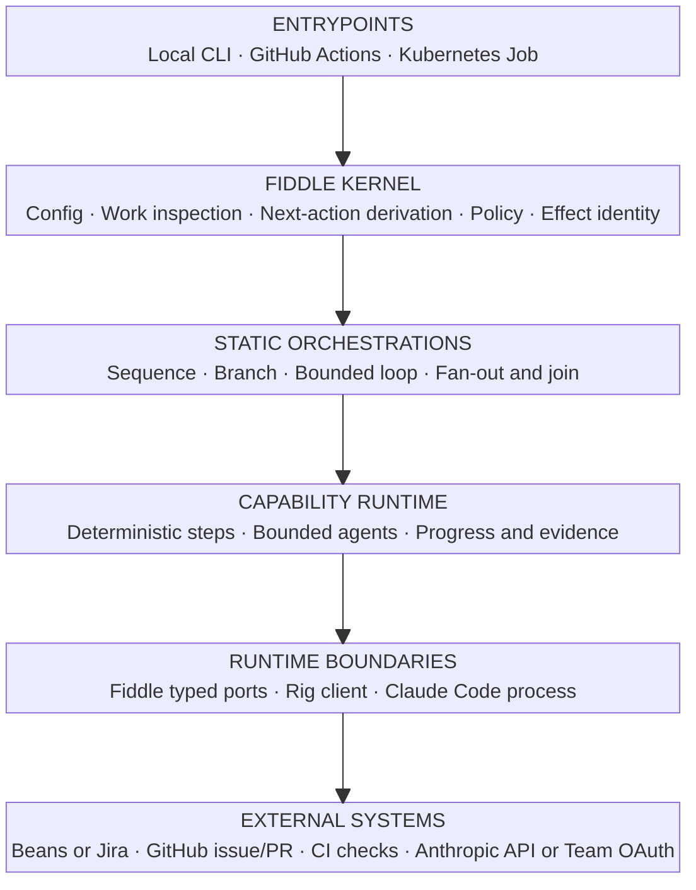
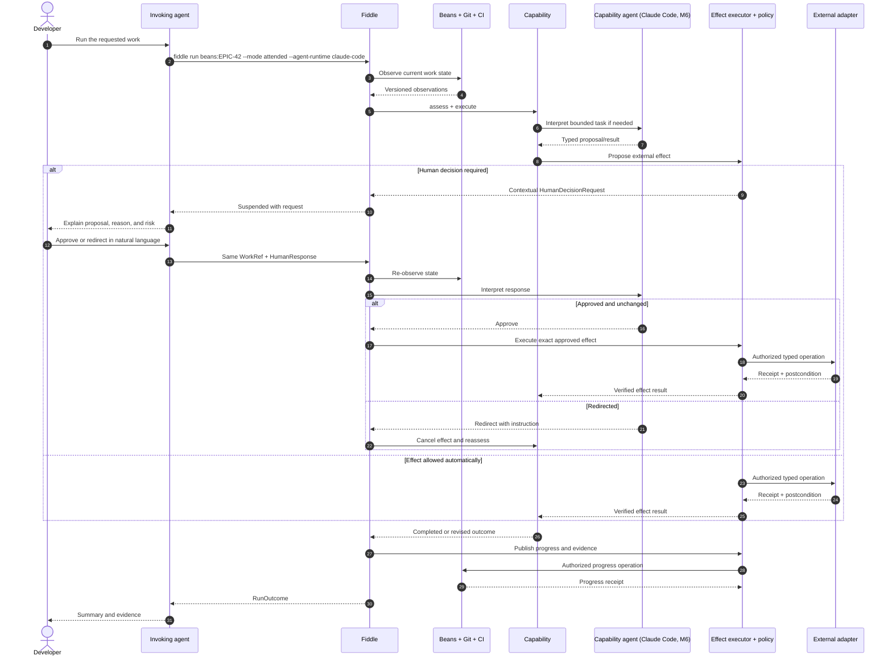
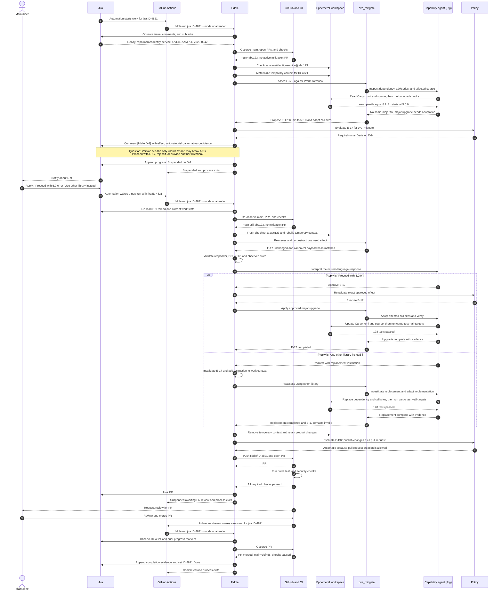
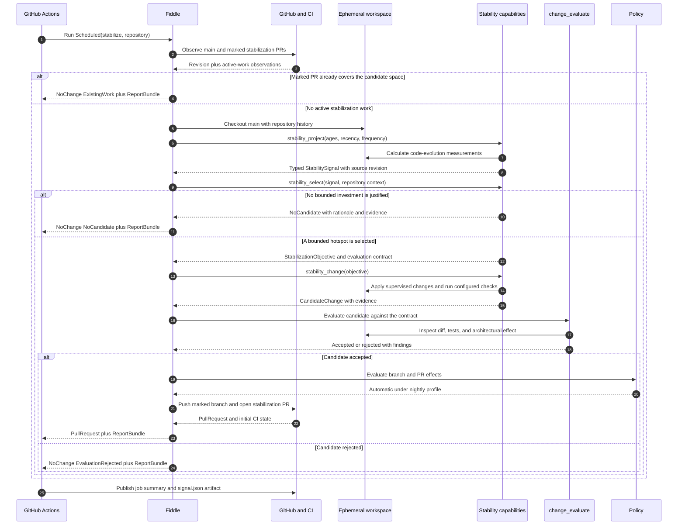
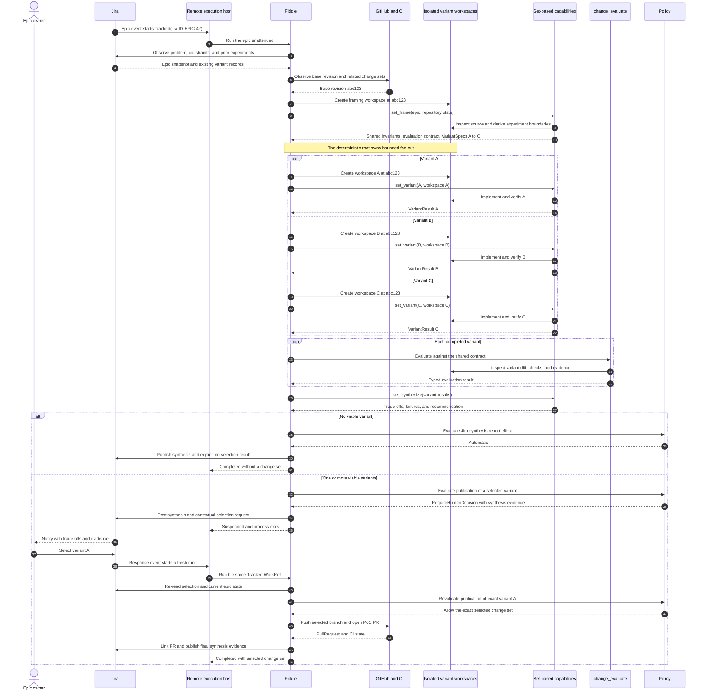
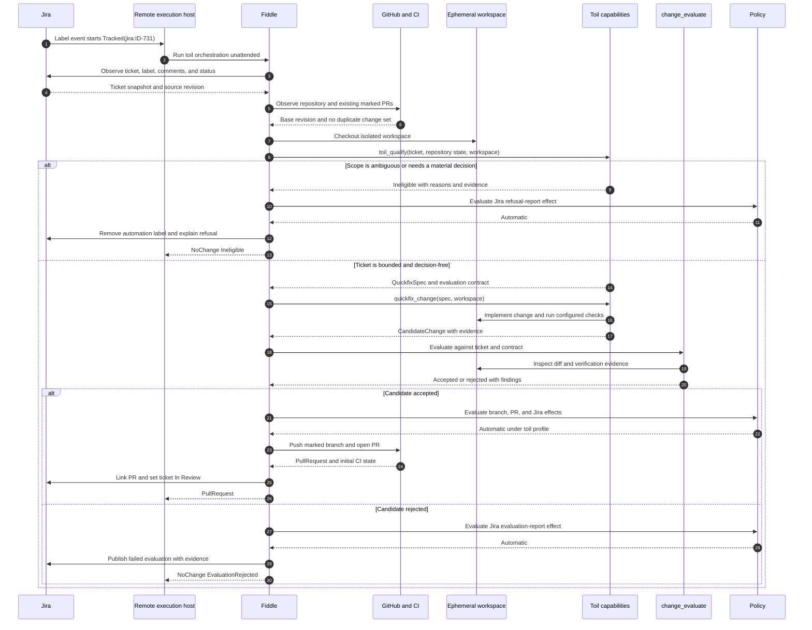
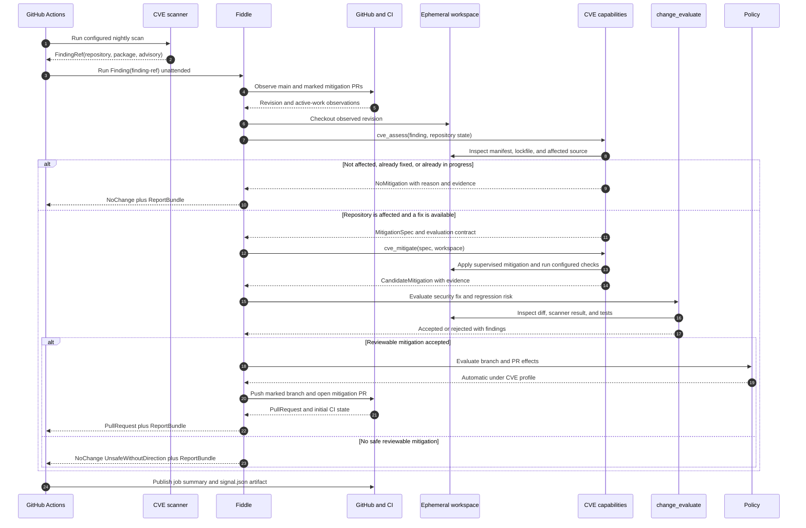

# RFC / PRD: Fiddle agentic software factory

**Status:** draft for implementation-team review  
**Audience:** Fiddle maintainers and implementers  
**Date:** 2026-08-07  
**Decision scope:** V1 product and component interfaces  
**Supersedes:** the factory direction in `docs/specs/2026-08-01-fiddle-v2-infrastructure-design.md` where this document differs

## TL;DR for wider engineering

This is Identities engineering work that fits naturally into Joe's factory ontology. Fiddle becomes the thin orchestration and supervision layer that turns a tracker item, scheduled repository routine, or scanner finding into a bounded, inspectable software operation. It does not replace the tracker, GitHub, CI, or execution platform; static Rust workflows coordinate typed capabilities, and bounded agents are used only inside steps that need interpretation and judgment.[S2](#s2)

The same operation can run locally, in GitHub Actions, or in Kubernetes with consistent safety and restart semantics. Fiddle derives progress from the tracker, Git, pull requests, CI, and curated source context; gates explicitly declared external effects through policy and contextual human decisions; keeps credentials out of agent and workspace state; and emits explicit progress and evidence. Capability tools run unattended inside their bounded environment—the agent is not interrupted for each tool call. V1 stays deliberately small: no control-plane service, shared database, persisted agent conversation, exact agent-run recovery, or generalized plugin system.

The required implementation outcomes are Stabilize, concurrent set-based engineering PoCs, Toil implementation, and CVE mitigation. They become specialized supervised orchestrations combining deterministic steps with bounded agentic judgment. A standalone version for circulation is in [`fiddle-agentic-factory-engineering-tldr.md`](fiddle-agentic-factory-engineering-tldr.md).

## Summary

Evolve Fiddle from a portable skill library into a small, type-driven software-work orchestrator. Its outer shell is deterministic: it observes durable work state, derives the next safe action, applies policy, executes typed effects, and records evidence. Its bounded capabilities may be deterministic, agentic, or hybrid. Static Rust orchestrations compose capabilities; capabilities may not invoke one another.

V1 is remote-first. GitHub Actions is the primary real-model runtime and embeds [Rig](https://www.rig.rs/docs) inside capabilities that require model judgment, using the existing CI `ANTHROPIC_API_KEY`. Rig supplies an in-process agent loop, typed tools, typed structured output, hooks, Anthropic integration, testing utilities, and `tracing`/OpenTelemetry instrumentation.[S5](#s5)[S6](#s6)[S20](#s20)[S21](#s21) Fiddle supplies the product-specific orchestration, policy, source tracking, restart semantics, and adapters around it. Rig does not become the workflow engine or durable source of work state.

Local real-model execution arrives later, after remote Jira/Toil proves the quick-fix contract. That milestone adds a Beans adapter and a narrowly scoped Claude Code implementation that launches `claude -p` under a Team subscription. Both implementations satisfy the same typed capability contract; Fiddle does not introduce a universal model-provider or tool abstraction between them. Claude Code supports non-interactive bounded execution, structured output, tool controls, streaming events, and OpenTelemetry export.[S30](#s30)

The factory is invoked as the same CLI binary on a developer machine, a GitHub Actions runner, or a Kubernetes job. V1 does not include a Fiddle service, scheduler, shared database, hosted sandbox, dedicated artifact store, or exact model-session continuation.

The implementation is not complete when only the orchestration kernel and adapters exist. It is complete when the four workflows in [Required implementation use cases and capability orchestration](#required-implementation-use-cases-and-capability-orchestration) run end to end, the M6 local Beans/Claude Code contract passes, and all milestone acceptance criteria are satisfied.

## Problem

Fiddle currently expresses its lifecycle and evaluator loop primarily through portable Markdown skills, shell helpers, and harness-specific entrypoints.[S1](#s1) That is effective for attended reasoning but leaves correctness-critical mechanics—state assessment, restart, idempotent external effects, policy enforcement, and progress reporting—distributed across model instructions and scripts.

The product needs a durable coordination boundary without becoming another tracker, CI system, GitHub client, sandbox platform, or general workflow engine. Given a stable invocation reference, a fresh Fiddle process must be able to inspect applicable external state and continue from the next incomplete capability. Correctness must not depend on preserving the prior model transcript or runner filesystem.

## Goals

- Run bounded software-engineering capabilities from one stable `InvocationRef` in attended or unattended mode.
- Make state transitions and external side effects typed, inspectable, policy-gated, and idempotent.
- Use bounded embedded agents only where interpretation is valuable while retaining deterministic control over lifecycle and effects.
- Keep task trackers, workspaces, model providers, GitHub, and CI behind narrow interfaces.
- Recover semantically from tracker, Git, pull-request, CI, and curated source context after process loss.
- Emit useful progress, evidence, and telemetry without introducing a shared V1 database.
- Delegate commodity behavior to existing CLIs, SDKs, APIs, and execution platforms.
- Deliver all four required use cases: nightly Stabilize, Jira-epic set-based engineering, Jira-ticket Toil implementation, and nightly/scanner-triggered CVE mitigation.
- Add local attended Beans execution only after remote quick-fix semantics are proven, using `claude -p` without changing the typed orchestration contract.

### Implementation planning constraint

The implementation plan must deliver progressively more capable, runnable versions of Fiddle. Every milestone must expose its new behavior through the public CLI and prove it automatically through unit/contract tests plus a black-box scenario in `peel/fiddle-acceptance`. Infrastructure may form a milestone only when exercised through a complete observable behavior; compiling a set of unused abstractions is not a milestone.

The plan must also include an end-to-end acceptance scenario for each required use case. It may sequence those use cases as later vertical slices, but it must not defer one as an optional future application of the platform. Current Fiddle lifecycle skills own task decomposition and execution after this RFC establishes the milestone boundaries.

External prerequisites remain explicit dependencies. In particular, unavailable Jira integration may block end-to-end acceptance of set-based engineering and Toil implementation, but it does not remove either workflow from scope. Work that does not require Jira should proceed independently while the dependency is unresolved.

## Non-goals and boundaries

- No persistent Fiddle control plane, queue, scheduler, or cross-run database.
- No durable model conversation memory, serialized agent-run checkpoint, or exact continuation of a prior model loop; a restart creates a fresh agent attempt.
- No dynamic capability loading, plugin ABI, capability package format, or per-capability schema versioning.
- No autonomous capability self-modification or promotion loop in V1.
- No general provider matrix or attempt to make unlike agent tool systems interchangeable. Rig is the primary CI implementation; M6 adds only the concrete Claude Code implementation required for local attended Beans work.
- No general credential broker and no credentials exposed to workspace commands or model-visible tool arguments.
- No dedicated artifact service. Code, pull requests, checks, tracker updates, runner artifacts, and telemetry remain in their natural systems.
- No reimplementation of complete GitHub, Jira, Beans, Git, CI, or Kubernetes clients.

Deferred ideas and their rationale are preserved in [`fiddle-agentic-factory-future-research.md`](fiddle-agentic-factory-future-research.md).

## Users and scenarios

### Local attended developer — introduced in M6

A developer runs Fiddle from a repository with a Beans work reference. Fiddle invokes the proven quick-fix capability through local `claude -p`, using the developer's Claude Team login when no API key overrides it.[S31](#s31) Fiddle returns a contextual decision request through the invoking agent when a proposed external effect requires human judgment. The developer may approve, reject, or redirect the work in ordinary language and may request JSON output for tooling.

### Remote unattended maintainer

A GitHub Actions workflow or Kubernetes job invokes Fiddle with an `InvocationRef`. Fiddle performs bounded work and exits. If human judgment is required, it posts a contextual question to the configured Jira or GitHub conversation and returns `Suspended`; a later invocation with the same reference reads and interprets the response.

### Capability author

An implementer adds one statically registered Rust capability. Its implementation may run deterministic commands, launch one bounded Rig agent, use a small manager-worker arrangement when there is a clear delegation boundary, or combine these forms. M6 demonstrates a second implementation of the already-proven quick-fix contract through Claude Code rather than requiring every capability to support every runtime. Every form uses the same typed assessment, progress, evidence, policy, and outcome contracts.

### Factory operator

An operator inspects tracker updates, GitHub state, CLI JSON, runner logs, and OpenTelemetry.

## Product model

### Identity

| Identity | Meaning | Persistence requirement |
|---|---|---|
| `InvocationRef` | Stable identity of the invocation source, wrapping a tracker item, repository routine, or scanner finding | Required across every invocation |
| `WorkRef` | Stable durable work identity, such as `beans:fiddle-123`, `jira:FID-42`, or a marked GitHub change set | Required once an invocation advances durable work; a scheduled `NoChange` result need not create one |
| `RunId` | One logical orchestration run for an invocation | May be reconstructed or linked externally |
| `AttemptId` | One process/agent attempt | Unique per invocation |
| `CapabilityInvocationId` | One logical capability operation | Stable across a retry of the same intended operation |
| `EffectId` | Identity of one proposed external effect | Stable enough to detect prior success and bind an approved decision |
| `DecisionRequestId` | One contextual question requiring human judgment | Stable across suspension and continuation |

### Outcome

```rust
enum RunOutcome {
    Completed,
    Suspended { reason: SuspensionReason },
    Retryable { reason: RetryReason },
    Failed { error: RunError },
}
```

`Suspended` means the system cannot continue until an external condition changes. In unattended mode, the interaction request is durably published before exit. In attended mode, it is returned to the invoking agent; if that interaction is lost, Fiddle may ask again. `Retryable` means a fresh invocation may make progress without human judgment. The CLI maps the outcome to human text, stable JSON, and documented exit codes.

## Component architecture

The diagram deliberately uses one vertical connection path. Component-to-component details are specified by the interfaces below rather than by cross-layer arrows.



### Ownership

| Component | Owns | Does not own |
|---|---|---|
| Fiddle kernel | configuration, work inspection, pure assessment and next-action derivation, policy, effect identity, run outcome | domain reasoning, external system internals |
| Static orchestration | explicit sequence, branching, bounded retry, and bounded fan-out/join over capabilities | open-ended model planning, hidden dynamic graphs |
| Capability | one domain operation, optional bounded agent implementation, runtime-specific bounded tool set, minimum effect policy, and typed progress/evidence | lifecycle composition, invoking other capabilities, weakening deployment policy |
| Tracker adapter | native work-item observations and mutations | repository or CI truth |
| Human-interaction adapter | contextual questions and responses on one configured channel | effect execution, interpreting a trigger payload as authoritative state |
| Workspace runtime | local files and command execution in an isolated root | authenticated GitHub/tracker/model calls |
| GitHub/Git adapter | published branches, commits, pull requests, reviews | workspace command execution, tracker status |
| CI adapter | workflow/check observations and requested check operations | deciding that product work is complete |
| Rig | model transport, per-attempt agent loop, typed tools/output, hooks, usage data, and optional agent-as-tool composition | Fiddle work semantics, orchestration, policy authority, durable cross-run recovery, general credentials |
| Claude Code process runner (M6) | launching the supported local quick-fix implementation, bounded CLI arguments, JSON event/result parsing, cancellation, and process telemetry | general provider abstraction, backend effects, durable session recovery, support for every capability |

## Execution model

### Deterministic shell, agentic interior

The outer kernel keeps decisions pure where that materially improves correctness and testing. For example:

```rust
fn derive_next(
    orchestration: OrchestrationId,
    work: &WorkStateView,
) -> Result<NextAction, AssessmentError>;
```

Static orchestrations are ordinary async Rust using typed values, `match`, bounded loops, and explicit concurrency. Fiddle does not introduce a workflow DSL or require every orchestration to fit one universal event/command reducer. Adapters return observations and receipts; pure assessments and policy decisions derive the next action from those values. Rig recommends this workflow shape when code can own the known sequence and routing, reserving agent loops for genuinely open-ended steps.[S5](#s5)

“Deterministic” applies to state transitions, policy evaluation, effect handling, and evidence rules. It does not imply repeatable model output.

### Capability contract

```rust
trait Capability: Send + Sync {
    type Input;
    type Output;

    fn id(&self) -> CapabilityId;
    fn assess(&self, work: &WorkStateView) -> CapabilityAssessment;

    async fn execute(
        &self,
        ctx: &CapabilityContext,
        input: Self::Input,
    ) -> Result<CapabilityOutcome<Self::Output>, CapabilityError>;
}

enum CapabilityOutcome<T> {
    Completed(T),
    Suspended(Suspension),
    Retryable(RetryAdvice),
}

struct CapabilityContext {
    invocation_ref: InvocationRef,
    attempt_id: AttemptId,
    services: CapabilityServices,
    cancellation: CancellationContext,
}
```

`assess` is pure and must explain its evidence. `execute` may be:

- deterministic: a sequence of typed observations and commands;
- agentic: a bounded Rig `AgentRunner` with selected tools and typed output;
- agentic local: an M6 Claude Code process implementing an already-proven capability contract;
- hybrid: deterministic preparation and verification around an agentic operation.

Only the static orchestration composes capabilities. A capability cannot invoke another capability. This preserves a visible call graph and prevents hidden recursive agency. Inside one agentic capability, Rig may expose a specialist agent as a tool when there is a clear internal delegation boundary; that worker remains an implementation detail of the capability and cannot invoke Fiddle capabilities or broaden policy. Rig advises keeping one focused agent when its domain and tool set are already small.[S7](#s7)

V1 capabilities are registered statically in Rust. A stable `CapabilityId` and the Fiddle build revision are sufficient identification; a descriptor format and capability-specific version lifecycle are deferred.

Each capability also defines its bounded tool set and minimum external-effect policy:

```rust
struct CapabilityDefinition {
    id: CapabilityId,
    tools: CapabilityToolSet,
    effects: EffectPolicy,
}

enum HumanDecisionRequirement {
    Automatic,
    Human,
}

trait EffectPolicy {
    fn human_decision_for(&self, effect: &ProposedEffect) -> HumanDecisionRequirement;
}
```

The capability controls which tools are available and which effects require human judgment. Deployment policy may make a rule stricter but cannot weaken the capability's minimum. No agent can modify either policy.

### Agent runtimes

From M1 through M5, an agentic capability constructs a Rig agent or explicit `AgentRunner` for one bounded attempt. The capability owns its prompt, tool set, turn budget, and typed result. Rig tools derive model-visible schemas from Rust types, while `TypedPrompt` or an extractor can return schema-validated Rust values.[S6](#s6)[S19](#s19) Deterministic and hybrid capabilities need not construct an agent at all.

Tools registered for a capability execute without per-call human confirmation. Rig hooks may support auditing, telemetry, cancellation, request shaping, and invalid-tool recovery, but Rig explicitly treats hook guardrails as controls rather than authorization boundaries.[S6](#s6) Safety comes from the small capability-specific tool set, workspace isolation, typed inputs, host-only context, and Fiddle's effect executor.

Rig agents may be used as tools by another agent, which supplies manager-worker composition without Fiddle implementing subagent machinery.[S7](#s7) This is optional and local to a capability. Static Fiddle orchestration, rather than a model manager, remains responsible for sequencing capabilities and bounded fan-out/join.

M6 adds a `ClaudeCodeQuickfix` implementation of the typed quick-fix capability already proven by `RigQuickfix` in M5. It launches a pinned `claude -p` process with an explicit prompt, bounded turns, controlled tools, structured output schema, streaming JSON, and no session persistence. Its model-visible prompt and tools receive only the isolated workspace and sanitized capability inputs; GitHub, Jira, and effect credentials remain outside the process, while model authentication is resolved by its wrapper and must not propagate to child tools. Claude Code owns its inner tool loop, while deterministic preparation, output validation, verification, policy, and effects remain in Fiddle.[S30](#s30)

The orchestration seam is the existing typed `Capability` input, output, assessment, and evidence contract—not a generic completion-provider API. The runtime selects one statically registered implementation supported by that capability. Rig tools and Claude Code built-in/MCP tools are allowed to differ internally; both implementations must satisfy the same capability acceptance contract and may not broaden its policy. Adding M6 therefore does not require making every capability portable to Claude Code.

Fiddle remains responsible for:

- capability selection and composition rules;
- invocation, work, attempt, capability, and effect identity;
- policy and contextual human-decision semantics;
- normalized work-state inspection;
- durable progress/evidence projection;
- credentials and authenticated integration handles;
- semantic restart across fresh agent attempts.

Fiddle core owns the durable, bounded lifecycle across capability attempts, CI results, human decisions, suspension, and restart. A capability owns agentic iteration within one attempt, including investigation, modification, and immediate checks. A later attempt uses a fresh agent; continuity comes from the current source state, external observations, and structured prior-attempt reports rather than a preserved conversation.

Rig's lower-level `AgentRun` can be serialized while a tool call is pending and resumed after an out-of-process approval.[S22](#s22) Claude Code can also persist sessions. V1 deliberately uses neither path for correctness: Fiddle publishes the contextual decision externally, exits, and reconstructs the capability input and proposed effect on the next invocation. Exact agent-loop continuation and any associated suspended-run store are deferred.

## V1 implementation stack

Fiddle starts as a Cargo workspace with three ownership boundaries:

- `fiddle-core`: domain identities, observations, assessments, policy decisions, effects, evidence, and outcomes; no Tokio, Rig, process execution, or external I/O;
- `fiddle-runtime`: Tokio orchestration, ports, effect execution, static workflows, capabilities, Rig integration, the M6 Claude Code process runner, and external adapters;
- `fiddle-cli`: Clap command surface, TOML configuration loading, effective-config validation, process lifecycle, human/JSON rendering, and exit codes.

The runtime uses Tokio's multi-threaded async runtime for concurrent I/O, bounded task groups for set-based fan-out, channels only where ownership or streaming requires them, and `CancellationToken` propagation from the process through orchestration and capability attempts.[S25](#s25) V1 adds no actor framework, Axum service, daemon, or Tauri control plane.

Configuration and boundary types use Serde with strict TOML deserialization. Clap owns CLI parsing. `secrecy` wraps resolved secret material; `thiserror` defines library/domain failures and `miette` renders actionable CLI diagnostics. `tracing` is the common instrumentation facade.[S27](#s27)

Local Git, GitHub, and Jira adapters delegate to the real `git`, official `gh`, and official Atlassian `acli` executables through `tokio::process::Command`. Adapters request structured output where available and parse it into narrow Fiddle-owned Serde types; they do not expose CLI output shapes to orchestration.[S28](#s28) Native community clients remain a documented future migration option.

The repository uses the existing `peel/rust.nix` design as a copied template rather than a shared flake module. The refreshed template uses a locked Nix flake, Fenix for one exact Rust toolchain shared by development and builds, Devenv for the shell, and Crane's dependency/build separation for cached checks and packages.[S26](#s26)[S29](#s29) Cargo manifests and `Cargo.lock` own Rust dependencies; `rust-toolchain.toml` owns the selected compiler version; `flake.lock` pins Nix inputs and external CLI packages. Formatting, linting, tests, and package builds are separate flake checks.

## Client interfaces

### Configuration

Project configuration moves from `orchestrate.json` to `fiddle.toml`. TOML is a Rust ecosystem convention for project configuration through Cargo, but this is a product choice rather than a requirement imposed by Rust.[S15](#s15)

The schema is organized by concrete component ownership, not by an abstract provider hierarchy. For example, GitHub owns repository, pull-request, and check settings under one authenticated integration; it is not selected once as a repository kind and again as a CI kind. Jira and Beans may coexist, and the `InvocationRef` selects the applicable adapter. **The block below is a composite across the whole of V1 and it is not a document a deployment can load**; the note after it says how far from loadable it is and how to read it, and [the configuration this build loads](#the-configuration-this-build-loads) follows. The final field names may change during implementation, but this reference configuration fixes the intended boundaries:

```toml
# fiddle.toml configures Fiddle's behavior in this repository. It does not
# provision runners, define schedules, or contain secret values.

[project]
# Repository-independent identity used in reports and telemetry.
name = "icecube"


[github]
# One integration owns source observations, branch publication, pull requests,
# and check observations. Credentials are resolved from the named environment
# source and are never exposed to capabilities or agents.
repo = "snowplow/icecube"
base = "main"
token = { env = "GITHUB_TOKEN" }

[github.pull_requests]
# Repository conventions applied when Fiddle publishes a reviewable change.
branch_prefix = "fiddle/"
managed_label = "fiddle/managed"

[github.actions]
# Required external checks Fiddle observes after publication. Workflow
# definitions, schedules, runner images, and artifact retention remain in
# GitHub Actions configuration rather than being duplicated here.
required_checks = ["build", "test", "security"]


[jira]
# Jira work-state and remote human-decision integration. This section may be
# absent in a repository that never receives Jira-backed invocation references.
site = "https://snowplow.atlassian.net"
project = "IDENTITY"
user = { env = "JIRA_USER_EMAIL" }
token = { env = "JIRA_API_TOKEN" }

[jira.workflow]
# Project-specific names projected onto Fiddle's typed work-state vocabulary.
ready = "Ready"
in_progress = "In Progress"
in_review = "In Review"
blocked = "Blocked"
done = "Done"

[jira.labels]
# Project conventions used to discover and identify Fiddle-managed work.
toil_trigger = "fiddle/toil"
managed = "fiddle/managed"

[jira.approvals]
# Rules for accepting responses to contextual decision requests in Jira.
authorized_roles = ["Developers", "Administrators"]
poll_interval = "1m"
timeout = "7d"

# From M6, a Beans-backed invocation selects the built-in local adapter. No
# [beans] table is needed while that adapter has no project-specific settings.


[agent]
# Defaults shared by bounded agent work. CI uses the Rig implementation unless
# an explicitly supported local capability selects Claude Code in M6.
default_runtime = "rig"
max_turns = 40
deadline = "45m"

[agent.rig]
# Primary CI implementation. The API key is resolved only by the host runtime
# and is never exposed to capability inputs or workspace commands.
model = "claude-sonnet-4-5"
api_key = { env = "ANTHROPIC_API_KEY" }
max_tokens = 8192

[agent.claude_code]
# M6 local attended implementation. Authentication remains owned by the
# official executable: Team OAuth locally, or ANTHROPIC_API_KEY in CI.
command = "claude"


[workspace]
# How Fiddle uses the checkout it receives from the local shell, GitHub Actions,
# or Kubernetes. Provisioning the host itself remains the caller's concern.
root = ".fiddle/workspaces"
isolation = "git-worktree"
command_timeout = "15m"
network = "dependency-fetch"
cleanup = "always"


[execution]
# Global bounds for the deterministic core's durable lifecycle. A capability
# owns iteration within one attempt; core owns retries across CI and suspension.
run_timeout = "2h"
max_parallel = 3
max_capability_attempts = 3


[policy]
# The deployment's hard ceiling on external effects. Capability rules live in
# Rust and may require more human judgment; configuration cannot weaken them.
allow_branch_creation = true
allow_push = true
allow_pull_request_creation = true
allow_tracker_comments = true
allow_tracker_transitions = true
allow_merge = false
allow_force_push = false


[artifacts]
# Temporary source context and structured reports used for evidence and handoff.
# Transient context is removed before the final PR state; durable facts remain
# in commits, pull requests, checks, tracker records, and published run reports.
context_directory = ".fiddle/context"
output_directory = ".fiddle-output"
remove_context_before_pull_request = true
report_formats = ["markdown", "json"]


[telemetry]
# OpenTelemetry export for operational events. This is observability, not the
# source of durable workflow state used to restart an invocation.
enabled = true
service_name = "fiddle"
otlp_endpoint = { env = "OTEL_EXPORTER_OTLP_ENDPOINT" }


[orchestration]
# Static root orchestrations enabled for this repository. Their composition and
# capability call graph remain registered in Rust rather than defined in TOML.
enabled = ["stabilize", "set_based", "toil", "cve"]

[orchestration.stabilize]
# Repository-specific tuning for the nightly code-age and change-frequency
# signal. The stabilization algorithm and safety rules remain in code.
history_window = "180d"
recent_window = "30d"
minimum_changes = 6
max_candidates = 1
cooldown = "30d"
include = ["**/*.go"]
exclude = ["vendor/**", "**/generated/**"]

[orchestration.set_based]
# Bounds for concurrent variants. Root orchestration owns fan-out and join;
# variant capabilities cannot launch one another. The global execution ceiling
# controls their actual concurrency.
max_variants = 3
require_human_selection = true

[orchestration.toil]
# Repository limits for labelled background toil. The Jira trigger label is
# defined once under [jira.labels] rather than repeated here.
max_files_changed = 10
max_diff_lines = 500

[orchestration.cve]
# Selection and run-budget preferences for nightly CVE mitigation. Which file
# fixes a finding and what version to move to are the agent's, including whether
# to take a major bump: nothing in Rust refuses a version, and the rescan is the
# guarantee. The immediate checks are the deployment's, under [[workspace.checks]].
# The image has no default and must be written down: the host workflow builds it
# and Fiddle scans it, so a guessed value would scan whichever tag this build
# happened to ship with. `severities` names grades and not a floor; findings below
# it are still acted on where a public exploit and a published fix coincide, which
# is a rule in Rust rather than a preference here.
image = "ghcr.io/snowplow/icecube:latest"
severities = ["HIGH", "CRITICAL"]
max_findings = 5


[capabilities.stability_select]
# Optional per-capability deviations from [agent]. Omitted values inherit the
# agent defaults; most capabilities therefore need no configuration table.
max_turns = 15

[capabilities.set_variant]
# This longer operation overrides only the default it genuinely needs to change.
timeout = "60m"
```

#### The reference configuration is a composite

The block above is the whole of V1 written down at once, and most of its tables name milestones that have not shipped, so it is a boundary map rather than a document. Fed to the compiled binary it exits 2, and because strict deserialization reports one unknown or missing field at a time, each refusal hides the next: clearing them one at a time — deleting the key a message points at, or the table whose header it names — takes 20 passes before what is left of it loads. 18 of its 23 tables have to be deleted along the way, and the two tables the schema requires, `[stub]` and `[report]`, are not in the block at all. `crates/fiddle-acceptance/tests/config_check.rs` measures those two numbers against the compiled binary rather than quoting them, so this paragraph cannot drift from what the binary does.

Read the block by one rule: a key is spelled the way this build spells it wherever the build already has that setting, and it keeps the manual's own spelling wherever it names behavior still to come. `[github]` therefore says `repo` and `base` rather than `repository` and `default_branch`, and `[agent]` says `deadline` rather than `timeout` — those three were the same settings under different words, which is a transcription defect and not a boundary. `[workspace] network`, `[orchestration] enabled`, and every table for an unshipped milestone stay as written, because they state intent rather than mis-name something that exists. Where a shipped table settled a boundary differently from this map, `crates/fiddle-cli/src/config.rs` is the schema of record: the deployment's effect ceiling is `[github.policy]`, keyed by effect kind rather than by the booleans `[policy]` shows, and `required_checks` is a key of `[github]` rather than of `[github.actions]`.

#### The configuration this build loads

Complete, and every key admitted by the strict schema — `fiddle config check --config fiddle.toml` exits 0 on it. It shows all eight tables the schema knows, which is the whole of what a deployment can say today, and an acceptance lane feeds the compiled binary these exact bytes so that this block cannot become as aspirational as the one above it.

```toml
# Complete and loadable. Every key here is admitted by the strict schema in
# `crates/fiddle-cli/src/config.rs`, and no field of that schema accepts a secret
# value, so this document is safe to track in version control.

[project]
# Repository-independent identity used in reports and telemetry.
name = "icecube"

[stub]
# Where the fixture-backed ports read and write their state. Required today
# because the ports a run reaches are still fixtures, and the table most likely
# to leave once they are not.
root = "tests/fixtures/stub-state"

[report]
# Where a run publishes its evidence bundles.
dir = ".fiddle/reports"

[agent]
# Model, endpoint, and credential variable have no defaults and must be written
# down: each names a deployment decision that cannot be guessed without being
# wrong somewhere. The two bounds below have defaults and are written out so the
# axes are visible.
model = "claude-sonnet-5"
base_url = "https://litellm.firn.snplow.net/v1"
api_key = { env = "LITELLM_API_KEY" }
max_turns = 12
deadline = "45m"

[workspace]
# How Fiddle uses the checkout it receives. One isolation mechanism and one
# cleanup rule are supported today; the keys exist so the axes are visible.
root = ".fiddle/workspaces"
isolation = "git-worktree"
command_timeout = "15m"
cleanup = "always"

[[workspace.checks]]
# The checks an attempt is judged by, run in the order written, each declaring
# its own success criterion because a scanner's non-zero exit reports findings
# rather than failure. Nothing in Rust reads what a changed file means, so a
# test check declared here is what stops a silenced test: a deployment that
# declares none has no such guarantee and gets no warning.
program = "make"
args = ["build"]
success = "exit-zero"

[[workspace.checks]]
program = "make"
args = ["test"]
success = "exit-zero"

[github]
# One integration owns branch publication, pull requests, and check observation.
# Absent in a deployment that never publishes.
repo = "snowplow/icecube"
base = "main"
token = { env = "FIDDLE_GITHUB_TOKEN" }

[scanner]
# The container scanner and the tenant it runs as. Absent in a deployment that
# never scans.
client_id = { env = "WIZ_CLIENT_ID" }
client_secret = { env = "WIZ_CLIENT_SECRET" }
timeout = "20m"

[orchestration.cve]
# The image has no default and must be written down: the host workflow builds it
# and Fiddle scans it, so a guessed value would scan whichever tag this build
# happened to ship with.
image = "ghcr.io/snowplow/icecube:latest"
severities = ["HIGH", "CRITICAL"]
max_findings = 5
```

Configuration requirements:

- defaults → project file → explicitly permitted CLI overrides;
- strict unknown-field validation with actionable errors;
- concrete integration sections rather than duplicated `kind` plus provider-specific sections;
- selection of Jira or, from M6, Beans from the `InvocationRef`, without a global active-tracker switch;
- tracker status, label, and relationship mappings as configuration rather than core enums;
- one authoritative interaction path for an invocation: Jira comments for remote Jira work and the invoking agent for attended Beans work;
- credential references that name an environment source or profile, never secret values;
- host scheduling, runner provisioning, and workflow definitions outside `fiddle.toml`;
- capability prompts, runtime-specific bounded tools, minimum human-decision rules, and orchestration graphs in Rust rather than dynamic configuration — but **not** the immediate checks, which M4 moved into the document as `[[workspace.checks]]`;
- explicit agent-runtime selection only for capability implementations that support it; no promise that every capability runs on every runtime;
- global defaults expressed once, with orchestration or capability overrides only for genuine deviations;
- `fiddle config check` resolving and validating the effective configuration without starting work.

Migration from overlapping `orchestrate.json` settings should be explicit; V1 need not preserve the old file as the new schema's architectural base.[S1](#s1)

### CLI

The minimum command surface is:

```text
fiddle run <invocation-ref> [--mode attended|unattended] [--capability <id>] [--agent-runtime <id>] [--json]
fiddle inspect <invocation-ref> [--json]
fiddle config check [--json]
```

An invocation reference identifies either tracker-backed work or a repository/scanner trigger supplied by the execution host. The exact CLI encoding of scheduled and scanner references remains an implementation decision.

`--agent-runtime` is an explicitly permitted override added in M6. It is rejected when the selected capability has no implementation for that runtime. CI defaults to `rig`; local attended Beans work selects `claude-code` explicitly rather than inferring behavior from the host machine.

`run` always begins by inspecting the current external state. Re-running the same command is the restart mechanism; V1 does not expose “resume model session” as a correctness primitive. `inspect` is read-only and reports normalized observations, contradictions, unavailable sources, capability assessments, and the proposed next action.

The word “reconcile” is intentionally excluded from the user interface. Fiddle **inspects** sources, **assesses** capabilities, and **derives** a next action.

## Component interfaces

The Rust signatures below specify semantic ownership. Where a port is used behind `dyn`, implementation may use `async-trait` or explicit boxed futures to make async methods object-safe; that mechanical choice does not change the interface contract.

### 1. Policy and human decisions

The policy engine is an in-process Fiddle component, not a separate service, a Rig hook, or a policy language in V1.

```rust
enum PolicyDecision {
    Allow,
    Deny { reason: PolicyReason },
    RequireHumanDecision { request: HumanDecisionRequest },
}

trait PolicyEngine {
    fn evaluate(
        &self,
        capability: &CapabilityDefinition,
        effect: &ProposedEffect,
        ctx: &PolicyContext,
    )
        -> PolicyDecision;
}
```

The capability declares the minimum rule for each kind of effect. The kernel combines it with deployment policy: deployment may require human judgment for more effects or deny an effect, but it cannot weaken the capability rule. Every mutating external operation passes through this interface whether proposed by deterministic code or an unattended Rig tool.

`RequireHumanDecision` means that the capability reached a product-level checkpoint before one exact effect. It does not mean asking before each Bash command or Rig tool call. Internal workspace operations normally execute automatically inside the capability's sandbox. An external effect tool may also execute automatically when its capability policy says so; otherwise its implementation returns control to Fiddle before applying the effect.

Rig hooks can inspect, skip, rewrite, or terminate tool calls, but Rig documents them as controls rather than security boundaries.[S6](#s6) Fiddle therefore uses hooks for observability and loop steering rather than as its V1 human-decision authority: all registered capability tools are non-interactive from the agent's perspective, and the effect executor remains the mandatory authorization boundary.

The request carries enough context for a person to make a meaningful decision:

```rust
struct HumanDecisionRequest {
    request_id: DecisionRequestId,
    invocation_ref: InvocationRef,
    work_ref: Option<WorkRef>,
    capability_id: CapabilityId,
    question: String,
    rationale: String,
    proposed_effect: ProposedEffect,
    risks: Vec<Risk>,
    alternatives_considered: Vec<Alternative>,
    evidence: Vec<EvidenceRef>,
}

struct HumanResponse {
    request_id: DecisionRequestId,
    author: ActorRef,
    text: String,
    source: InteractionRef,
}

enum InterpretedHumanDecision {
    Approve,
    Reject { reason: String },
    Redirect { instruction: String },
    Unclear,
}
```

A bounded agent interpretation step converts the natural-language response to `InterpretedHumanDecision`: Rig for remote work and the supported Claude Code implementation for M6 local quick-fix work. The deterministic shell verifies the author, request identity, current effect, and current external state before acting. An approved decision binds:

- `EffectId`;
- `InvocationRef` and the `WorkRef` when one exists;
- target identity;
- canonical payload hash;
- expiry or invalidation rule where required.

Changing the target or payload invalidates the approval. `Redirect` cancels the proposed effect and supplies new context to capability assessment; it is not approval for a modified effect. `Unclear` produces a follow-up request. The model interprets language, but it cannot broaden what was approved.

### 2. Task trackers

```rust
trait TrackerPort: Send + Sync {
    async fn observe(&self, work: &WorkRef) -> Result<Observation<WorkItemState>, TrackerError>;
    async fn append_progress(&self, effect: AuthorizedEffect<AppendProgress>)
        -> Result<EffectReceipt<ProgressRef>, TrackerError>;
    async fn ensure_status(&self, effect: AuthorizedEffect<EnsureWorkStatus>)
        -> Result<EffectReceipt<WorkItemRef>, TrackerError>;
}
```

Beans and Jira remain native systems. Adapters normalize only the semantics Fiddle uses; they do not hide each tracker's complete API. Statuses, labels, parent/child relations, comments, and revision mechanisms are mapped by configuration.

Tracker mutations are desired-state operations (`ensure_status`, “append report with marker”), not blind commands. Every additive comment/report carries a stable Fiddle marker so an ambiguous retry can discover whether the first write succeeded.

### Shared human-interaction port

Human interaction is its own semantic port because the conversation may live in Jira, GitHub, or the attended invoking agent:

```rust
trait HumanInteractionPort: Send + Sync {
    async fn request(
        &self,
        effect: AuthorizedEffect<PublishDecisionRequest>,
    ) -> Result<EffectReceipt<InteractionRef>, InteractionError>;

    async fn responses(
        &self,
        interaction: &InteractionRef,
    ) -> Result<Vec<HumanResponse>, InteractionError>;
}

enum InteractionRef {
    JiraComment(JiraCommentRef),
    GitHubIssueComment(GitHubCommentRef),
    GitHubPullRequestComment(GitHubCommentRef),
    Attended(AttendedInteractionRef),
}
```

Exactly one channel is authoritative for each request. Fiddle must not publish the same decision request to Jira and GitHub and then attempt to merge conflicting answers.

- **Jira unattended:** Fiddle posts a contextual issue comment. A person replies in ordinary language. A deployment-owned Jira automation, scheduled invocation, or manual rerun wakes the execution host.
- **GitHub unattended:** Fiddle posts a contextual issue comment or top-level pull-request conversation comment. A human-created `issue_comment` event can start GitHub Actions for either surface.[S16](#s16) Inline review comments are not used for work-level decisions.
- **Beans attended from M6:** Fiddle returns the request to the invoking agent. The agent asks the user and invokes Fiddle again with the same request identity and the natural-language response. V1 need not persist the pending local interaction; if it is lost, Fiddle asks again.

#### Suspension and continuation

1. A capability proposes an external effect and policy returns `RequireHumanDecision`.
2. Fiddle formats a `HumanDecisionRequest`. In unattended mode it publishes the request to the configured channel, emits suspended progress, returns `Suspended`, and exits. In attended mode it returns the request to the invoking agent.
3. A person replies in ordinary language with approval, rejection, a redirection, or a question.
4. The invoking agent calls Fiddle again, or deployment-owned automation starts a fresh remote invocation with the same `InvocationRef`.
5. Fiddle reads the authoritative interaction, validates the actor and request identity, reconstructs the proposed effect, and re-observes external state before a bounded agent step interprets the response.
6. Approval permits only the unchanged effect; rejection stops it; redirection invalidates it and causes capability reassessment with the new instruction; an unclear response produces a follow-up and another suspension.

The wake-up event is only a hint. A fresh Fiddle process re-reads the entire authoritative interaction, work state, and proposed effect. It never trusts the event payload as a human decision. Responses from unauthorized actors are ignored or surfaced for review according to deployment policy.

### 3. Workspace setup and runtime

```rust
trait WorkspaceRuntime: Send + Sync {
    fn root(&self) -> &WorkspacePath;
    async fn execute(&self, command: WorkspaceCommand)
        -> Result<CommandResult, WorkspaceError>;
}

struct WorkspaceCommand {
    program: Program,
    args: Vec<Argument>,
    cwd: WorkspaceRelativePath,
    env: SanitizedEnvironment,
    timeout: Duration,
    intent: WorkspaceIntent, // Observe | MutateWorkspace
}
```

The same workspace boundary backs deterministic capabilities and tools registered with Rig agents. In M6, the Claude Code process receives that isolated workspace as its working directory and may invoke only the capability's explicitly permitted workspace operations. A local checkout, GitHub Actions workspace, or Kubernetes-mounted checkout can implement this contract without an execution-host abstraction.

Security boundary:

- commands run under a declared workspace root with a sanitized environment;
- workspace commands do not inherit GitHub, tracker, cloud, or model credentials; M6 must prove that Claude Code tool subprocesses cannot observe the credential used by the parent agent process;
- network access, if enabled, is an explicit host policy (for example dependency fetches);
- local Git operations such as diff and commit may run in the workspace;
- publishing a branch, mutating a pull request, or changing tracker state uses a typed authenticated integration operation.

### 4. Agent execution implementations

Rig is the primary in-process library used by agentic capability implementations, not an external Fiddle component and not another Fiddle port. Fiddle core contains no Rig types; the runtime crate owns the dependency, constructs the authenticated provider client, and supplies configured completion models to Rig capability factories. Capability implementations can be generic over Rig's completion-model trait so tests substitute Rig test doubles directly. This avoids wrapping Rig's provider and agent abstractions in a second generic SDK of Fiddle's own, and capabilities never receive the API key itself.

Each agentic capability defines its system prompt, bounded tools, turn/budget limits, and structured output in its Rust module. The capability's existing typed input and output are its interface to orchestration. Rig `Tool` implementations are its interface to model-selected operations. Deterministic capabilities use neither interface.

Trusted runtime values such as scoped capability services, invocation metadata, or cancellation state are supplied through Rig's host-only tool context rather than model-visible tool arguments.[S6](#s6) Tools expose only their typed schemas and sanitized results to the model. A tool that proposes an authenticated external mutation delegates to Fiddle's shared effect executor; it never receives raw integration handles or performs that mutation directly.

When a capability genuinely needs internal delegation, a named and described Rig agent may be exposed as a tool to another Rig agent.[S7](#s7) Its result is converted to the capability's typed output before returning to orchestration. This does not permit arbitrary capability nesting or agent-controlled orchestration.

Rig's documented Anthropic integration supports completion, streaming, tools, structured output through tool use, prompt caching, token accounting, vision, and extended thinking. It is configured with an Anthropic API key and requires a per-request output-token limit.[S21](#s21) Claude Team and Claude Code OAuth credentials are not accepted by the Rig implementation; M6 uses them only through the official Claude Code executable.

M6 adds one external implementation for local attended work: `ClaudeCodeQuickfix`. A small runtime-owned process runner launches `claude -p` and parses its documented JSON event/result formats. The implementation supplies the quick-fix schema and bounded workspace tool permissions explicitly, disables session persistence, and maps the validated result into the same quick-fix output type used by the Rig implementation. It does not attempt to expose Claude Code as a Rig completion model or normalize the two tool systems.[S30](#s30)

Selection is explicit. CI defaults to the Rig implementation and `ANTHROPIC_API_KEY`; a local attended Beans invocation may select the supported Claude Code implementation and use subscription OAuth when the API-key variable is absent. Claude Code gives API keys precedence over subscription login, so Fiddle's preflight reports the effective credential source and refuses an unintended override when local subscription-only execution was requested.[S31](#s31)

### 5. Git and GitHub

Fiddle separates workspace-local Git from authenticated GitHub effects.

```rust
trait GitHubPort: Send + Sync {
    async fn observe_change_set(&self, invocation: &InvocationRef) -> Result<Observation<ChangeSetState>, GitHubError>;
    async fn ensure_branch_published(&self, effect: AuthorizedEffect<EnsureBranchPublished>) -> Result<EffectReceipt<BranchRef>, GitHubError>;
    async fn ensure_pull_request(&self, effect: AuthorizedEffect<EnsurePullRequest>) -> Result<EffectReceipt<PullRequestRef>, GitHubError>;
    async fn observe_review(&self, pull_request: &PullRequestRef) -> Result<Observation<ReviewState>, GitHubError>;
}
```

The adapter should delegate first: use a stable CLI with structured output when it has the required operation and auth behavior, use an SDK when it materially improves safety or typing, and call a narrow API endpoint only when needed. Fiddle must not grow a universal GitHub client.

`ensure_*` operations inspect before and after mutation. Their receipts include effect identity, target identity, observed postcondition, and external revision/reference. GitHub Actions' `GITHUB_TOKEN` can be permission-scoped; operations needing unavailable permissions may use a GitHub App installation token.[S9](#s9)

### 6. CI and GitHub Actions

```rust
trait CiPort: Send + Sync {
    async fn observe_verification(&self, target: &ChangeTarget)
        -> Result<Observation<VerificationState>, CiError>;
    async fn ensure_check_requested(&self, effect: AuthorizedEffect<EnsureCheckRequested>)
        -> Result<EffectReceipt<CheckRef>, CiError>;
}
```

GitHub Actions owns job provisioning, runner lifetime, caches, artifacts, and concurrency. Fiddle owns work assessment and run outcome. Actions concurrency can serialize jobs for a work-derived key, but duplicate-safe behavior must still come from effect identity and postcondition inspection.[S10](#s10)

V1 treats check results as externally owned facts. A progress report claiming verification cannot override a failed or missing required check.

### Shared external-effect protocol

Human-interaction, tracker, GitHub, and CI mutations use the same conceptual protocol. Only the effect executor can construct the authorization envelope accepted by mutating ports:

```rust
struct AuthorizedEffect<T> {
    effect_id: EffectId,
    payload_hash: PayloadHash,
    operation: T,
}

trait EffectExecutor: Send + Sync {
    async fn execute(
        &self,
        effect: ProposedEffect,
    ) -> Result<EffectReceipt<EffectOutput>, EffectError>;
}

trait IntegrationOperation {
    type Input;
    type Output;

    async fn execute(
        &self,
        ctx: &EffectContext,
        input: Self::Input,
    ) -> Result<EffectReceipt<Self::Output>, EffectError>;
}
```

`EffectExecutor` is the capability-facing interface. The runtime supplies each capability with an executor already bound to its `CapabilityId`, definition, and effective deployment policy; a capability or model-selected tool cannot claim another capability's identity when proposing an effect. `EffectOutput` is a closed enum over the external results Fiddle supports, avoiding a generic method on the trait; callers narrow the variant expected for their proposed effect. The runtime applies the async-trait convention stated above when using it behind `dyn`. `IntegrationOperation` is an internal generic implemented by concrete adapter operations. `AuthorizedEffect<T>` is a runtime capability token, not durable approval state, and its constructor is private to the effect executor. Adapters still inspect the target and return a verified receipt; receiving the envelope proves that identity, policy, and any required contextual decision were checked for this exact payload.

Execution order:

1. Validate typed input.
2. Derive stable `EffectId` and canonical payload hash.
3. Inspect whether the desired postcondition already exists.
4. Combine the capability's minimum effect rule with deployment policy and, when needed, resolve a matching contextual human decision.
5. Obtain an opaque authenticated adapter handle.
6. Construct the `AuthorizedEffect` for the exact operation.
7. Delegate to the selected CLI, SDK, or narrow API.
8. Observe the postcondition.
9. Return a typed receipt from which orchestration may derive subsequent progress and evidence. Publishing that report is itself an idempotent external effect and does not recursively report its own publication.

An external timeout after dispatch is an unknown result, not proof of failure. The next attempt inspects the target using the same `EffectId` before retrying.

## State, source tracking, and restart

### Distributed source of truth

V1 does not create one authoritative Fiddle record. Each system owns its own facts:

| Source | Owns |
|---|---|
| Tracker | work status, subtasks, blockers, and human-visible milestones |
| Interaction channel | contextual decision requests and human responses |
| Git | source artifacts, commits, branch history, temporary curated context |
| GitHub | published branches, pull requests, reviews, and GitHub-hosted interaction threads |
| CI | check executions and results |
| OpenTelemetry backend | operational traces, metrics, and logs |

The selected agent implementation owns model/tool history only for the current attempt. Fiddle does not configure durable Rig conversation memory, persist serialized `AgentRun` state, or depend on Claude Code session state in V1. A process may retain history while it runs, but neither that history nor the runner filesystem is a source of work truth.[S6](#s6)[S24](#s24)[S30](#s30)

### Normalized observations

```rust
struct WorkStateView {
    work_item: Observation<WorkItemState>,
    changes: Observation<ChangeSetState>,
    review: Observation<ReviewState>,
    verification: Observation<VerificationState>,
    human_decisions: Observation<HumanDecisionState>,
    context: Observation<ContextState>,
}

enum Observation<T> {
    Available {
        value: T,
        source: SourceRef,
        revision: Option<Revision>,
        observed_at: Timestamp,
    },
    Unavailable { source: SourceRef, reason: UnavailableReason },
    NotApplicable { reason: NotApplicableReason },
}

enum CapabilityAssessment {
    NotStarted { evidence: Vec<EvidenceRef> },
    Partial { evidence: Vec<EvidenceRef> },
    Satisfied { evidence: Vec<EvidenceRef> },
    Blocked { reason: BlockReason, evidence: Vec<EvidenceRef> },
    Contradictory { conflicts: Vec<StateConflict> },
}
```

Unavailable is not equivalent to empty or absent. Completion and mutating external effects fail closed when a required source cannot be observed. `NotApplicable` is different: the selected static orchestration explicitly does not use that source, such as Jira during a trackerless nightly run. Read-only investigation may continue with an explicitly partial view.

No source can overrule another source's owned fact. For example, a tracker milestone cannot make a missing commit exist, and a progress comment cannot make a failed CI check pass. Contradictions are reported with both source references rather than silently resolved by precedence.

### Semantic restart

On every `fiddle run <invocation-ref>`:

1. Load configuration and authenticated adapter handles.
2. Observe the applicable tracker, Git/GitHub, CI, authoritative interaction channel, and curated source context.
3. Build `WorkStateView`, preserving unavailable sources and revisions.
4. Ask each relevant capability to `assess` the view.
5. Derive the next safe incomplete capability.
6. Start a fresh bounded attempt through the capability's selected implementation if agentic interpretation is needed.
7. Execute effects through policy and idempotency boundaries.
8. Publish typed progress/evidence and return `RunOutcome`.

This is restart from work state, not restart from a hidden durable checkpoint. An agent attempt may use its transient history while it exists, but Fiddle must recover from external facts alone.

### Temporary source context

Capabilities may maintain a small, typed facade over ordinary Git-tracked context files:

```rust
trait WorkContext {
    async fn observe(&self, invocation: &InvocationRef) -> Result<Observation<ContextState>, ContextError>;
    async fn record(&self, entry: ContextEntry) -> Result<WorkspaceReceipt, ContextError>;
    async fn remove(&self, invocation: &InvocationRef) -> Result<WorkspaceReceipt, ContextError>;
}

enum ContextEntry {
    Finding(Finding),
    Decision(Decision),
    Blocker(Blocker),
    NextStep(NextStep),
}
```

These files contain curated findings and decisions, not raw transcripts or secrets. They are durable only after commit and publication. A recovery milestone that depends on source context therefore references a published `CommitRef`. Before final merge, lasting decisions move to permanent documentation, the pull request, or the tracker, and temporary context is removed.

## Progress, evidence, and telemetry

Progress is explicit domain output, never inferred from model prose.

```rust
struct ProgressReport<S> {
    invocation_ref: InvocationRef,
    work_ref: Option<WorkRef>,
    attempt_id: AttemptId,
    capability_id: CapabilityId,
    stage: S,
    status: ProgressStatus,
    summary: String,
    evidence: Vec<EvidenceRef>,
    effect_id: Option<EffectId>,
}

enum ProgressStatus {
    Started,
    Completed,
    Suspended,
    Retryable,
    Blocked,
    Failed,
}
```

Each capability owns a typed stage enum. Stages are append-only milestones, not a second workflow engine. Reports are projected to the applicable tracker and CLI/JSON; evidence points to commits, diffs, source context, pull requests, checks, or tracker records.

Three data classes remain distinct:

| Class | Mechanism | Required for restart? |
|---|---|---|
| Recovery milestones | typed Fiddle reports and interactions projected to tracker/Git/GitHub/CI | Yes |
| Agent-attempt history | in-process Rig history or M6 Claude Code process/session history | No |
| Operational telemetry | OpenTelemetry traces, metrics, and logs | No |

OpenTelemetry is the observability mechanism, not the work-state store. OpenTelemetry defines vendor-neutral telemetry APIs and conventions. Rig emits `tracing` spans for model calls, agent turns, tool execution, token usage, and latency using OpenTelemetry GenAI conventions; sensitive request and response content is opt-in.[S8](#s8)[S23](#s23) Claude Code can export metrics, structured events, and beta traces for model requests, tool calls, hooks, usage, and cost; non-interactive runs honor inbound trace context.[S30](#s30) Fiddle adds invocation, attempt, capability, effect, runtime, and external-reference attributes around either implementation. Product progress remains an explicit typed output rather than being inferred from telemetry.

## Credentials and trust boundaries

Fiddle resolves credentials at process bootstrap and constructs opaque authenticated handles for the integration layer. Capabilities and in-process Rig tools receive a narrower facade; the M6 Claude Code process receives no integration handles:

```rust
struct RuntimeContext {
    tracker: Option<Arc<dyn TrackerPort>>,
    interaction: Arc<dyn HumanInteractionPort>,
    github: Arc<dyn GitHubPort>,
    ci: Arc<dyn CiPort>,
    workspace: Arc<dyn WorkspaceRuntime>,
    policy: Arc<dyn PolicyEngine>,
}

struct CapabilityServices {
    workspace: Arc<dyn WorkspaceRuntime>,
    effects: Arc<dyn EffectExecutor>,
}
```

`RuntimeContext` remains owned by the Fiddle runtime. The runtime derives a capability-scoped `EffectExecutor` before constructing `CapabilityServices`. Those services may be supplied to Rig tools through host-only tool context; they expose policy-checked semantic actions rather than raw tracker/GitHub/CI clients or credential handles. The model receives only typed tool schemas and sanitized results.[S6](#s6)

Expected auth sources:

- local: existing `gh`/tracker sessions or OS-backed credential helpers; from M6, Claude Team OAuth owned by the official Claude Code executable;
- GitHub Actions: minimally scoped `GITHUB_TOKEN`, GitHub App installation token, and encrypted action secrets where unavoidable;[S9](#s9)
- Kubernetes: workload identity, projected service-account tokens, or mounted secrets supplied by deployment configuration; Kubernetes documents projected service-account tokens and persistent volumes as platform facilities, not Fiddle requirements.[S11](#s11)[S12](#s12)
- model provider in CI: an Anthropic API key resolved by the host and used to construct Rig's Anthropic client.[S21](#s21)
- local M6 model execution: Claude Code subscription OAuth, with explicit preflight because `ANTHROPIC_API_KEY` takes precedence when present.[S31](#s31)

Credentials must never be written to project configuration, workspace command environments, source context, agent history, serialized agent state, progress reports, evidence, model prompts, or telemetry. Redaction is defense in depth, not permission to persist secrets.

## Flows

### Local attended — M6



### Remote unattended

```mermaid
sequenceDiagram
  autonumber
  actor Human
  participant Host as GitHub Actions or Kubernetes
  participant Fiddle
  participant Conversation as Jira or GitHub conversation
  participant Sources as Applicable tracker + GitHub + CI
  participant Capability
  participant Agent as Capability agent (Rig)
  participant Effects as Effect executor + policy

  Host->>Fiddle: fiddle run InvocationRef --mode unattended
  Fiddle->>Sources: Observe work, changes, and checks
  Sources-->>Fiddle: Versioned observations
  Fiddle->>Capability: assess + execute next incomplete work
  Capability->>Agent: Interpret bounded task if needed
  Agent-->>Capability: Typed proposal/result
  Capability->>Effects: Propose external effect
  Effects-->>Fiddle: RequireHumanDecision
  Fiddle->>Effects: Publish decision request
  Effects->>Conversation: Authorized contextual comment
  Conversation-->>Effects: Verified interaction receipt
  Effects-->>Fiddle: Request published
  Conversation-->>Human: Configured notification
  Fiddle-->>Host: Suspended and process exits

  Human->>Conversation: Reply naturally with approval or direction
  Conversation->>Host: Comment event or configured automation
  Host->>Fiddle: Same InvocationRef in a fresh process
  Fiddle->>Conversation: Read request and subsequent responses
  Fiddle->>Sources: Re-observe external state
  Fiddle->>Agent: Interpret authorized human response
  alt Approved and effect unchanged
    Agent-->>Fiddle: Approve
    Fiddle->>Effects: Execute exact approved effect
    Effects->>Sources: Authorized operation and postcondition inspection
    Sources-->>Effects: Receipt + evidence
    Effects-->>Capability: Verified effect result
  else Redirected
    Agent-->>Fiddle: Redirect with instruction
    Fiddle->>Capability: Cancel effect and reassess
  else Unclear or rejected
    Agent-->>Fiddle: Follow up or stop
    Fiddle->>Effects: Publish outcome or follow-up
    Effects->>Conversation: Authorized contextual comment
  end
  Fiddle->>Effects: Publish progress and evidence
  Effects->>Sources: Authorized progress operation
  Sources-->>Effects: Progress receipt
  Fiddle-->>Host: Completed or suspended and process exits
```



## Delegate-first implementation rule

For each adapter operation, choose the smallest maintained dependency that meets the semantic contract:

1. Existing CLI when it provides stable structured output and suitable authentication.
2. SDK/library when it materially improves typing, safety, or error handling.
3. Narrow direct API call for an operation not adequately exposed above.

This is a per-operation choice, not a mandate to use one mechanism for an entire backend. Adapter tests, not wrapper volume, establish the contract.

## Testing and runtime verification

V1 verification has distinct layers rather than treating either unit tests or live model calls as sufficient:

Before M6, local verification is credential-free and uses deterministic Rig model doubles plus process/backend stubs; real-model verification runs in CI with `ANTHROPIC_API_KEY`. M6 is the first milestone that supports a real local model canary through Team-authenticated `claude -p`.

1. **Kernel tests:** pure assessments, policy combination, effect identity, approval binding, contradiction handling, and next-action derivation.
2. **Capability protocol tests:** Rig's deterministic completion-model test doubles script text and multi-turn tool calls, while request inspection verifies prompts, injected context, advertised tools, and turn counts.[S20](#s20) From M6, a process-level Claude Code stub also verifies command construction, event parsing, schema validation, cancellation, and credential preflight without requiring a subscription.
3. **Adapter contract tests:** process-level stubs for `git`, `gh`, `acli`, and from M6 `claude` exercise structured-output parsing, authentication isolation, ambiguous writes, inspect-before-retry, and postcondition receipts.
4. **Acceptance scenarios:** `peel/fiddle-acceptance` runs the same CLI contract against disposable repositories and progressively enabled GitHub and Jira test integrations.
5. **Live model canaries:** scheduled Rig/Anthropic CI runs check that real models can complete representative capability scenarios. From M6, CI also runs the Claude Code implementation with the existing API key, while an opt-in local canary exercises Team OAuth. They record runtime, model, prompt/capability revision, outcome, evidence, latency, and token use; their non-deterministic quality signal is not a substitute for deterministic contract tests.

Rig's experimental eval framework may later help score live outputs, but V1 does not make an experimental API part of the runtime or acceptance contract.[S20](#s20) The first implementation slice must include a compile-and-behavior spike against one pinned Rig release because Rig's recent releases include breaking agent and tool API changes.[S23](#s23)

## V1 product requirements

1. `fiddle run` and `fiddle inspect` accept Jira `WorkRef` values and the scheduled or scanner invocation references required by the remote orchestrations; M6 adds Beans `WorkRef` values for local attended work.
2. Repeated `run` invocations inspect real state and do not duplicate previously successful external effects.
3. The kernel represents work state, next actions, effects, observations, assessments, evidence, and outcomes as Rust types; orchestration remains ordinary Rust rather than a separate workflow DSL.
4. The four required orchestrations are explicit ordinary Rust workflows that compose statically registered capabilities; a model does not select the orchestration graph, and nested capability calls are rejected by construction.
5. The required orchestrations collectively exercise the deterministic, agentic, and hybrid capability forms they need. Bounded agent-as-tool delegation may occur inside one capability but cannot invoke another capability or broaden policy.
6. Every capability declares a bounded tool set and minimum effect policy; deployment policy can tighten but not weaken it.
7. Registered Rig tools and M6 Claude Code workspace tools run without per-call interactive confirmation; every mutating external effect still passes through one policy/effect protocol and returns a verified receipt.
8. Jira, human interaction, workspace, GitHub/Git, and GitHub Actions implement the narrow ports in this RFC or an equivalent reviewed contract; M6 adds the Beans adapter and local attended interaction transport.
9. Every human-decision request includes a question, rationale, proposed effect, risks, alternatives considered, and evidence sufficient to understand what is being decided and why.
10. A natural-language response is interpreted as approve, reject, redirect, or unclear. Redirecting invalidates the pending effect and returns the instruction to capability assessment.
11. An unattended request is posted to exactly one configured Jira or GitHub conversation and exits with `Suspended`; a later invocation reconstructs context and continues in a fresh process without the old agent run or transcript.
12. From M6, an attended Beans request is returned to the invoking agent; the agent asks the user and invokes Fiddle again with the natural-language response.
13. A wake-up payload never counts as approval. Fiddle re-reads the authoritative conversation, validates the actor and current effect, and re-observes external state.
14. Progress is emitted through typed reports with evidence references.
15. Missing required observations prevent completion and unsafe mutation; partial read-only inspection remains possible.
16. Secrets are absent from model-visible arguments, workspace environments, project state, agent history, serialized agent state, progress, evidence, and OTel exports.
17. Local, GitHub Actions, and Kubernetes use the same binary and run contract; host manifests own provisioning.
18. The implementation has no V1 runtime dependency on a Fiddle service, shared database, or dedicated artifact store.
19. Stabilize runs from a nightly repository trigger, derives a revision-bound stability signal, and produces either a policy-checked pull request or an evidenced `NoChange` result without requiring Jira.
20. Concurrent set-based engineering runs from a Jira epic, executes bounded variants concurrently in isolated workspaces, evaluates them against one contract, synthesizes the results, and publishes the selected reviewable change set or an explicit no-selection result.
21. Toil implementation runs only for an eligible labelled Jira ticket, refuses ambiguous or decision-heavy work, and otherwise produces an evaluated pull request with Jira progress.
22. CVE mitigation runs from a nightly scan or stable scanner finding, avoids duplicate mitigation work, and produces either an evaluated pull request or an evidenced `NoChange` result without requiring Jira.
23. The implementation plan and acceptance suite map explicitly to requirements 19–22; completing only the shared kernel or a subset of orchestrations does not satisfy this RFC.
24. Agentic capability tests use Rig completion-model test doubles to exercise scripted tool loops and assert model-visible requests without provider credentials; M6 adds equivalent process-protocol tests for the Claude Code quick-fix implementation.
25. Restart acceptance tests begin in a fresh process with no prior agent conversation, Claude Code session, or serialized `AgentRun` and recover only from the configured external sources.
26. The build pins a released Rig version and verifies the selected Anthropic, tool, structured-output, hook, and telemetry surfaces in an executable integration spike before capability implementation depends on them.
27. M6 pins or constrains a tested Claude Code CLI version, supports `claude-code` only for the quick-fix capability contract, and refuses runtime selection for capabilities without a registered implementation.
28. M6 CI acceptance runs the Claude Code quick-fix implementation with `ANTHROPIC_API_KEY`; an opt-in local acceptance run uses Team OAuth with the API-key variable absent, and both produce the same typed outcome and evidence schema as the Rig implementation. An instrumented workspace operation proves that Claude Code child tools cannot observe the parent model credential.

## Success criteria

- From M6, a local attended Beans run through `claude -p` returns a contextual decision request through its invoking agent and handles both approval and redirection.
- A remote run can post a Jira or GitHub question, suspend, lose its process and all in-process Rig history, and interpret the human's reply after a fresh invocation.
- An approved response executes only the unchanged effect described by the request; a redirected response cancels that effect and changes the capability's next assessment.
- Killing a process after an ambiguous external write does not create a duplicate tracker report, branch publication, pull request, or check request.
- `fiddle inspect` explains source availability, contradictions, evidence, capability assessments, and the proposed next action without mutation.
- A failed or unavailable required CI observation cannot be represented as completed work.
- Capability authors can add bounded agentic behavior without receiving raw credentials or bypassing policy.
- Capability authors can test Rig prompts, tool wiring, and multi-turn behavior deterministically through model test doubles; M6 can test Claude Code command/event/schema behavior through a process stub.
- The first backend implementations delegate to maintained tools/libraries and expose only Fiddle's required semantic operations.
- OTel traces are useful when configured, while deleting them does not change restart behavior.
- The M5 quick-fix acceptance contract passes through Rig in CI and, from M6, through Claude Code in CI and local Team-authenticated execution without changing orchestration semantics.
- A nightly Stabilize run demonstrates both dispositions: a revision-bound `NoChange` report when no bounded candidate is justified and a marked stabilization PR when an accepted candidate exists.
- A set-based epic demonstrates bounded fan-out, isolated variant workspaces, common-contract evaluation, synthesis, contextual selection, and publication of the exact selected change set.
- An ineligible Toil ticket is refused with evidence; an eligible ticket produces an evaluated PR and a linked Jira update without an unplanned product decision.
- A CVE finding demonstrates deduplication and both dispositions: no PR when no fixable mitigation is needed, and a marked mitigation PR when a safe reviewable change is accepted.

## Risks and mitigations

| Risk | V1 mitigation |
|---|---|
| Fiddle becomes a second GitHub/Jira/CI implementation | Narrow semantic ports, delegate-first rule, contract tests |
| “Deterministic” is mistaken for deterministic model output | Limit the guarantee to typed transitions, effects, and evidence |
| Distributed state contradicts itself | Preserve source/revision on observations; report `Contradictory`; no claimed progress overrides owned facts |
| Unattended agent tools exceed their authority | Capability-specific tool registration, workspace isolation, typed inputs, and one mandatory external-effect executor |
| Jira and GitHub produce conflicting answers | Exactly one authoritative interaction channel per request |
| A comment is mistaken for approval | Re-read the full interaction, validate actor and request identity, then interpret approve/reject/redirect/unclear |
| Duplicate writes after timeouts | Stable effect identity, operation markers, inspect-before-retry, postcondition receipts |
| Agent transcript, Claude Code session, or serialized `AgentRun` becomes an accidental correctness dependency | Recovery tests start a fresh process with no prior agent state |
| Secrets leak through Bash, prompts, progress, or telemetry | Opaque handles, sanitized workspace env, typed tools, redaction tests |
| Capability graph becomes hidden and recursive | Orchestration-only composition and static registration |
| Temporary source context becomes permanent clutter | Curated entry types and mandatory final cleanup/decision promotion |
| Rig API evolution causes coupling | Keep Rig out of `fiddle-core`, pin its release, use its facade inside the runtime crate, and keep capability/domain types at the boundary |
| Rig and Claude Code quick-fix implementations drift | Share typed capability semantics and acceptance fixtures; select implementations statically; require both to satisfy the M6 outcome/evidence contract |
| Local Claude Code loads unintended credentials or ambient behavior | Explicit runtime selection and tool/settings arguments, no session persistence, credential-source preflight, CI protocol tests, and refusal when API-key precedence violates the requested local profile |

## Open questions

- Which exact tracker-native marker representation is least intrusive for Beans and Jira?
- Which effects in each required orchestration need human judgment, and which stricter rules belong to deployment profiles?
- How are authorized decision-makers mapped for each Jira project and GitHub repository?
- Which Jira automation wakes the reference remote deployment after a new response?
- What is the smallest evidence vocabulary needed by the first capability?
- Should local `inspect` observe GitHub/CI only when a remote exists, or require an explicit offline mode?
- Which required `gh` or `acli` operations lack sufficiently stable structured output and need a narrow fallback?
- What temporary source-context path and format fit existing repositories without polluting normal documentation?
- What stable JSON and exit-code contract should CI consumers receive?
- Which tested Claude Code version range and controlled settings invocation preserve Team OAuth while excluding unintended local plugins, hooks, MCP servers, and memory?

These questions may change implementation details but not the component boundaries in this RFC.

## Interface example: optional Jira-backed CVE decision

This sequence illustrates remote suspension and contextual steering for a deployment that elects to use Jira as its human-interaction channel. It is not the required CVE orchestration's default: the required nightly CVE flow below is trackerless, creates a reviewable PR when it can do so safely, and uses PR review as its ordinary human gate. The values below are illustrative; GitHub Actions provides disposable remote execution, and deployment policy permits opening a pull request automatically but not merging it.



## Required implementation use cases and capability orchestration

These four workflows are required implementation outcomes and define the acceptance boundary for this RFC. They should be static root-level orchestrations, not four monolithic agents and not a user-defined workflow language. Triggers select an orchestration; the root orchestrator composes bounded capabilities; capabilities never invoke one another. Workspace provisioning, state observation, policy, effect execution, reporting, and idempotency remain shared kernel services.

### Invocation and outcome model

Jira is one source of work identity, not a prerequisite for every run. The invocation layer needs three logical inputs:

```rust
enum InvocationRef {
    Tracked(WorkRef),
    Scheduled(RoutineRef),
    Finding(FindingRef),
}

enum ChangeDisposition {
    NoChange { reason: NoChangeReason, report: ReportBundle },
    PullRequest { change_set: ChangeSetRef, report: ReportBundle },
}
```

`RoutineRef` identifies a configured repository routine independently of a particular nightly `RunId`. `FindingRef` carries the scanner's stable finding identity. Once either flow proposes durable work, Fiddle derives a stable correlation key and searches GitHub for a marked branch or pull request before creating another one.

Suggested correlation inputs are repository + hotspot + stabilization objective for Stabilize, and repository + package identity + advisory identifier for CVE mitigation. The exact hash and marker representation remain implementation decisions. A nightly invocation that finds no actionable change completes as `NoChange` without manufacturing a Jira item or durable `WorkRef`.

Tracked workflows continue to use Jira as their durable work and interaction surface. Scheduled workflows use Git, pull requests, reviews, and CI as durable work state once a change exists.

For trackerless nightly orchestrations, ordinary human judgment happens through pull-request review. Workspace changes and opening the reviewable PR may be automatic under deployment policy; merging remains human-controlled. If a capability cannot produce a reviewable change without prior steering, it returns `NoChange` with a reason and evidence instead of suspending on a nonexistent Jira conversation. A deployment may add a GitHub interaction channel later, but it is not required by these two orchestrations.

### Stabilize

The static orchestration composes `stability_project`, `stability_select`, `stability_change`, and shared `change_evaluate`. GitHub becomes durable work state only if the run creates a branch and pull request.



### Concurrent set-based engineering PoC

The static orchestration composes `set_frame`, parameterized `set_variant`, shared `change_evaluate`, and `set_synthesize`. The root owns fan-out and join; variants never launch sibling capabilities.



### Toil implementer

The static orchestration composes `toil_qualify`, `quickfix_change`, and shared `change_evaluate`. Eligibility is intentionally strict because the labelled ticket promises bounded work without product decisions.



### CVE agent

The static orchestration composes `cve_assess`, `cve_mitigate`, and shared `change_evaluate`. It is trackerless: scanner identity prevents duplicate work, and GitHub owns durable state when a mitigation PR exists.

**The mitigation decision stays trackerless permanently.** From M5 the orchestration additionally reports the CVEs it could not patch to Jira as a policy-checked effect, and from M9 it reports a run's outcome to Slack. Neither is an input: no tracker state and no notification gates, informs, or deduplicates a mitigation, and a run with both integrations unavailable produces the same pull request and the same typed outcome as one with them configured. Requirement 22's "without requiring Jira" is therefore preserved — the verdict report is an additional output of a decision already made, and the capability holds no tracker credential, receiving an executor already bound to its own capability identity.



### Shared capability boundaries

The names above describe responsibility boundaries, not a required module layout. `change_evaluate` is the principal reusable agentic capability. It receives a workflow-specific evaluation contract and returns typed findings and evidence. It does not decide orchestration, create pull requests, or mutate trackers. PR publication, tracker updates, and CI observation remain policy-checked effects owned by the kernel adapters.

Set-based engineering is the only orchestration that requires fan-out and join. Each variant receives a typed `VariantSpec`, its own workspace, and the same evaluation contract. `set_variant` does not launch sibling capabilities, and `set_synthesize` sees only completed typed results and evidence. V1 therefore needs bounded static concurrency, not a generalized DAG engine.

### Stabilize signal as a reusable product input

Metric extraction should be deterministic where possible; agentic interpretation turns those measurements into a bounded stabilization proposal. The output is a typed `StabilitySignal`, separate from the human-facing report. Other capabilities in the same orchestration can consume the typed value directly. A later nightly run recomputes it from Git rather than trusting an expired artifact.

This preserves two future uses without making them V1 dependencies:

- knowledge-graph or ontology evolution can consume stability and change-shape observations;
- evaluation policy can tighten or relax quality gates based on an explicitly supplied stability signal.

Neither consumer is allowed to infer product truth from an old report artifact without re-observing its source revision.

### Nightly report publication

Every scheduled run produces a platform-neutral bundle:

```text
.fiddle-output/
├── summary.md
└── signal.json
```

Fiddle owns the typed content; the execution host owns publication. The GitHub Actions wrapper appends `summary.md` to `GITHUB_STEP_SUMMARY` and uploads `signal.json` as a workflow artifact.[S17](#s17)[S18](#s18) If a PR is created, its body includes the material findings and references the originating run.

The artifact is retained evidence, not durable orchestration state. Same-run consumers receive the typed capability output directly; later runs recompute the signal from Git or the scanner. Artifact expiry, deletion, or unavailability must not alter restart behavior. V1 does not add a custom Checks API integration or dedicated signal store.

### Required incremental milestones

A milestone is a progressively more capable version of the system, not a collection of internal tasks. Each version must run through the same CLI contract and be automatically verified through the acceptance harness. The current Fiddle lifecycle skills will decompose an approved milestone into implementation beans; this RFC does not prescribe that task breakdown.

#### Just-in-time planning and calibration

Each milestone begins with one explicit **plan and calibrate** seed bean. That bean runs the current Fiddle discovery and definition workflow against the repository as it exists after the preceding milestone; the remaining implementation beans for that milestone are created from its output. Later milestones are not decomposed fully in advance because their useful task boundaries, dependency versions, and risk profile will change as the system becomes real.

Initial project setup therefore materializes the M0–M8 milestone records and one seed bean inside each milestone. It creates the implementation beans only for the milestone being started.

The lifecycle lead executes a seed as planning work, outside `fiddle:develop-loop`. It runs discovery, design, design challenge, and `fiddle:write-plan --from-orchestrate --epic EPIC_ID` against the existing milestone epic, validates the generated beans, records marker-delimited seed evidence on that epic, and completes the seed. Only then does `fiddle:develop --epic EPIC_ID` process the generated implementation beans; the completed seed is skipped. Worktree agents route every Beans operation to the main checkout's canonical `.beans` store rather than creating worktree-local state.

Seed evidence records repository revision and dirty state, baseline commands and results, external-assumption dispositions, design and plan paths, calibration identifiers, generated bean IDs, and validation results. A retry replaces the same stable evidence block and reuses existing exact-title beans and dependency edges.

The seed bean must:

1. inspect the current repository, accepted decisions, prior milestone evidence, and unresolved debt;
2. run the existing acceptance suite to establish the starting baseline;
3. verify external assumptions that the milestone depends on, including pinned library/CLI surfaces and available backend access;
4. refine the milestone's implementation design and create repository-specific, test-driven beans with requirement traceability;
5. calibrate its automated evaluation before implementation—fixtures, assertions, failure injection, and backend observations for deterministic behavior, plus evaluator anchors and live-canary expectations where model judgment is involved;
6. identify prerequisite or remediation work discovered from the current repository state.

Planning may change task decomposition and implementation detail, but it may not silently weaken the milestone's externally observable capability or mandatory automated proof. A material change to those boundaries returns to this RFC for an explicit decision. The seed bean completes only when the milestone plan, implementation beans, calibration, and executable baseline are present; planning prose alone is not sufficient evidence.

| Milestone | Newly working system capability | Mandatory automated proof |
|---|---|---|
| **M0 — Executable skeleton** | Rust workspace and build, configuration, CLI, deterministic orchestration, stub ports, `run`/`inspect`, typed outcome, and report bundle | A process-level stub scenario invokes the CLI, observes fixture state, executes a deterministic capability, and asserts the typed outcome and evidence bundle. A second fresh invocation proves the observable state is stable. |
| **M1 — Bounded agentic capability** | Pinned Rig integration, ephemeral workspace, host-only tool context, typed agent output, bounded inner tool loop, cancellation, and attempt limits | A scripted Rig model repairs a deliberately broken fixture through real workspace tools and passes its configured checks. A scheduled CI Anthropic canary exercises the same capability contract without becoming the deterministic gate. |
| **M2 — Safe GitHub effects** | Capability-bound effect executor, policy combination, stable effect identity, local Git and authenticated GitHub adapters, pull-request publication, CI observation, and remote GitHub Actions execution | A disposable GitHub repository receives exactly one branch and pull request. Failure injection after an ambiguous write followed by a fresh-process retry proves that no branch, PR, or check request is duplicated. |
| **M3 — Suspension and human direction** | GitHub conversation adapter, contextual human-decision request, suspended exit, fresh-process continuation, actor/effect validation, approval, rejection, redirection, and stale-decision invalidation | A remote risky-change scenario proves approval of the unchanged effect, redirection to a different change, rejection of stale approval, and continuation without prior Rig memory or runner state. |
| **M4a — CVE mitigation capability** | Scanner invocation and the scan as an observation, `cve_assess`, `cve_mitigate`, shared change evaluation, deduplication by finding identity, and the PR-or-no-PR dispositions | A vulnerable fixture produces one evaluated mitigation PR; an already-fixed fixture produces evidenced `NoChange`; an unfixable finding produces an evidenced verdict. Offline and credential-free against a scripted scanner and a scripted forge: a scanner that errored, wrote nothing, found nothing or never ran must reach four distinguishable results, none of them a successful `NoChange`. |
| **M4b — CVE workflow integration** | A published release artifact, the capability running from a real host workflow against a real forge and a real scanner, and CI feedback across fresh attempts | The capability runs unmodified from a host workflow in a real repository, replacing an agent invocation, and opens or updates one shared mitigation pull request. A failing CI result causes a fresh bounded mitigation attempt in a new process using observed failure evidence, bounded by the configured attempt limit. |
| **M5 — Jira and toil implementation** | Jira observation and progress, eligibility assessment, Jira interaction channel, Rig-backed bounded quick-fix implementation, Jira-linked pull requests, and **CVE verdict reporting as a policy-checked Jira effect** | Jira-compatible contract stubs run on every build. Progressive live acceptance proves that an eligible ticket produces one evaluated PR and linked Jira update, while an ambiguous or decision-heavy ticket is refused with evidence. A CVE run's unpatchable verdicts file exactly one ticket each, deduplicated against existing tickets, and an interrupted run files no duplicate; the same run with Jira unavailable produces an identical pull request and typed outcome. |
| **M6 — Local attended Beans execution** | Beans observation/progress, explicit `claude-code` runtime selection, local `claude -p` quick-fix implementation, Team OAuth preflight, attended interaction transport, Claude Code event/OTel integration, and parity with the M5 quick-fix contract | CI runs the Claude Code quick-fix implementation with `ANTHROPIC_API_KEY` against a disposable Beans project and asserts the same typed outcome/evidence contract as Rig. Process stubs prove auth, command, event, schema, cancellation, and failure behavior without credentials; an instrumented workspace operation proves that child tools cannot observe the model credential. An opt-in local canary repeats the scenario through Team OAuth with the API-key variable absent. |
| **M7 — Stabilization** | Deterministic repository-history signal, revision-bound hotspot assessment, agentic stabilization proposal, change evaluation, and PR-or-no-PR disposition | A stable repository fixture produces evidenced `NoChange`; a hotspot fixture produces one justified, evaluated stabilization PR tied to the observed revision. |
| **M8 — Concurrent set-based engineering** | Jira-epic invocation, bounded isolated workspace fan-out, common evaluation contract, typed synthesis, and publication of only the selected change set | Multiple real variants execute concurrently against the same contract; synthesis receives only typed results and evidence, and exactly one accepted change set is published or an explicit no-selection outcome is reported. |
| **M9 — Notification channel** | A narrow outbound notification port, a Slack adapter as its first implementation, and run-outcome notification for the orchestrations that have one | A contract stub runs on every build. A notification is a policy-checked effect with stable identity, so an interrupted run posts no duplicate message. Deleting the notification configuration changes no outcome, no exit code and no evidence bundle: a scenario runs with the channel configured and unconfigured and asserts both produce the identical typed result. No notification is ever an input to a decision. |

Every milestone gate includes:

- completion of its repository-state-based plan-and-calibrate seed bean before implementation begins;
- ordinary Rust unit and adapter contract tests for the behavior introduced;
- a black-box `peel/fiddle-acceptance` scenario using the public CLI;
- fresh-process execution wherever restart or external-state recovery is in scope;
- inspection of resulting workspace and backend state rather than relying only on exit status or model prose;
- failure injection for every newly introduced retry or recovery boundary;
- a machine-readable evidence bundle containing the Fiddle package version and source build revision.

Fiddle uses normal Cargo package versioning and reports the package version plus source build revision through `fiddle --version` and acceptance evidence. Milestone identifiers are planning boundaries rather than Git tags, runtime capability versions, or a second release mechanism. The implementation plan assigns concrete package versions and may reorder work within a milestone, but it must preserve each milestone's externally observable capability and automated gate.

M0 proves the deterministic outer shell. M1 inserts a bounded Rig inner loop without giving it orchestration authority. M2 and M3 then prove that authenticated effects, idempotency, policy, suspension, and cross-process continuation remain owned by Fiddle core. M4 and M5 prove the first two product workflows remotely before M6 adds local `claude -p` and Beans against the established quick-fix contract.

M4 is split into M4a and M4b because the two halves fail differently and are proved differently. M4a's claim is about *decisions*: the projection, the attribution, the deduplication and the dispositions are arithmetic and lookups whose wrong answers are silent, and every one of them can be gated offline against a scripted scanner and a scripted forge. M4b's claim is about *deployment*: that the same binary runs unmodified from a host workflow against a real forge, a real scanner and real CI feedback. Merging them would mean a milestone whose gate needs a credential to say anything, and M0's constraint that the acceptance lane is never gated on a secret is what keeps M4a's proof runnable by anyone. The split is along the line the gate already drew: the two fixture dispositions are M4a's, and the fresh attempt from observed CI evidence is M4b's. Stabilize and set-based engineering follow in M7 and M8. Completing the foundation or local runtime without all four product workflows does not complete this RFC.

M9 is last deliberately, and it is the only milestone whose absence changes nothing observable. A notification is an output about work already decided, so it can only be built once there are outcomes worth reporting — and it must never become the reason a run behaves differently. Ordering it after the four product workflows keeps that honest: nothing earlier may take a dependency on a message having been sent.

Jira-dependent milestones cannot complete live remote acceptance until the Jira adapter and deployment integration are available. Their contract-stub work may proceed, and trackerless GitHub milestones must continue independently while that external dependency is unresolved.

## Bibliography

- <a id="s1"></a>**S1.** [peel/fiddle](https://github.com/peel/fiddle) and the local [`README.md`](../README.md) — current portable skills, four-phase lifecycle, evaluator loop, provider configuration, and harness surfaces.
- <a id="s2"></a>**S2.** [snowplow-devops/applied-ai: `factory`](https://github.com/snowplow-devops/applied-ai/tree/main/factory) — role separation, bounded execution, human gates, evidence, and durable handoffs used as design input.
- <a id="s3"></a>**S3.** [Warp, “We are now factory engineers, not product engineers”](https://www.warp.dev/blog/we-are-now-factory-engineers-not-product-engineers) — software-factory framing, intervention points, and feedback-loop motivation; inspiration rather than a requirement.
- <a id="s5"></a>**S5.** [Rig architecture](https://www.rig.rs/docs/architecture) and [workflows](https://www.rig.rs/docs/concepts/chains) — provider/model layering and ordinary-Rust sequential, conditional, parallel, and evaluator-optimizer workflow composition.
- <a id="s6"></a>**S6.** [Rig `AgentRunner`](https://www.rig.rs/docs/concepts/agentrunner), [tools](https://www.rig.rs/docs/concepts/tools), and [hooks](https://www.rig.rs/docs/concepts/hooks) — bounded agent runs, typed tools, host-only tool context, hook events, and the distinction between hook controls and authorization boundaries.
- <a id="s7"></a>**S7.** [Rig multi-agent systems](https://www.rig.rs/docs/guides/advanced/multi_agent_systems) — agents as tools for manager-worker composition and guidance for deciding when multiple agents are justified.
- <a id="s8"></a>**S8.** [OpenTelemetry overview](https://opentelemetry.io/docs/what-is-opentelemetry/) — vendor-neutral traces, metrics, and logs.
- <a id="s9"></a>**S9.** [GitHub Actions authentication with `GITHUB_TOKEN`](https://docs.github.com/en/actions/tutorials/authenticate-with-github_token) — token permissions and GitHub App installation tokens for additional permissions.
- <a id="s10"></a>**S10.** [GitHub Actions concurrency](https://docs.github.com/en/actions/how-tos/write-workflows/choose-when-workflows-run/control-workflow-concurrency) — workflow/job concurrency groups.
- <a id="s11"></a>**S11.** [Kubernetes service accounts](https://kubernetes.io/docs/concepts/security/service-accounts/) — workload identities and projected service-account tokens.
- <a id="s12"></a>**S12.** [Kubernetes persistent volumes](https://kubernetes.io/docs/concepts/storage/persistent-volumes/) — optional host-managed durable storage; not a V1 Fiddle correctness dependency.
- <a id="s13"></a>**S13.** [tontinton/maki](https://github.com/tontinton/maki) — prior art for a programmable agent orchestrator and tool-driven agent composition.
- <a id="s14"></a>**S14.** [smol-env/smol](https://github.com/smol-env/smol) — prior art for a small agent using a constrained tool surface; conceptual inspiration for specialized capabilities.
- <a id="s15"></a>**S15.** [Cargo manifest reference](https://doc.rust-lang.org/cargo/reference/manifest.html) and [`toml` crate](https://docs.rs/toml/latest/toml/) — established TOML use in Rust tooling and Rust TOML parsing support.
- <a id="s16"></a>**S16.** [GitHub Actions workflow events: `issue_comment`](https://docs.github.com/en/actions/reference/workflows-and-actions/events-that-trigger-workflows#issue_comment) — comments on GitHub issues and pull-request conversations as workflow triggers.
- <a id="s17"></a>**S17.** [GitHub Actions job summaries](https://docs.github.com/en/actions/writing-workflows/choosing-what-your-workflow-does/workflow-commands-for-github-actions#adding-a-job-summary) — publishing GitHub-flavored Markdown through `GITHUB_STEP_SUMMARY` on a workflow-run page.
- <a id="s18"></a>**S18.** [GitHub Actions workflow artifacts](https://docs.github.com/en/actions/tutorials/store-and-share-data) — uploading, retaining, and sharing files produced by workflow jobs.
- <a id="s19"></a>**S19.** [Rig structured output](https://www.rig.rs/docs/concepts/extractors) — schema-derived extractors and typed prompts for converting model output into Rust values.
- <a id="s20"></a>**S20.** [Rig testing](https://www.rig.rs/docs/concepts/testing) and [evals](https://www.rig.rs/docs/concepts/evals) — deterministic completion-model test doubles, scripted tool-call turns, request inspection, and the experimental live-output evaluation framework.
- <a id="s21"></a>**S21.** [Rig Anthropic integration](https://www.rig.rs/docs/integrations/model_providers/anthropic) — API-key client setup, output-token requirement, tool use, structured output, prompt caching, usage reporting, vision, and extended thinking.
- <a id="s22"></a>**S22.** [Rig durable approval example](https://github.com/0xPlaygrounds/rig/blob/v0.41.0/examples/agent_with_durable_approval/src/main.rs) — serialization of a pending `AgentRun` across an out-of-process human-decision boundary.
- <a id="s23"></a>**S23.** [Rig observability](https://www.rig.rs/docs/concepts/observability) and [Rig 0.41 release](https://github.com/0xPlaygrounds/rig/releases/tag/v0.41.0) — `tracing`, OpenTelemetry GenAI conventions, model/tool spans, and opt-in sensitive span content.
- <a id="s24"></a>**S24.** [Rig memory](https://www.rig.rs/docs/concepts/memory) — in-process conversation memory, optional user-supplied durable backends, and bounded-history policies.
- <a id="s25"></a>**S25.** [Tokio tutorial](https://tokio.rs/tokio/tutorial) and [`CancellationToken`](https://docs.rs/tokio-util/latest/tokio_util/sync/struct.CancellationToken.html) — multi-threaded async runtime facilities, tasks, channels, I/O, and propagated cancellation.
- <a id="s26"></a>**S26.** [Crane](https://crane.dev/) — Nix library for building Cargo projects and separating dependency artifacts from application builds.
- <a id="s27"></a>**S27.** [Clap](https://docs.rs/clap/latest/clap/), [Serde](https://serde.rs/), and [`tracing`](https://docs.rs/tracing/latest/tracing/) — Rust CLI parsing, serialization/deserialization, and structured instrumentation.
- <a id="s28"></a>**S28.** [`tokio::process`](https://docs.rs/tokio/latest/tokio/process/), [`gh` manual](https://cli.github.com/manual/), and [Atlassian CLI Jira work-item commands](https://developer.atlassian.com/cloud/acli/reference/commands/jira-workitem/) — asynchronous child processes and vendor-supported GitHub/Jira command surfaces.
- <a id="s29"></a>**S29.** [Fenix](https://github.com/nix-community/fenix), [Devenv](https://devenv.sh/), and [Nix flakes](https://nix.dev/manual/nix/latest/command-ref/new-cli/nix3-flake.html) — pinned Rust toolchains, development environments, and locked Nix inputs.
- <a id="s30"></a>**S30.** [Claude Code headless execution](https://code.claude.com/docs/en/headless), [CLI reference](https://code.claude.com/docs/en/cli-usage), and [Agent SDK observability](https://code.claude.com/docs/en/agent-sdk/observability) — non-interactive `claude -p`, bounded tools/turns, JSON Schema output, streaming events, session controls, and OpenTelemetry metrics/events/traces.
- <a id="s31"></a>**S31.** [Claude Code authentication](https://code.claude.com/docs/en/authentication), [Team-plan Claude Code access](https://support.claude.com/en/articles/11845131-use-claude-code-with-your-team-or-enterprise-plan), and [current Agent SDK subscription policy](https://support.claude.com/en/articles/15036540-use-the-claude-agent-sdk-with-your-claude-plan) — Team OAuth support, API-key precedence, CI tokens, per-seat subscription usage, and the current transitional policy for Agent SDK/`claude -p` usage.

## Decision record

- Adopt a type-driven deterministic outer shell with bounded imperative/agentic capabilities.
- Use Rig with the existing Anthropic API key as the primary CI agent implementation from M1; add only the M6 Claude Code quick-fix implementation required for local attended Beans work.
- Express the four orchestrations as ordinary static Rust workflows; keep capabilities orchestration-composed and allow deterministic, agentic, and hybrid implementations.
- Do not introduce a universal root supervisor agent. Use one focused Rig agent per agentic capability by default and agent-as-tool delegation only for a clear internal boundary.
- Run each capability's registered Rig or M6 Claude Code workspace tools unattended, without per-tool confirmation prompts.
- Let each capability declare its minimum external-effect human-decision rules; deployment policy may tighten but not weaken them.
- Treat product approval as an in-process Fiddle effect boundary, not a Rig hook or tool prompt.
- Carry contextual human-decision semantics independently of transport: attended invoker, Jira comment, or GitHub issue/PR conversation comment.
- Interpret responses as approve, reject, redirect, or unclear; redirection invalidates the pending effect and returns new context to the capability.
- Use exactly one authoritative interaction channel per request and treat wake-up events only as hints.
- Infer restart position from external work state; do not require a durable Fiddle checkpoint.
- Do not persist Rig conversation memory, Claude Code session state, or serialized `AgentRun` state in V1; reconstruct work from external facts after process loss.
- Defer exact `AgentRun` continuation and a suspended-run store until measured need justifies them.
- Use explicit progress reports and evidence; use OTel only for operational telemetry.
- Pin a released Rig version and prove the selected runtime surfaces in an executable integration spike before expanding capability work.
- Keep domain types in a Tokio/Rig-free `fiddle-core`; put async orchestration and integrations in `fiddle-runtime`; keep parsing and presentation in `fiddle-cli`.
- Use the native Tokio async stack with propagated cancellation and bounded task groups; add no actor framework or service/UI stack in V1.
- Delegate V1 GitHub and Jira operations to pinned `gh` and `acli` executables behind Fiddle ports; defer native community clients.
- Build from a copied, refreshed `peel/rust.nix` template using one pinned Fenix toolchain with Crane and Devenv.
- Treat Jira as one source of work identity rather than a prerequisite; scheduled repository and scanner invocations may complete as `NoChange` without creating tracker work.
- Publish nightly summaries and machine-readable artifacts as retained evidence, never as restart-critical state.
- Treat all four use cases as required V1 implementation outcomes and static root orchestrations over bounded domain capabilities; add bounded fan-out/join only for set-based engineering.
- Deliver M0–M8 as progressively capable CLI versions, each beginning with a just-in-time plan-and-calibrate seed bean and ending with black-box acceptance evidence; leave repository-specific task decomposition to the existing Fiddle lifecycle skills.
- Keep the typed capability contract as the Rig/Claude Code seam; do not create a universal completion-provider or common tool abstraction, and do not imply that every capability supports both runtimes.
- Keep credentials in host-owned authenticated handles and outside workspace/model-visible state.
- Exclude a dedicated artifact store, controller service, and execution-host abstraction from V1.
- Use TOML for the new project configuration and keep secrets out of it.
- Use “inspect”, “assess”, and “derive”; avoid “reconcile” in product interfaces.
